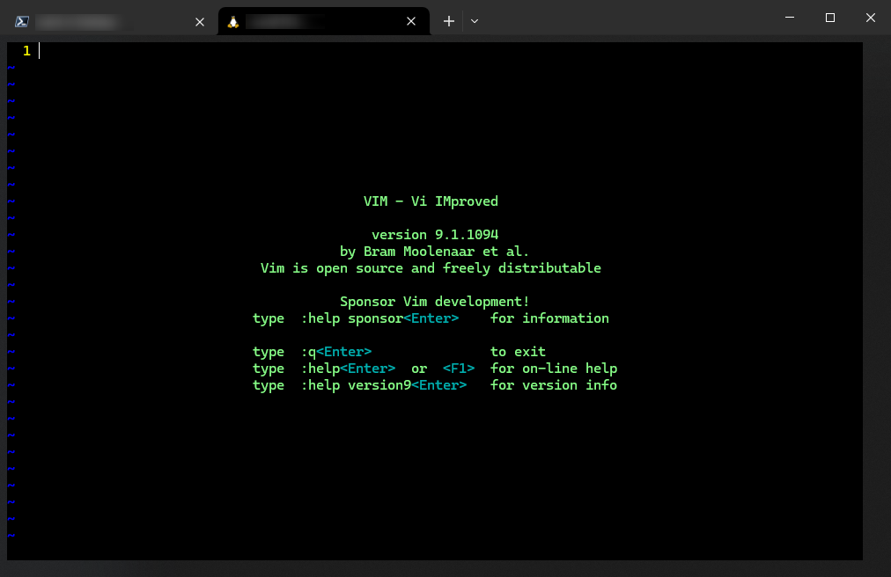

# 开篇词：在 AI 时代持续深耕底层技术，做长期主义的坚定捍卫者

## 1 背景：AI 时代的底层技术觉醒

在 AI 人工智能技术迅猛发展的当下，我们仿佛被瞬间拉入了一个 **魔法时代** —— 日常快问快答有 `ChatGPT`、`DeepSeek` 总揽大局；写代码有 `Copilot`、`MarsCode` 等一众神器自动补全，甚至 AI 绘画也能生成令人惊叹的艺术作品。科学技术的阶跃式发展让许多复杂的任务简单化、甚至实现了部分自动化、智能化。然而，正是在这样的大背景下，我们更需要反思：身为技术极客，我们的核心竞争力究竟是什么？是完全依靠工具，还是深入底层一探究竟？

**【图 1：最新版 Vim 9.1 启动页截图】**

`Vim`，这款诞生于 1991 年的文本编辑器，或许在许多人眼中早已 **过气** 了。殊不知，正是这样一款看似古老的小工具，却在当下的 AI 时代焕发出极为强劲的生命力。在第一次系统了解 `Vim` 之后我才发现，它绝不仅仅是一个文本编辑器这么简单，反倒更像是一种独具特色的思维方式：一种对效率、心流体验和底层技术细节的极致追求！在这个新的 `Vim` 专栏，我将延续此前《[Vim Mastering](https://blog.csdn.net/frgod/article/details/145338140)》专栏的创作风格（姑且算作 `Vim` 进阶专栏吧），把自己在精进 `Vim` 过程中的实战经历和心得体会如实地分享出来，和众多仍然没有放弃深度思考、始终不愿向 AI 缴械投降的未来极客们一道，积极探索 `Vim` 的高效进阶之路，重新审视 `Vim` 应有的价值，并将它有效融入我们的专属技术体系中。

## 2 Vim：一款被严重低估的文本编辑神器

AI 时代的技术迭代之快，让每一个人都亲眼见证了什么叫日新月异，也深刻理解了什么叫目不暇接；然而随之而来的，也有甚嚣尘上的 **躺平流**、**观望派**、**投降主义者**，让人们本就焦躁不安的内心变得更加脆弱、消极与浮躁。其实，外界越是纷纷扰扰、泥沙俱下，我们越需要守住心神，努力夯实底层知识结构。而 `Vim` 就是这样一款具有 “定心丸” 效果的小工具：高度定制、极致聚焦、功能强大、内核稳定……毫不夸张地说，`Vim` 的价值至今仍是被 **严重低估** 的。它不仅仅是一个工具，更是一种对效率的极致追求。

`Vim` 的核心在于 **模式化编辑**，这种设计理念让用户可以在键盘上完成所有文本操作，无需频繁切换鼠标和键盘。这样的高效交互方式，不仅提升了编辑速度，更重要的是避免了因为频繁切换上下文而导致的注意力分散问题；而注意力早已成为 AI 时代的稀缺资源。`Vim` 的创始人可能做梦都没有想到，当年这款仅仅出于应付带宽和网速双双不给力而被迫搞出来的小工具，如今以其天才的独特设计，能在 AI 成果不断爆发的当下，帮助人们更好地聚焦代码本身，而不是被工具所干扰。

## 3 聊聊 IT 人士的职业病

作为一名技术极客，你是否经常感到肩膀背痛、手腕疲劳、手指僵硬？这大概率是因为编码时频繁切换鼠标和键盘所致。`Vim` 的纯键盘操作模式，不仅提升了效率，还从源头上减轻了这方面的身体负担。

在 `Vim` 中，你可以通过快捷键完成几乎所有操作：移动光标、删除文本、复制粘贴、搜索替换……这些操作都是在键盘上实现的，无需将手从键盘上移开。这种设计不仅减少了手腕的抬放，还让我们的注意力更加集中。在 AI 魔法时代，效率与健康同等重要，两手都要抓，两手都要硬。从这一点来看，`Vim` 不仅是一款编辑器，更是一种健康的工作方式和生活哲学——返璞归真，一切极简。

## 4 进阶之道：构建完整的知识体系

在之前的《***Vim Masterclass***》专栏中，我已经将全套英文课程介绍的知识点完完整整梳理了一遍：从 `Vim` 的基本操作到高级技巧，如果您一直关注我的专栏动态，想必已经掌握了 `Vim` 的核心概念。然而，`Vim` 的世界远不止于此。在最新版的《***Mastering Vim***》这本小册子中，作者还深入探讨了 `Vim` 的许多高级特性和技巧。这些知识点看似零散，但有了坚实的基础，我们可以轻松地将它们进行归类，从而进一步完善自己的 `Vim` 认知体系。

例如，`Vim` 的宏（`Macro`）特性可以帮助我们实现重复任务的自动化；完善的插件系统（如 `Vimscript`、`Lua`）可以任意定制带有浓郁个人主义色彩的专属编辑器；`Vim` 的 `Buffer` 缓冲区管理、多窗口界面等特性，则让我们在多任务场景下游刃有余……所有这些内容，都是进阶阶段需要认真掌握的。

## 5 从 AI 时代的深耕与精进再谈长期主义

这几天，贺岁电影《哪吒 2》以其深入人心的故事情节和精雕细琢的动画特效，缔造了世界影史票房的新纪录。这部电影的成功，离不开饺子团队五年如一日的耐心打磨，个别镜头特效甚至到了出片前的一刻还在修改打磨。我想说的是，动漫特效只是各类技术突破式创新的一个缩影。我们身处的 AI 时代对长期主义和深耕自我的深切呼唤，俨然超过了人类文明史上任何一个耀眼的瞬间。

强大如 `Vim` 尚且被绝大部分 IT 从业人员拒之门外，只因听说其学习曲线 **十分陡峭**（这一点和 `D3.js` 何其相似！）；然而很少有人真正意识到掌握 `Vim` 后得到的巨大回报，有些人即便意识到了也懒于付诸行动。殊不知，对 `Vim` 的理解每加深一层，我们的编码效率就能看到立竿见影的效果。这样的积累，断然不是一蹴而就的，而是需要长期的坚持和精进；AI 又何尝不是如此呢？无论是算法、算力还是数据，哪一样少得了长期积累？哪一项不是量变引发的质变？哪一个最新成果不是数十年如一日的持续精进造就的？未来 AI 淘汰的，不过是心浮气躁又固步自封的人罢了。

在梳理 `Vim` 知识点的过程中，我曾不止一次暗暗庆幸去年 9 月那个神奇的下午，偶然间读到了 **Ruby on Rails** 的发起人 **David Heinemeier Hansson** 大神写的那篇称赞 `Vim` 的热情洋溢的 [硬核文章](https://blog.csdn.net/frgod/article/details/142445430)，并由此开始了我的 `Vim` 精进之旅。没错，相遇就是缘分。在这个什么都讲快的时代，不是每个人都有机会在恰当的时刻见证长期主义者的成长的。作为一名技术博主，我深知优质内容的价值所在；即便是再好的内容，有时候可能也需要一些机缘巧合，才能邂逅真正的知音。因此，在本专栏中，我将一如既往地用精雕细刻的内容回馈每一位读者，并郑重承诺绝不浪费大家宝贵的时间。无论是 `Vim` 的高级炫酷技巧，还是 AI 时代的底层技术思考，我都会用心耕耘，无愧初心。

在决定认真打造 CSDN 博客之前，我一直对 “酒深不怕巷子深” 这句话深信不疑；但经过这大半年的持续创作，我发现干货内容也只是打造个人 IP 的其中一个重要因素，除此之外，还需要懂得如何宣传自己、讲好自己的故事。因此我也希望通过自己的努力，真心收获大家的持续关注，希望能在大家的见证下逐步成长为一名长期主义的坚定捍卫者。你我有幸生逢空前的华夏盛世，只有深耕底层技术，持续夯实各方面的基础能力，才能在 AI 的奇点时刻真正降临时做到 “手中有粮，心中不慌”。而 `Vim` 正是深耕底层技术的一个绝佳突破口。

我坚信，未来一定属于历经磨难而不改初心的长期主义者们。让我们一起用 `Vim` 这把瑞士军刀，一路披荆斩棘，创造属于我们自己的新的票房纪录！
