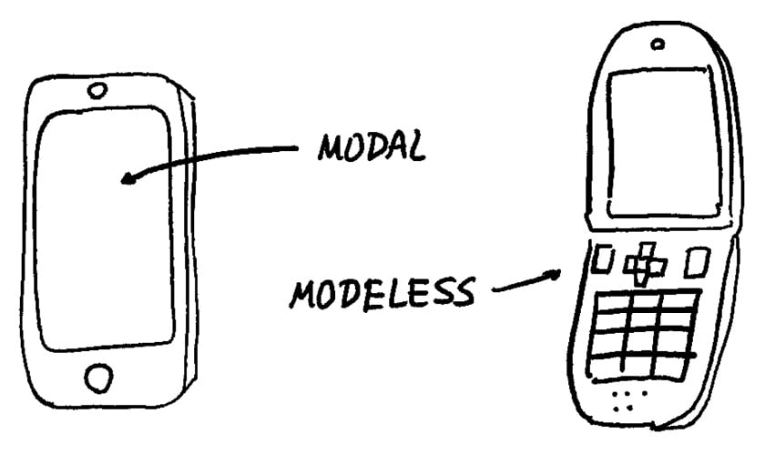
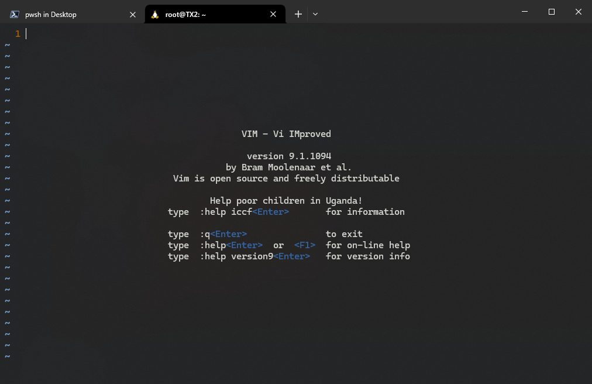
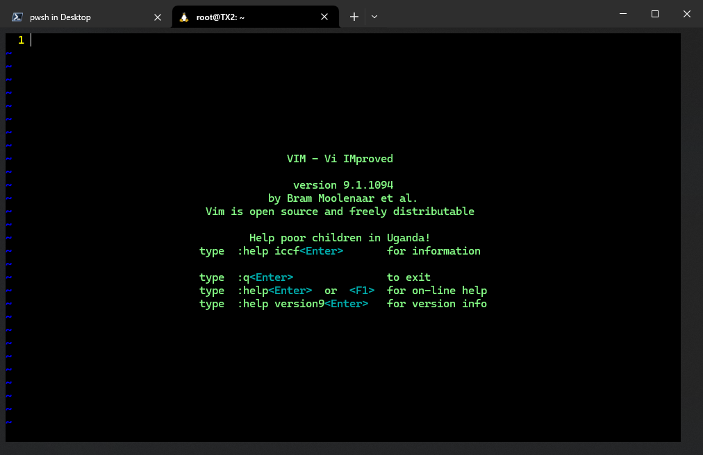
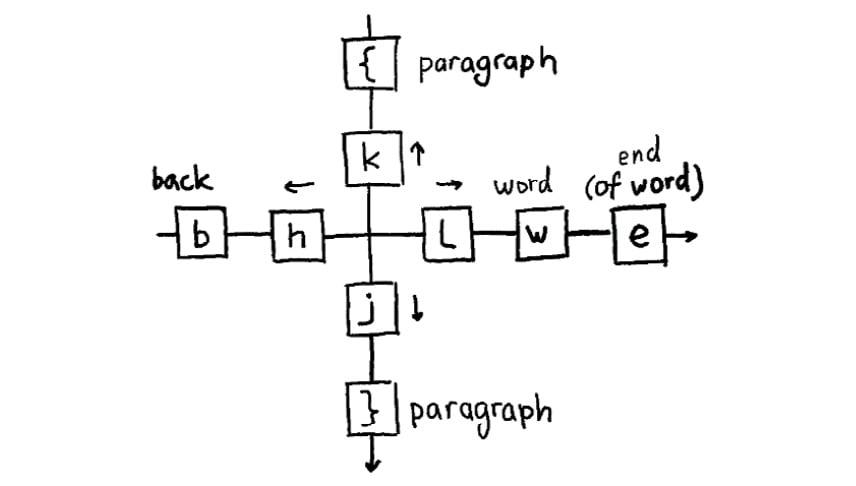
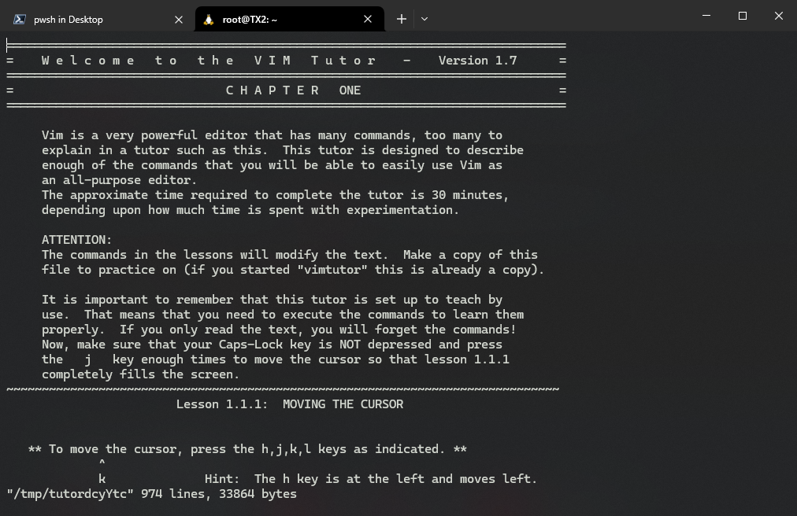

# 第一章 Vim 入门


> **本章概要**
>
> - 主要 `Vim` 版本间的区别
> - 模态与无模态界面，以及 `Vim` 的不同之处
> - `Vim` 的安装与升级
> - `gVim`：`Vim` 的图形界面
> - 配置 `Vim` 的 `Python` 语言支持和编辑配置文件
> - 常见的文件操作：打开、修改、保存和关闭文件
> - 光标的移动：用箭头键、方向键，按单词、段落等进行导航
> - 对文件进行简单编辑，并将编辑命令与移动命令相结合
> - 持久化撤消（undo）历史
> - 查看 `Vim` 内置帮助手册

本章源码：`https://github.com/PacktPublishing/Mastering-Vim-Second-Edition/tree/main/Chapter01`。

由于本章绝大部分知识都在《**Vim Masterclass**》专栏详细介绍过了，这里只梳理与该专栏强调的核心知识不太一样的地方。

---


## 1 Vim 简史


**图 1.1 由 Teletype Corporation 出品的 ASR-33 电传打字机**

20 世纪中叶的出现电传打字机（`teleprinter`）实现了远程收发信息打字。

由于当时只能逐行处理文本，于是出现了基于文本行的编辑工具 `ed`（**Ken Thompson** 开发）以及 `ex`（**Bill Joy** 开发）。

后来有了带显示器的版本，文本编辑工具也随之升级出更强大的功能。

1976 年，**Bill Joy** 推出了 `vi` 编辑器，并实现了多行编辑（此 `vi` 非彼 `vi`：如今的 `vi` 其实是 `Vim` 简化版 `Vim-tiny` 的一个快捷方式（symlink））。

`Vim` 各版本核心功能一览表：

|    主版本     |    年份     | 核心看点                                                     |
| :-----------: | :---------: | ------------------------------------------------------------ |
|     `1.0`     |    1991     | **Bram Moolenaar** 为 `Amiga` 电脑发布 **Vi Imitation**      |
|     `2.0`     |    1993     | 更名为 **Vi Improved** 正式发布                              |
|     `3.0`     |    1994     | 支持多窗口                                                   |
|     `4.0`     |    1996     | 支持图形界面（`GUI`）                                        |
| `5.0` - `5.8` | 1998 - 2001 | 新增语法高亮、脚本（`scripting`）和选择模式（select mode）   |
| `6.0` - `6.4` | 2001 - 2005 | 添加插件支持和 `fold` 折叠                                   |
| `7.0` - `7.4` | 2006 - 2013 | 拼写检查、代码自动补全、`tag` 标签、分支历史和 `undo` 的持久化 |
| `8.0` - `8.2` | 2016 - 2019 | 大量优化、异步 `I/O` 支持、内置终端和弹窗                    |
|     `9.0`     |    2022     | 引入新脚本语言（`Vim9script`）                               |

> [!tip]
>
> 想查看 `Vim 9.0` 的新功能，命令模式下执行：`:help version9` + <kbd>Enter</kbd>


## 2 模态 vs 非模态

主要区别：对上下文语境的识别——

- 支持模态的编辑器：同样的操作随上下文的不同而不同（智能机）；
- 不支持模态的编辑器：各操作一直是静态功能（直板机）。



**图 1.2 模态界面之于非模态界面，就如同智能手机之于大多数传统手机的对比**


## 3 Vim 9 的安装（WSL 版）

这一节讲得很细，各操作系统的 `Vim9` 安装方案都演示了一遍。我只根据本机情况做了实测，实现了在 `WSL Unbuntu v20.04` 环境下将原来的 `v8.1` 版 `Vim` 通过源码编译的方式升级到了最新的 `vim 9.1`。

以下是具体的安装操作：

```bash
$ pwd
/root
# 安装 Unbuntu 构建依赖
$ sudo apt-get install make build-essential libncurses5-dev libncursesw5-dev --fix-missing
# 下载 ncurses 依赖：https://invisible-island.net/ncurses/#download_ncurses
$ cp /mnt/c/Users/ad/Desktop/ncurses.tar.gz .
$ tar -zxvf ncurses.tar.gz
$ cd ncurses-6.3
$ ./configure
$ make
$ sudo make install
# 从 GitHub 下载 Vim 的最新稳定版：https://github.com/vim/vim/tags（vim-9.1.1094.tar.gz）
$ cp /mnt/c/Users/ad/Desktop/vim-9.1.1094.tar.gz .
# 安装过程中一律点确认
$ tar -zxvf vim-9.1.1094.tar.gz
$ cd vim-9.1.1094
$ ./configure --prefix=/usr/local --with-features=huge --enable-python3interp
$ make
$ sudo make install
```

注意：

- `--prefix` 用于指定安装路径；
- `--with-feature` 是限定安装范围（按最完整版本安装）；
- `--enable-python3interp` 是添加对 `Python3` 的语言支持。

安装完毕后，最好重启 `WSL`，并输入 `vim` + <kbd>Enter</kbd> 进行确认：



按照书中给出的一个 `vimrc` 配置更新 `.vimrc` 文件：

```bash
syntax on " Enable syntax highlighting.
filetype plugin indent on " Enable file type based options.
set nocompatible " Don't run in backwards compatible mode.
set autoindent " Respect indentation when starting new line.
set expandtab " Expand tabs to spaces. Essential in Python.
set tabstop=4 " Number of spaces tab is counted for.
set shiftwidth=4 " Number of spaces to use for autoindent.
set backspace=2 " Fix backspace behavior on most terminals.
colorscheme murphy " Change a colorscheme.

" DIY: show line numbers
set number
```

于是得到如下效果（启用 `murphy` 配色方案）：




## 4 创建示例文件

用 `Vim` 创建一个用于演示相关操作的 `Python` 文件 `spam.py`：

```python
#!/usr/bin/python

import random

INGREDIENTS = ['egg', 'sausage', 'bacon', 'ham', 'crumpets', 'spam']

def prepare_menu_item(ingredient, with_spam=True):
    if with_spam:
        return 'spam ' + ingredient
    return ingredient

def main():
    print('Scene: A cafe. A man and his wife enter.')
    print('Man: Well, what\'ve you got?')
    menu = []
    for ingredient in INGREDIENTS:
        has_spam = random.choice([True, False])
        menu.append(prepare_menu_item(ingredient, with_spam=has_spam))
    print('Waitress: Well, there\'s', ', '.join(menu))

if __name__ == '__main__':
    main()

```

然后运行该程序：

```bash
$ python3 spam.py
$ Scene: A cafe. A man and his wife enter.
Man: Well, what've you got?
Waitress: Well, there's spam egg, spam sausage, bacon, ham, spam crumpets, spam
$ 
```


## 5 关于 .swp 交换文件

当 `Vim` 会话非正常关闭或远程服务器突然中断时，未及时保存变更的文件会生成一个 `.swp` 交换（`swap` 的简写）文件，通常格式为 `<filename>.swp` 或 `.<filename>.swp`，并且它们就在目标文件的所在路径下同步产生。

想要自定义 `.swp` 文件存放的路径，可以通过 `directory` 选项实现（注意末尾为两个斜杠符，否则不生效）：

```bash
set directory=%USERDATA%\.vim\swap//
```

若要完全禁用交换文件的生成，则可以在 `.vimrc` 中设置：

```bash
set noswapfile
```


## 6 Vim 光标浏览技巧

主要记住这张示意图就行了：



**图 1.3 Vim 光标浏览核心按键示意图**

和此前专栏最大的不同，是对 `e` 命令和按段落浏览（<kbd>{</kbd> 和 <kbd>}</kbd>）的强调。`e` 即 `end of word` 的缩写，可快速定位到光标所在单词（word）的最后一个字符，与 `b` 命令相互呼应。


## 7 对 undo 与 redo 的持久化相关设置

`Vim` 的 `undo` 历史列表并不是线性的。如果需要记得几天以前的历史操作，持久化设置就显得很有必要了：

```bash
set undofile
```

但是这样会在每个正在编辑的文件旁生成一个 `undo` 文件。此时可以用下列脚本将它们合并到一起：

```bash
" Set up persistent undo across all files.
set undofile
let my_undo_dir = expand('$HOME/.vim/undodir')
if !isdirectory(my_undo_dir))
  call mkdir(my_undo_dir, "p")
endif
set undodir=my_undo_dir
```


## 8 关于 Vim 帮助文档

`Vim` 还内置了一个交互式的入门文档 `vimtutor`，直接在 `Vim` 外运行命令 `vimtutor` + <kbd>Enter</kbd> 即可：



**图 1.4 Vim 自带的交互式入门文档界面**