# 第二章 Vim 编辑与浏览高级技巧


> **本章概要**
>
> - `Vim` 插件的快速简易安装方法（第 3 章详述）；
> - 多文件或长文本语境下 `Vim` 缓冲区、窗口、标签和折叠功能的应用；
> - 利用 `Netrw`、`NERDTree`、`Vinegar`、`CtrlP` 等插件实现在 `Vim` 内部浏览复杂文件结构树；
> - 涵盖各类文本对象的文件高级导航技巧，以及利用 `grep` 和 `ack` 工具实现跨文件检索技巧，以及 `EasyMotion` 插件的用法；
> - 利用寄存器进行复制和粘贴操作

本章内容依然略显杂乱，提到的 `Vim` 知识点几乎涵盖了我在《**Vim Masterclass**》专栏介绍过的所有高级话题。先撇开叙述的结构化和条理性不谈，这让我对后续需要真正 “精通” 的内容充满期待。这篇笔记依然会延续上一章的行文风格，对基础专栏讲过的内容一概从简，仅梳理本书独有的、或此前专栏着墨不多的新内容。

为方便查阅，以下是本章涉及的《**Vim Masterclass**》专栏对应的文章位置（强烈推荐从这里夯实基础）：

- [【Vim Masterclass 笔记06】S05L18 寄存器的用法](https://blog.csdn.net/frgod/article/details/144911544)
- [【Vim Masterclass 笔记09】S06L22：Vim 文本的搜索、查找与替换操作](https://blog.csdn.net/frgod/article/details/145066785)
- [【Vim Masterclass 笔记10】S06L23：Vim 文本的搜索、查找与替换操作](https://blog.csdn.net/frgod/article/details/145095539)
- [【Vim Masterclass 笔记13】S07L28：Vim 文本对象](https://blog.csdn.net/frgod/article/details/145136033)
- [【Vim Masterclass 笔记23】第十章：Vim 缓冲区与多窗口的用法概述 + S10L42：Vim 缓冲区的用法详解与多文件编辑](https://blog.csdn.net/frgod/article/details/145271525)
- [【Vim Masterclass 笔记25】S10L45：Vim 多窗口的常用操作方法及相关注意事项](https://blog.csdn.net/frgod/article/details/145291107)
- [【Vim Masterclass 笔记26】S11L46：Vim 插件的安装、使用与日常管理](https://blog.csdn.net/frgod/article/details/145313538)


---

本章源码：`https://github.com/PacktPublishing/Mastering-Vim-Second-Edition/tree/main/Chapter02`。


## 1 Vim 插件的快速安装

为方便后续介绍，本章所有插件都默认安装到了 `~/.vim/pack/plugins/start/` 目录下，并且都是通过复制 `GitHub` 代码仓库实现安装的。但是作者跳过了很多关键细节，比如为什么要在 `~/.vim/` 下创建文件夹等。这里略作补充。

先通过 `Vim` 的 `:set packpath?` 命令找到 `Vim` 插件的默认根路径，确认为 `~/.vim`：

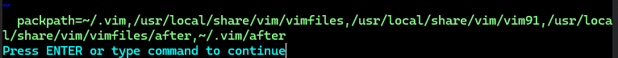

然后按插件自动生效的方式，创建包名为 `plugins` 的实际存放路径，并完成相应插件的安装：

```bash
mkdir -p ~/.vim/pack/plugins/start
cd ~/.vim/pack/plugins/start
git clone https://github.com/your/plugin/url
```

本章会用到的插件 `GitHub` 仓库地址如下：

- `Unimpaired`：[https://github.com/tpope/vim-unimpaired](https://github.com/tpope/vim-unimpaired)；
- `NERDTree`：[https://github.com/scrooloose/nerdtree](https://github.com/scrooloose/nerdtree)；
- `Vinegar`：[https://github.com/tpope/vim-vinegar](https://github.com/tpope/vim-vinegar)；
- `CtrlP`：[https://github.com/ctrlpvim/ctrlp.vim](https://github.com/ctrlpvim/ctrlp.vim)；
- `ack.vim`：[https://github.com/mileszs/ack.vim](https://github.com/mileszs/ack.vim)；
- `EasyMotion`：[https://github.com/easymotion/vim-easymotion](https://github.com/easymotion/vim-easymotion)。

注意：这样安装的插件不会自动加载其文档到 `Vim` 帮助系统，必须手动执行 `:helptags /your/plugin/doc/path` 或者 `:helpt ALL`。为此，可以在 `vimrc` 文件添加如下命令，实现每次启动 `Vim` 强制加载插件文档 [^1]：

```bash
autocmd VimEnter * silent! helptags ALL " Load help files for all plugins
```

> [!tip]
>
> 更多插件管理详情，请参考我的《**Vim Masterclass**》[第 26 篇笔记：Vim 插件的安装、使用与日常管理](https://blog.csdn.net/frgod/article/details/145313538)。


## 2 Vim 处理多个文件的方式

主要有四种方式：

- `Buffers`：即缓冲区（详见《**Vim Masterclass**》[第 23 篇笔记](https://blog.csdn.net/frgod/article/details/145271525)）
- `Windows`：即多窗口操作（详见《**Vim Masterclass**》[第 25 篇笔记](https://blog.csdn.net/frgod/article/details/145291107)）
- `Tabs`：标签页操作（新增）
- `Folds`：编辑区折叠（新增）

如下图所示：

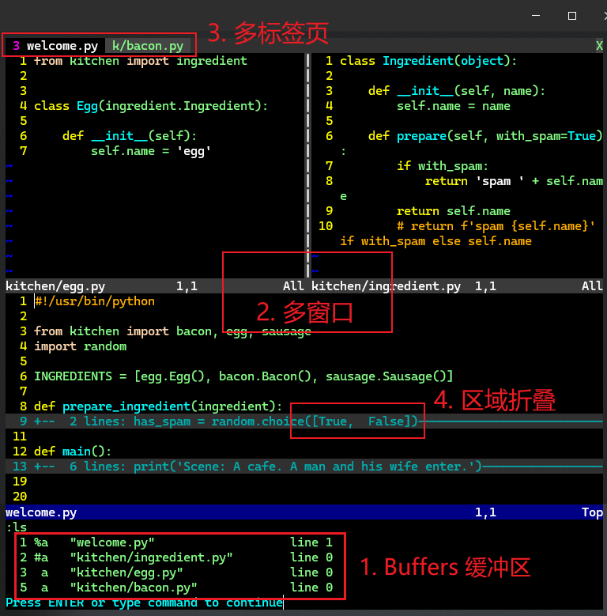

**图 2.1 Vim 处理多个文件的方式：Buffers 缓冲区（未专门展示）、Windows**

### 2.1 Buffers 缓冲区

介绍缓冲区常规操作时提到了一个叫 `unimpaired` 的插件（详见 [GitHub 仓库](https://github.com/tpope/vim-unimpaired)）。该插件通过设置一系列方便实用的组合键提升编辑效率：

- `]b` 与 `[b`：取代 `:bn` 和 `:bp` 来浏览缓冲区；
- `]f` 与 `[f`：顺、逆序浏览当前缓冲区同级目录下的不同文件；
- `]l` 与 `[l`：顺、逆序浏览位置列表（`location list`，第 5 章详述）；
- `]q` 与 `[q`：顺、逆序浏览快速修复列表（`quickfix list`，第 5 章详述）；
- `]t` 与 `[t`：顺、逆序浏览各标签页（第 4 章详述）。

更多用法参考插件文档（`:help unimpaired`）。


### 2.2 Windows 窗口

<kbd>Ctrl</kbd> + <kbd>X</kbd>：将当前窗口与下一个窗口进行位置互换。

调整窗口大小的命令：

- 高度增加 `N` 行：`:resize +N` + <kbd>Enter</kbd>
- 高度减少 `N` 行：`:resize -N` + <kbd>Enter</kbd>
- 宽度增加 `N` 列：`:vertical resize +N` + <kbd>Enter</kbd>
- 宽度减少 `N` 列：`:vertical resize -N` + <kbd>Enter</kbd>

简写形式：

- `:res` 等价于 `:resize`
- `:vert res` 等价于 `:vertical resize`

类似用法还可以迁移到窗口切分上：`:vertical split` 等效于 `:vert sp` 等效于 `:vs`


### 2.3  Tabs 标签

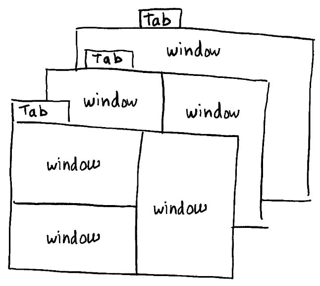

**图 2.2 Vim 中的多标签页示意图**

基本操作：

- 新增标签页：`:tabnew`
- 切到下一个标签页：`gt` 或 `:tabnext` 或 `:tabn`
- 切回上一个标签页：`gT` 或 `:tabprevious` 或 `:tabp`
- 转到第一个标签页：`:tabfirst`
- 转到最后一个标签页：`:tablast`
- 移动当前标签到顺数第 `N` 个位置：`:tabmove N` 或 `:tabm N`
- 在新标签中打开文件 `file_name`：`:tabe path/to/file_name`（或 `:tabedit`）


### 2.4 Folds 折叠

控制内容折叠的 `Vim` 选项为 `foldmethod`，默认值为 `manual`，表示手动管理折叠区域。常见操作有：

- **创建折叠**：
  - `zf`：创建折叠。例如，选中一段文本后按 `zf`，会将选中的文本折叠。
  - `zF`：在指定行数范围内创建折叠。例如，`10zF20` 会将第 10 行到第 20 行折叠。
- **打开折叠**：
  - `zo`：打开当前光标下的折叠。
  - `zO`：递归打开当前光标下的所有折叠。
- **关闭折叠**：
  - `zc`：关闭当前光标下的折叠。
  - `zC`：递归关闭当前光标下的所有折叠。
- **切换折叠状态**：
  - `za`：切换当前光标下的折叠状态（打开或关闭）。
- **删除折叠**：
  - `zd`：删除当前光标下的折叠。

设置 `Python` 文件自动根据代码缩进进行折叠（写到 `.vimrc` 文件，重启 `Vim` 生效）：

```bash
" Fold python code lines based on indentations
autocmd filetype python set foldmethod=indent
```


#### Folds 的可视化效果设置

执行命令 `:set foldcolumn=N`（其中 `N` 为 0 到 12 之间的数字），`Vim` 将在左侧开辟一个宽度为 `N` 列字符距离的可视化区域：

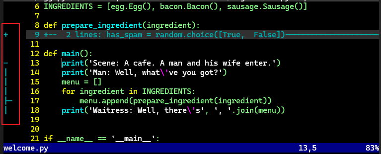

**图 2.3 设置宽度为 5 的 Folds 可视化区域效果图**

> [!tip]
>
> **设置首次打开文件是自动展开所有折叠区域**
>
> 对 `.vimrc` 文件作如下设置：
>
> ```bash
> " Mave all of the folds open when opening a new file
> autocmd BufRead * normal zR
> ```
>
> 或者利用 `foldlevelstart` 选项，设置默认展开的最大层数（例如 5 层）：
>
> ```bash
> set foldlevelstart=5
> ```


`foldmethod` 选项的常用取值：

- `manual`：默认值；
- `indent`：按缩进折叠；
- `expr`：基于自定义表达式来折叠，支持 `Vimscript` 语法；
- `marker`：基于特定的标记（marker）来定义折叠区域，默认为 `{{{` + `}}}`，适用于较长的 `.vimrc` 文件；
- `syntax`：基于语法高亮规则来折叠代码，但并非每种语言都自动支持（例如 `Python` 就不支持）；
- `diff`：当 `Vim` 处于 `diff` 模式时自动生效（第 5 章详述）

由于书中并未展开，很多知识都在后面章节详述，这里仅举一例（`marker`）：

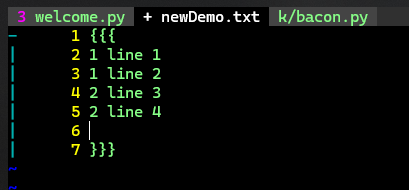

**图 2.4 foldmethod=marker 时的折叠实测效果**

此外，也可以基于某种文件类型单独生效某种折叠方式，语法格式为：

```markdown
autocmd filetype <filetype> set foldmethod=<method>
```


## 3 文件树形结构导航技巧

主要介绍了五种树形导航技巧：

- 内置 `Netrw` 插件
- `:e` + `wildmenu` 选项
- 第三方 `NERDTree` 插件
- 第三方 `Vinegar` 插件
- 第三方 `CtrlP` 插件


### 3.1 内置的 Netrw 插件

`Netrw` 读作 `/net-R-W/`，即 `Network Read Write` 的缩写，由 Vim 社区大神 **Tim Pope** 贡献，旨在为 `Vim` 提供内置的文件浏览特性，让用户可以更轻松地浏览目录和管理文件，并且支持远程浏览。这是一款 **非常容易上瘾** 的隐藏了诸多强大功能的极致插件（详见 [郑征大神的 Netrw 专题分享](https://blog.csdn.net/somenzz/article/details/120735538)）。

打开方式：

1. `vim .` + <kbd>Enter</kbd>
2. `:E` + <kbd>Enter</kbd>；
3. `:e .` + <kbd>Enter</kbd>；
4. 以垂直分割窗口打开：`:Vex` + <kbd>Enter</kbd>；
5. 以水平分割窗口打开：`:Sex` + <kbd>Enter</kbd>；
6. 以靠左侧边栏形式打开：`:Lex` + <kbd>Enter</kbd>；

初始界面：

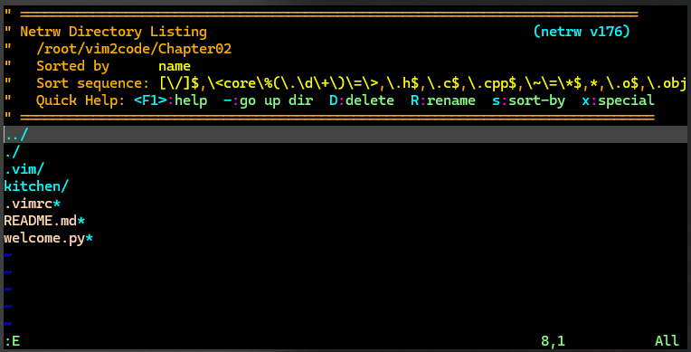

**图 2.5 Vim 内置插件 Netrw 界面效果截图**


【`Netrw` 的远程浏览】：

- 通过 `SFTP` 协议访问某远程文件夹：`:Ex sftp://<domain>/<directory>/`
- 通过 `SCP` 协议打开某远程文件：`:e scp://<domain>/<directory>/<file>`


> [!tip]
>
> **Netrw 实用小技巧补充**
>
> 这里仅补充几个实用技巧（按 <kbd>F1</kbd> 查看详细文档）：
>
> - 新增文件：`%`，然后按要求输入文件名即可；
> - 新增文件夹：`d`，然后按要求输入文件夹名称即可；
> - 快速切换到当前用户主目录下：`~`；
> - 隐藏或显示顶部提示栏：`I`
> - 切换文件列表视图：按 `i` 依次轮换 ——
>   - 简约视图（`thin`，亦即默认视图，如图 2.5 所示）
>   - 详细视图（`long`，）
>   - 平铺视图（`wide`）
>   - 目录树视图（`tree`）
>
> 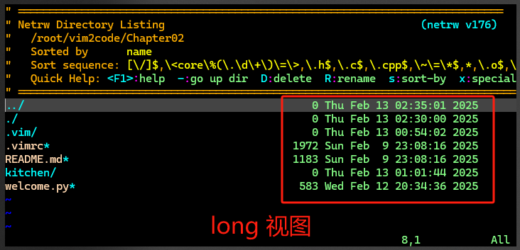
>
> **补图 1：Netrw 的 long 详细视图**
>
> 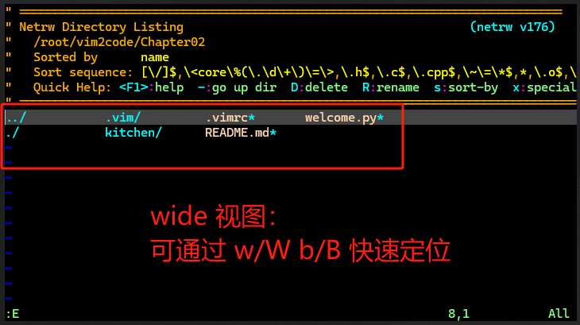
>
> **补图 2：Netrw 的 wide 平铺视图**
>
> 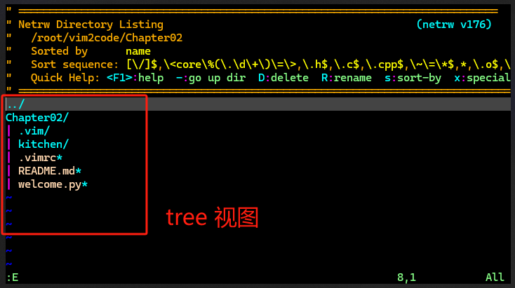
>
> **补图 3：Netrw 的 tree 目录树视图**
>
> 值得一提的是，**Tim Pope** 对目录树视图似乎情有独钟，插件文档里还专门列出了目录树视图的示例操作流程（最佳实践）：
>
> 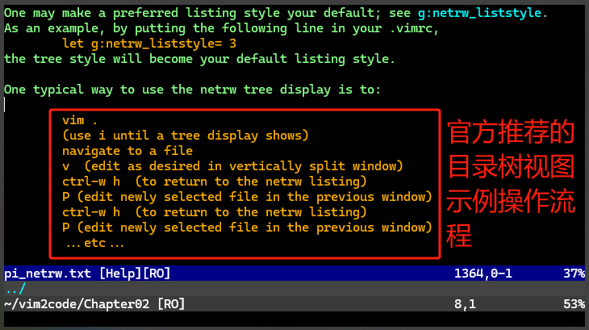
>
> 翻译过来就是：
>
> ```markdown
> vim .
> （用 i 切到目录树视图）
> 导航到目标文件
> v（在垂直分割窗口中编辑目标文件内容）
> ctrl-w h（切回 netrw 文件列表）
> P（在上一个窗口中编辑刚才选中的文件）
> ctrl-w h（切回 netrw 文件列表）
> P（在上一个窗口中编辑刚才选中的文件）
> ...以此类推...
> ```


### 3.2 :e + wildmenu 选项

利用 `:e` 和 `wildmenu` 选项的组合，也可以快速浏览文件。如图所示（执行命令 `:e` + <kbd>Space</kbd> + <kbd>Tab</kbd>）：

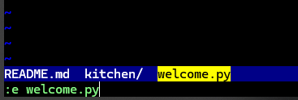

**图 2.6 利用 :e + wildmenu 快速浏览文件目录**

除了用 <kbd>Tab</kbd> 键切换候选项外，还可以在文件夹上通过方向键 <kbd>↓</kbd>（下钻）<kbd>↑</kbd>（返回上一层）打破当前路径限制，实现其他位置文件列表的快速浏览。

> [!tip]
>
> **Vim 9 新增的 wildmenu 垂直弹窗特性**
>
> 新版 `Vim 9` 还为 `wildmenu` 提供了垂直弹窗功能，通过命令 `set wildoptions=pum` + <kbd>Enter</kbd> 即可开启，体验感爆棚：
>
> 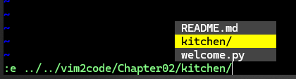
>
> **图 2.7 Vim9 提供的垂直弹窗形式的 wildmenu 实测效果图**


### 3.3 NERDTree 插件

`GitHub` 安装地址：[https://github.com/scrooloose/nerdtree](https://github.com/scrooloose/nerdtree)

打开命令：`:NERDTree` + <kbd>Enter</kbd>

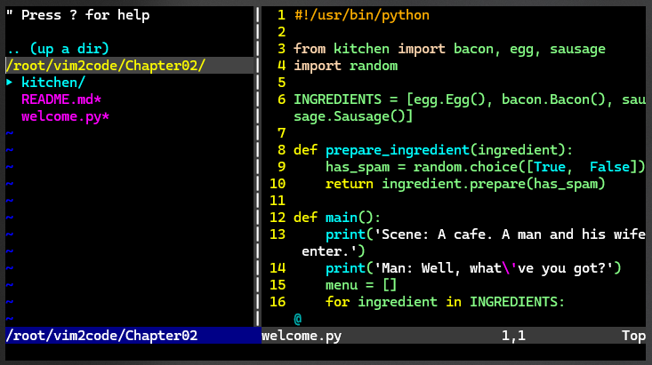

**图 2.8 NERDTree 实测界面效果图**

将光标所在条目设置为 `NERDTree` 书签：`:Bookmark` + <kbd>Enter</kbd>

标注的书签都存放在 `NERDTree` 的收藏夹中，通过大写的 `B` 命令控制其显示与隐藏：

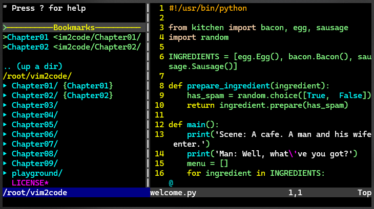

**图 2.9 NERDTree 书签与收藏夹功能实测效果图**

`NERDTree` 收藏夹默认是隐藏的，可手动配置自动开启：

```bash
let NERDTreeShowBookmarks=1 " Display bookmarks on startup.
```

设置启动 `Vim` 自动显示 `NERDTree` 侧边栏：

```bash
autocmd VimEnter * NERDTree " Enable NERDTree on Vim startup.
```

当 `NERDTree` 变为最后一个开启的窗口时，默认不会自动关闭，通过在 `vimrc` 文件中配置下列内容可实现默认自动关闭：

```bash
" Autoclose NERDTree if it's the only open window left.
autocmd BufEnter * if (winnr("$") == 1 && exists("b:NERDTree") && b:NERDTree.isTabTree()) | q | endif
```


### 3.4 Vinegar 插件

`Vinegar` 插件也是 **Tim Pope** 的杰作（详见 [GitHub 仓库](https://github.com/tpope/vim-vinegar)），主要是为了解决 `NERDTree` 插件在复杂多窗口环境下操作困难的问题。例如，在下列环境中如果再打开一个文件，将很难一眼看出会在哪个窗口中加载目标内容：

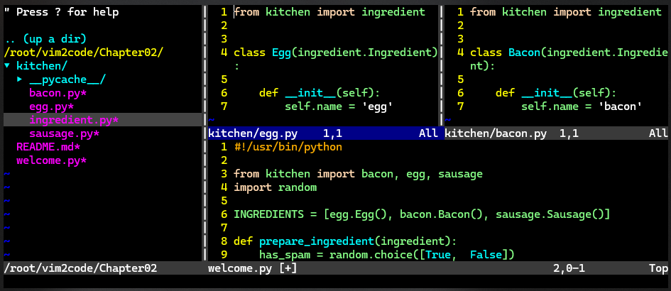

**图 2.10 NERDTree 在复杂多窗口环境下编辑文件存在的问题**

按照上述截图的实际情况，最终 `ingredient.py` 文件将出现在加载 `egg.py` 文件的窗口中，因为 `NERDTree` 会在 **最后创建的窗口中** 打开下一个目标文件。

`Vinegar` 实现了在当前活动窗口加载目标文件的问题，并且通过 `-` 命令让文件列表就在当前窗口中渲染 `Netrw` 界面，选中文件也在当前窗口加载，操作十分丝滑。

但是如果已经安装了 `NERDTree`，再使用 `-` 时默认会出现 `NERDTree` 的界面。这需要在 `vimrc` 文件中设置以下内容进行修复：

```bash
" Avoid NERDTree replaces Netrw
let NERDTreeHijackNetrw=0
packloadall
```

这样，想在哪个窗口加载文件内容，就能在哪儿调出 `Netrw` 界面，十分方便：

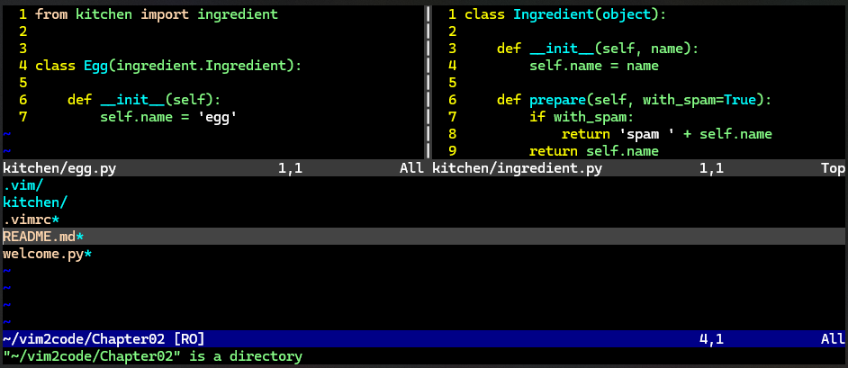

**图 2.11 修复 NERDTree 劫持 Netrw 后的编辑界面效果图（拟在底部窗口加载目标文件）**


### 3.5 CtrlP 插件

`CtrlP` 插件（详见 [GitHub 仓库](https://github.com/ctrlpvim/ctrlp.vim)）非常适合跨文件的浏览与访问，并且支持文件名的模糊查找。启动命令：<kbd>Ctrl</kbd> + <kbd>P</kbd>。

其他常见操作：

- <kbd>Ctrl</kbd> + <kbd>J</kbd>：令光标在 `CtrlP` 的候选列表中上移一项；
- <kbd>Ctrl</kbd> + <kbd>K</kbd>：令光标在 `CtrlP` 的候选列表中下移一项；
- <kbd>Enter</kbd>：打开当前光标所在的文件；
- <kbd>Esc</kbd>：关闭 `CtrlP`；
- <kbd>Ctrl</kbd> + <kbd>F</kbd>：候选列表下翻一页；
- <kbd>Ctrl</kbd> + <kbd>B</kbd>：候选列表上翻一页；

此外，`CtrlP` 还支持直接查看缓冲区列表（`:CtrlPBuffer`）以及最近修改过的文件列表（`:CtrlPMRU`）以及两者混合列表（`:CtrlPMixed`）。例如通过 `:CtrlPBuffer` 命令限定缓冲区列表：

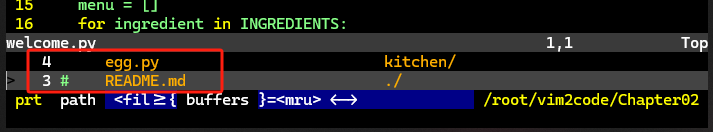

**图 2.12 利用 CtrlPBuffer 命令限定 CtrlP 只展示缓冲区列表**

也可以将其映射为一个定制的快捷键组合：

```bash
nnoremap <C-b> :CtrlPBuffer<cr> " Map CtrlP buffer mode to Ctrl + b.
```


## 4 文件内的高级导航技巧

主要记住这张图：

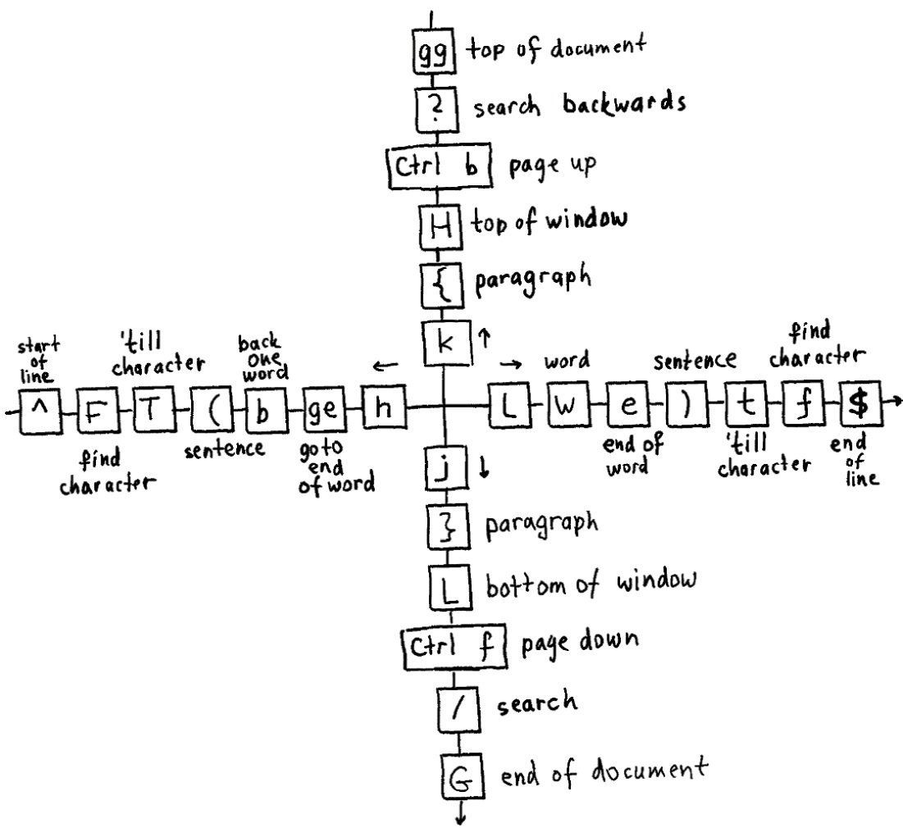

**图 2.13 Ted Naleid 总结的文件内导航按键一览表**

其中值得一提的有：

- `ge`：光标移至前一个单词（word）的末尾（`gE` 则对应 WORD）；
- `{` 和 `}`：快速定位当前段落的段首和段尾；
- `(` 和 `)`：快速定位到当前句子的句首和句尾；
- `H` / `M` / `L`：光标快速定位到当前页面的顶部、正中、底部；
- `t` / `f` 检索技巧：详见《**Vim Masterclass**》[第 9 篇](https://blog.csdn.net/frgod/article/details/145066785)、[第 10 篇笔记](https://blog.csdn.net/frgod/article/details/145095539)；
- `:noh`：完整写法 `:nohlsearch`，用于清除跨行检索某关键字后 **残留的高亮显示样式**。


关于插入模式的常用按键，记住这个图：

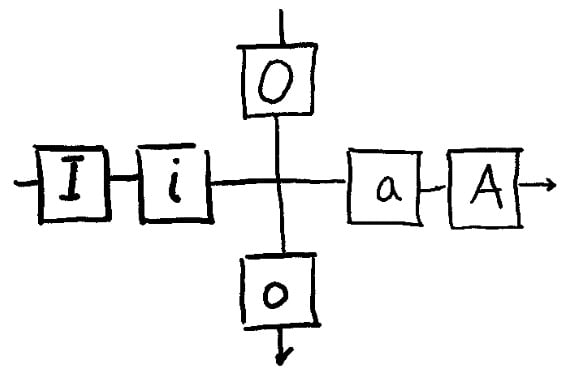

**图 2.14 Vim 插入模式的按键汇总**

补充几个重要按键：

- `gi`：快速定位并重新进入上一次插入内容的地方；
- `[count]s`：删除 `[count]` 个或单个字符（前缀为数字可删除多个字符），然后进入插入模式；
- `S` 或 `cc`：快速删除当前行内容并进入插入模式，且保留当前行缩进部分；


## 5 跨文件搜索技巧

### 5.1 系统工具 grep

熟悉 `grep` 命令的可以直接用 `grep`。例如搜索当前路径下所有包含 `ingredient` 的 `Python` 源文件：

```bash
grep -r "ingredient" . --include="*.py"
```

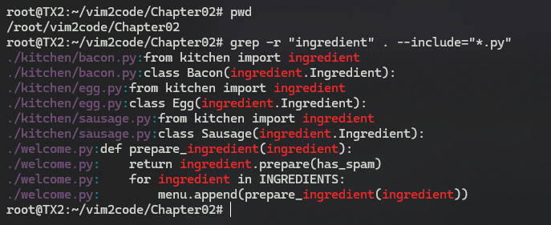

**图 2.15 使用系统内置 grep 命令进行文件内容检索**


### 5.2 vimgrep 命令

如果对 `grep` 不熟，也可换用 `:vimgrep`，语法格式为：

```markdown
:vimgrep <pattern> <path>
```

其中，`pattern` 既可以是一个字符串，也可以是一个基于 `Vim` 的正则表达式。路径 `path` 支持通配符检索，例如 `**` 表示递归检索，`**/*.py` 可限定文件类型等。

在 `Vim` 中实现同等检索效果，需执行命令：`:vimgrep ingredient **/*.py` + <kbd>Enter</kbd>

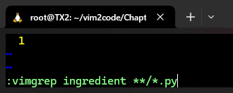

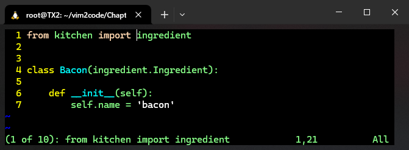

**图 2.16 在 Vim 中利用 vimgrep 实现跨文件检索实测效果图**

关于 `vimgrep` 检索的常见操作：

- `:cn`：定位到下一个匹配项，未在当前文件则自动加载对应的文件；
- `:cp`：定位到上一个匹配项，未在当前文件则自动加载对应的文件；
- `:copen`：以 `quickfix` 窗口形式显示所有匹配结果（如下图所示）；并可通过 <kbd>J</kbd> <kbd>K</kbd> 键完成上下浏览，<kbd>Enter</kbd> 键打开选中的匹配项；

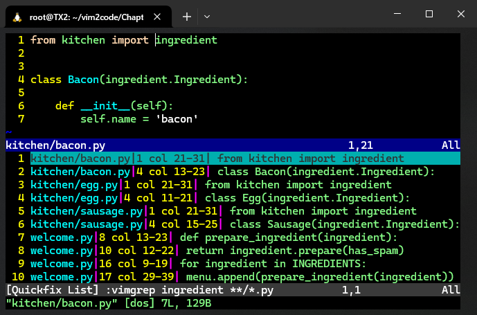

**图 2.17 利用 :copen 命令查看所有匹配结果**


### 5.3 系统工具 ack

`ack` 工具针对代码库检索进行了专门优化，非常适合进行源代码检索。安装命令：

```bash
$ sudo apt install ack-grep
```

搜索当前路径下所有包含 `ingredient` 的 `Python` 源文件：

```bash
ack --python ingredient
```

实测结果：

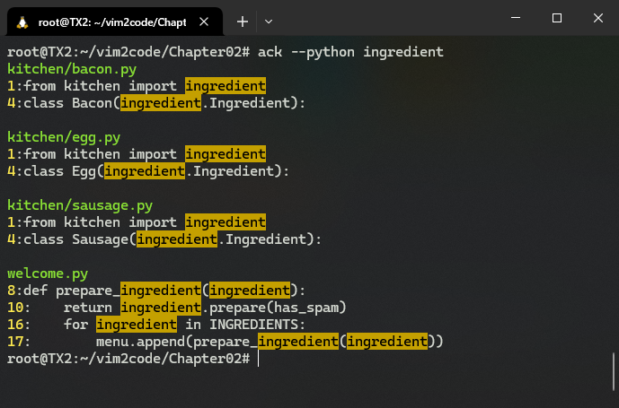

**图 2.18 利用 ack 系统工具检索效果图**

更多安装配置，详见官网：[https://beyondgrep.com/install](https://beyondgrep.com/install)。


### 5.4 Vim 的 ack 插件

`Vim` 的 `ack` 插件将系统 `ack` 的检索结果集成到了 `quickfix` 窗口中，使用体验更加流畅。

安装地址：[https://github.com/mileszs/ack.vim](https://github.com/mileszs/ack.vim)

使用方法也很简单，只需要将系统命令改为 `Vim` 版：

```bash
:Ack --python ingredient
```

实测结果如下：

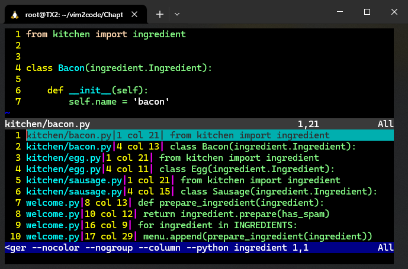

**图 2.19 实测 Vim 的 ack 插件检索效果截图**

有了该插件，无需运行 `:copen` 命令即可显示 `quickfix` 窗口。


### 5.5 文本对象使用技巧

`Vim` 中的文本对象即：单词（`w`）、句子（`s`）、段落（`p`）、标签（`t`）、各种引号与括号（<kbd>`</kbd>、<kbd>'</kbd>、<kbd>"</kbd>、<kbd>)</kbd>、<kbd>]</kbd>、<kbd>}</kbd>）。

具体用法详见《**Vim Masterclass**》专栏 [第 13 篇笔记](https://blog.csdn.net/frgod/article/details/145136033)。


### 5.6 EasyMotion 插件

安装地址：[https://github.com/easymotion/vim-easymotion](https://github.com/easymotion/vim-easymotion)

该插件极大地拓宽了原生 `Vim` 的光标定位操作，可以在极短时间内精确定位到页面上的指定位置。

使用方法：`\\` + `{motion}`

其中 `\\` 为两次重复的 `Leader` 键，默认为 <kbd>\\</kbd> 键，实测效果如下：

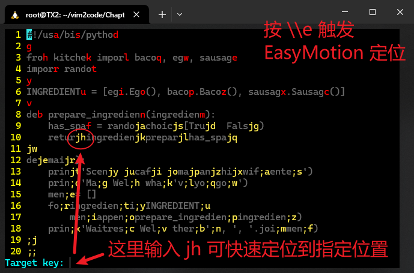

**图 2.20 实测 EasyMotion 插件的导航定位功能界面效果**

具体用法详见《**Vim Masterclass**》[第 26 篇笔记](https://blog.csdn.net/frgod/article/details/145313538)。

也可以直接参考 `EasyMotion` 插件文档：`:help easymotion` + <kbd>Enter</kbd>


## 6 寄存器的用法

书中所有知识点都可以参考《**Vim Masterclass**》专栏 [第 6 篇笔记](https://blog.csdn.net/frgod/article/details/144911544)。


> **后记**
>
> 本章知识点十分庞杂，是后续进阶高级话题的必备基础。书中提到的每个第三方插件都值得认真深挖，配合官方提供的插件文档与 `DeepSeek` 智能助手，可实现快速突破。如果基础没有打牢，不建议继续往下学。

---

[^1]: 原书提供的初始配置命令 `silent! helptags ALL` 并不生效。后求助 `DeepSeek` 进行改进，方才实现既定目标。

