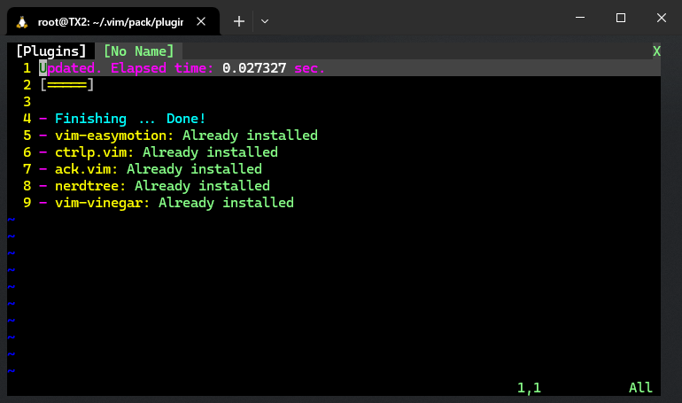
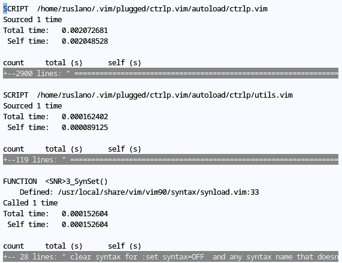
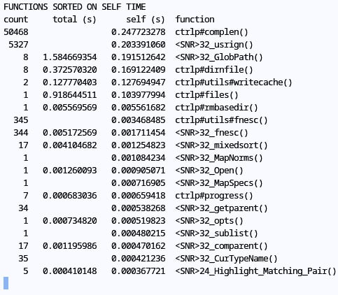
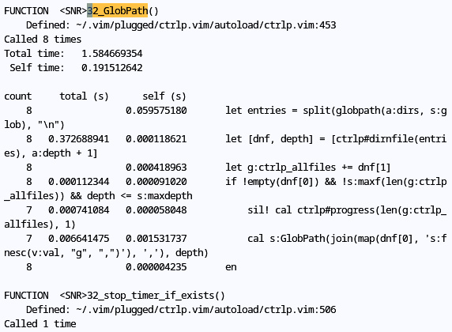
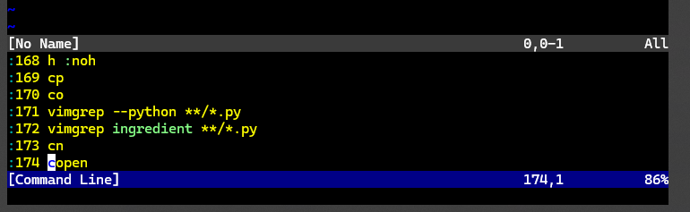

# 第三章 追随最佳实践：插件管理之道


> **本章概要**
>
> - `vim-plug`、`Vundle`、`Pathogen` 或 `Vim` 原生的 `package` 包在插件管理中的应用；
> - 剖析插件运行缓慢的方法；
> - `Vim` 的主要模式（modes）；
> - 探究重新映射命令的细节；
> - 引导键及其在各类自定义快捷键中的用途；
> - 插件配置和定制。

本章聚焦 `Vim` 插件管理，探讨了很多实用的管理技巧。

---

本章源码：[https://github.com/PacktPublishing/Mastering-Vim-Second-Edition/tree/main/Chapter03](https://github.com/PacktPublishing/Mastering-Vim-Second-Edition/tree/main/Chapter03)


## 1 插件的管理

`Vim` 插件数量很多，安装到本地后需要统一管理。目前最流行的管理工具首推 `vim-plug`（[https://github.com/junegunn/vim-plug](https://github.com/junegunn/vim-plug)）。

先删除上一章手动安装的所有插件，然后按下列方法操作，利用 `vim-plug` 工具实现一键安装、统一管理：

```bash
# 1. 删除本地手动安装的插件
$ pwd
/root/.vim/pack/plugins/start
$ rm -rf *
# 2. 修改 vimrc 文件
$ vim ~/.vimrc
```

在 `.vimrc` 文件中加入以下内容：

```bash
" Manage plugins with vim-plug.
call plug#begin()

Plug 'scrooloose/nerdtree'
Plug 'tpope/vim-vinegar'
Plug 'ctrlpvim/ctrlp.vim'
Plug 'mileszs/ack.vim'
Plug 'easymotion/vim-easymotion'

call plug#end()
```

然后下载 `vim-plug` 工具文件：

```bash
curl -fLo ~/.vim/autoload/plug.vim --create-dirs https://raw.github.com/junegunn/vim-plug/master/plug.vim
```

最后打开 `Vim`，并执行命令 `:PlugInsatll` + <kbd>Enter</kbd>：



**图 3.1 使用 vim-plug 工具批量安装 Vim 插件实测效果图**

注意：

1. 配置到 `Plug` 后面的字符串，都是该插件 `GitHub` 仓库的 `<username>/<repository>` 部分；
2. 统一安装：`:PlugInstall` + <kbd>Enter</kbd>；
3. 统一更新：`:PlugUpdate` + <kbd>Enter</kbd>；
4. 统一删除：`:PlugClean` + <kbd>Enter</kbd>；
5. 升级 `vim-plug` 本身：`:PlugUpgrade` + <kbd>Enter</kbd>；

此外，还可以针对不同的插件做一些个性化的定制，例如：

```bash
" 1. load NERDTree when the :NERDTreeToggle command is called
Plug 'scrooloose/nerdtree', { 'on': 'NERDTreeToggle' }
" 2. load goyo only for markdown
Plug 'junegunn/goyo.vim', { 'for': 'markdown' }
```

更多配置参数，详见其 `GitHub` [官方文档](https://github.com/junegunn/vim-plug)。

如果需要迁移 `vimrc` 文件，下列代码可以实现在新设备上自动安装相应的 `Vim` 插件：

```bash
" Download and install vim-plug (Linux, Mac, and Windows).
if empty(glob(
    \ '$HOME/' . (has('win32') ? 'vimfiles' : '.vim') .
      \ '/autoload/plug.vim'))
  execute '!curl -fLo ' .
    \ (has('win32') ? '\%USERPROFILE\%/vimfiles' : '$HOME/.vim') .
    \ '/autoload/plug.vim --create-dirs ' .
    \ 'https://raw.githubusercontent.com/junegunn/vim-plug/master/plug.vim'
  autocmd VimEnter * PlugInstall --sync | source $MYVIMRC
endif
```


## 2 插件的手动加载

方法：将插件手动安装到 `{packpath}/pack/<package_name>/opt/` 路径下，并执行命令 `:packadd <plugin_name>` 手动激活。

具体详见我的《**Vim Masterclass**》[第 26 篇自学笔记](https://blog.csdn.net/frgod/article/details/145313538)。


## 3 packadd 命令的懒加载设置

可仿照下列形式在 `vimrc` 文件中进行懒加载配置：

```bash
" Load and run ack.vim plugin on :Ack command.
command! -nargs=* Ack :packadd ack.vim | Ack <f-args>
" Load an run Goyo plugin when opening Markdown files.
autocmd! filetype markdown packadd goyo.vim | Goyo
```


## 4 利用 Git 子模块更新插件

以 `NERDTree` 插件为例：

```bash
# 1. 初始化 Git 仓库
$ cd ~/.vim
$ git init
# 2. 将目标插件作为 Git 子模块引入
$ git submodule add https://github.com/scrooloose/nerdtree.git pack/plugins/start/nerdtree
$ git commit -am "Add NERDTree plugin"
```

需要更新插件时，执行 `Git` 命令：

```bash
$ git submodule update --recursive
$ git commit -am "Update plugins"
```

插件的删除使用：

```bash
$ git submodule deinit -f -- pack/plugins/start/nerdtree
$ rm -rf .git/modules/pack/plugins/start/nerdtree
$ git rm -f pack/plugins/start/nerdtree
```


## 5 其他插件管理工具简介

主要提到两种：

- `Vundle`：`vim-plug` 的前身，但没有 `vim-plug` 轻量。最大的不同在于提供了 `:PluginSearch` 命令，可在 `Vim` 中检索并试用需要的插件，但该特性自 2019 年就停止维护了，至今仍未恢复。具体详见 [GitHub 仓库](https://github.com/VundleVim/Vundle.vim)；
- `Pathogen`：本质是一个 `runtimepath` 管理工具，不是专门的插件管理器。`runtimepath` 自 `Vim 8.0` 后式微，新用户已经很少了。具体详见 [GitHub 仓库](https://github.com/tpope/vim-pathogen)；


## 6 插件运行慢的原因剖析

`Vim` 支持性能参数日志记录，可以通过分析日志文件找出运行缓慢的原因。语法格式如下：

```bash
$ vim --startuptime startuptime.log
# 或者
$ gvim --startuptime startuptime.log
```

然后正常操作 `Vim` 一段时间，关闭后查看日志文件 `startuptime.log` 即可。

书中以 `Python` 的 `GitHub` 仓库为例，通过 `CtrlP` 插件给源码库建立索引来模拟影响性能的因素，演示了性能日志的创建及分析过程。

复制 `Python` 库到本地后，进入该项目目录；然后正常启动 `Vim`，并执行下列命令：

```bash
:profile start profile.log
:profile func *
:profile file *
```

接着按 <kbd>Ctrl</kbd> + <kbd>P</kbd> 命令触发 `CtrlP` 插件创建索引，然后退出 `Vim`，打开日志文件 `profile.log`（最后提前开启按缩进折叠 `:set foldmethod=indent`）：



**图 3.2 演示 Vim 性能日志及慢插件原因剖析过程**

用 `G` 定位到日志末尾，找到最耗性能的函数：



**图 3.3 在日志末尾定位执行缓慢的函数**

接着全文检索 `/32_GlobPath`（仅供演示）查看单项性能数据，找到运行缓慢的原因：



**图 3.4 定位存疑函数（SNR32_GlobPath）并查看性能参数详情，定位运行慢的具体原因**


## 7 Vim 中的不同模式

共分析了七大模式——

1. `Normal mode`：正常模式；
2. `Command-line | ex mode`：命令模式；
3. `Insert mode`：插入模式下，使用 `Ctrl-o` 可以执行某个正常模式下的命令，然后重回插入模式；
4. `Replace | virtual replace mode`：替换模式；
5. `Visual | Select mode`：可视化模式、选择模式（较少使用）；
6. `Terminal mode`：终端模式，既可以水平拆分出一个窗口单独执行 `shell` 命令，也可以通过 `:term <shell_command>` 的形式在 `Vim` 内部执行一个 `shell` 命令；
7. `Operator-pending mode`：操作符待令模式，即操作文本对象时指令输入过程中命令尚未触发执行的阶段。

其中，命令行模式的常见操作有：

- `Ctrl-f`：调出历史命令列表；
- `Ctrl-p` / `Ctrl-n`：历史命令的上下浏览，与上下方向键等效；
- `Ctrl-b` / `Ctrl-e`：快速定位到命令行的起始、结尾位置；
- <kbd>Shift</kbd><kbd>Left | Right</kbd>、<kbd>Ctrl</kbd><kbd>Left | Right</kbd>：实现在命令行中按单词快速移动；



**图 3.5 使用 Ctrl + f 调出历史命令列表**


## 8 Vim 命令的重新映射

这部分内容可结合本人《**Vim Masterclass**》专栏 [第 39 篇笔记](https://blog.csdn.net/frgod/article/details/145250092) 对照学习。

即 `:map` 和 `:noremap` 的使用。前者可调用自定义的映射设置，后者仅限系统默认的映射设置。

也可以配置到 `vimrc` 文件：

```bash
noremap ; : " Use ; in addition to : to type commands.
noremap <c-u> :w<cr> " Save using <Ctrl-u> (u stands for update).
```

定制映射时可以限定生效范围：

- `:nmap` 和 `:nnoremap`：仅限正常模式生效；
- `:vmap` 和 `:vnoremap` ：仅限可视化模式与选择模式生效；
- `:xmap` 和 `:xnoremap` ：仅限可视模式生效；
- `:smap` 和 `:snoremap` ：选择 `select` 选择模式生效；
- `:omap` 和 `:onoremap` ：仅限操作符待令模式生效；
- `:map!` 和 `:noremap!` ：仅对插入模式和命令行模式生效；
- `:imap` 和 `:inoremap` ：仅对插入模式生效；
- `:cmap` 和 `:cnoremap` ：仅对命令模式生效；

> [!tip]
>
> **发散：输入引号时自动带出另一半引号**
>
> 可通过 `inoremap` 映射轻松实现引号的成对自动补全（补全后可继续直接输入）：
>
> ```properties
> " Immediately add a closing quotes or braces in insert mode.
> inoremap ' ''<esc>i
> inoremap " ""<esc>i
> inoremap ( ()<esc>i
> inoremap { {}<esc>i
> inoremap [ []<esc>i
> ```


## 9 Leader 键的使用技巧

`Leader` 键又叫引导键，默认为 <kbd>\\</kbd> 键，可通过 `mapleader` 进行修改：

```bash
" Map the leader key to a comma.
let mapleader = ','
" Map the leader key to a spacebar.
let mapleader = "\<space>"
```

上述定义中，将引导键设为空格键必须按第 4 行的写法来书写：

- `mapleader` 不能直接出现特殊字符（如 `space`）；
- 必须使用双引号，转义符在单引号下无法正常转义；

实用案例：用 `Leader` 键 + <kbd>W</kbd> 自定义 `:w` + <kbd>Enter</kbd> 命令——

```bash
" Save a file with leader-w.
noremap <leader>w :w<cr>
```

再如：用 `Leader` 键 + <kbd>N</kbd> 自定义 `:NERDTreeToggle` 命令（用于切换 `NERDTree` 侧边栏的显示与隐藏）：

```bash
noremap <leader>n :NERDTreeToggle<cr>
```

这样，每次想要切换 `NERDTree` 的显示与隐藏，就不用在命令模式输入 `:NERDTreeToggle` + <kbd>Enter</kbd>，直接在正常模式下输入 <kbd>Space</kbd> + <kbd>N</kbd> 即可，非常方便（假设 `Leader` 已变更为空格键）。