# 第四章 深入理解结构化文本


> **本章概要**
>
> - `Vim` 自带的自动补全功能与 `YouCompleteMe` 插件简介
> - `Exuberant Ctags` 在浏览大型代码库中的应用（实现声明和引用间的即时跳转）
> - `Undotree` 插件在浏览 `Vim` 的复杂撤销树中的具体用法

相关源码：`https://github.com/PacktPublishing/Mastering-Vim-Second-Edition/tree/main/Chapter04`

---


## 1 Vim 内置的自动补全功能

打开第四章源码文件 `Chapter04/welcome.py`，任意位置输入 `pr`，然后在插入模式下按 <kbd>Ctrl</kbd> + <kbd>N</kbd>，将弹出一个 `Vim` 自带的自动补全候选列表：

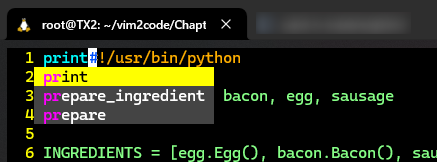

**图 4.1 Vim 内置的自动补全列表**

常见操作：

- 选中下一项：`Ctrl-n`
- 选中上一项：`Ctrl-p`
- 继续输入其他内容：自动补全列表消失

此外，`Vim` 还提供了一个 **插入补全（insert-completion）** 模式，支持多种补全方式。常见的补全方式有以下四种，通过键入 <kbd>Ctrl</kbd><kbd>X</kbd> 与以下按键相结合得到不同的自动补全列表：

1. <kbd>Ctrl</kbd><kbd>L</kbd>：以整行形式自动补全（如图 4.2 所示）；
2. <kbd>Ctrl</kbd><kbd>]</kbd>：基于标签（`tags`）进行自动补全（如图 4.3 所示）；
3. <kbd>Ctrl</kbd><kbd>F</kbd>：基于当前路径下的所有文件名提供自动补全列表（如图 4.4 所示）；
4. <kbd>S</kbd>：在打开语法检查的情况下（`:set spell` + <kbd>Enter</kbd>），基于语法修改建议提供自动补全列表（如图 4.5 所示）；

以下截图为上述四种补全类型分别在示例文件 `welcome.py` 中的实测效果：

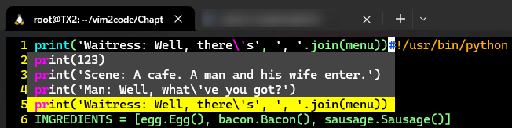

**图 4.2 基于当前文件的整行内容（Ctrl + XL）提供自动补全候选列表**

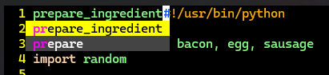

**图 4.3 基于 tags 标签（Ctrl + X]）提供自动补全候选列表（关于标签的具体含义稍后详述）**

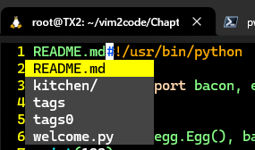

**图 4.4 基于当前路径下的文件名（Ctrl + XF）提供自动补全列表（注意：本例无需输入 “pr” 字样，否则没有匹配项）**

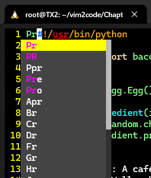

**图 4.5 基于当前输入的语法建议提供自动补全列表（需要先启用 set spell 语法检查）**

更多插入补全模式的用法介绍，详见 `Vim` 帮助文档（`:help ins-completion` 或 `:help 'complete'`）：

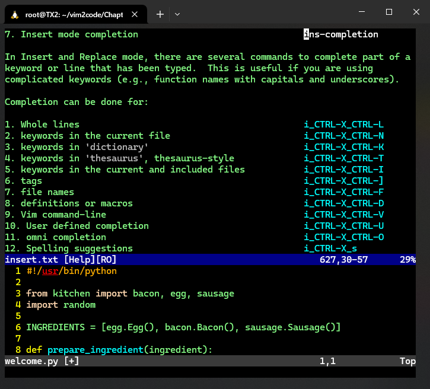

**图 4.6 Vim 内置的插入补全模式帮助文档页截图**


## 2 YouCompleteMe 插件对自动补全的增强

`YouCompleteMe` 插件是对 `Vim` 内置的自动补全特性的增强，可根据不同的编程语言提供特定的语法支持。只不过这一节感觉作者不怎么用心，按书中给出的操作很难一次性安装成功，因为插件本身有很多隐形限制条件：

- 插件对每种语言的支持情况各不相同，需要提前配置 `Vim` 的语法兼容包。例如对 `+python3` 的编译支持；
- 如果想利用插件在 `Python` 环境下的自动补全，解释器版本还不能低于 `v3.9`；
- 手动安装时还不能以 `root` 用户进行安装（权限过高）；
- ……

为了一个自动补全，还得提供这么多周边依赖支持，于是果断放弃。后面有空再来尝试安装。以下为书中提供的操作步骤：

```bash
# 1. 安装相关依赖
$ sudo apt install cmake llvm
# 2. 检查当前 Vim 版本是否支持 python3
$ vim --version | grep python3
+cmdline_info      +libcall           +python3           +virtualedit
# 3. 在 vimrc 文件中加入下列 Vim-Plug 配置内容
" Increase vim-plug timeout for YouCompleteMe.
let g:plug_timeout = 300
Plug 'ycm-core/YouCompleteMe', { 'do': './install.py' }
# 4. 保存配置并立即安装插件
:w | so $MYVIMRC | PlugInstall
```

安装过程中，如果遇到像 `c++: internal compiler error: Killed (program cc1plus)` 这样的报错信息，说明设备的可用内存不足，可以尝试下列方式扩充交换空间（`Linux` 环境下）：

```bash
# 用 dd 命令临时开辟 1Gb 大小的交换文件
$ sudo dd if=/dev/zero of=/var/swap.img bs=1024k count=1000
$ sudo mkswap /var/swap.img
$ sudo swapon /var/swap.img
```

安装就绪后，编辑任意内容应该能看到如下效果：

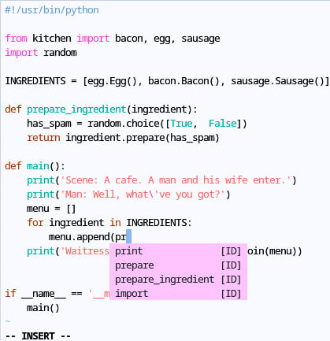

**图 4.7 YouCompleteMe 插件生效后的自动补全列表效果**

`YouCompleteMe` 的列表项可通过 <kbd>Tab</kbd> 键切换，并且支持在文件顶部展示选中项的 `docstring` 文档。

如果在 `Python` 环境下工作，`YouCompleteMe` 还支持自动跳转到光标所在函数的定义处，执行命令为：`:YcmCompleter GoTo` + <kbd>Enter</kbd>。也可以用上一章介绍的 `noremap` 语法，将其映射为某个快捷键（例如 `Leader` 键 + <kbd>]</kbd>）：

```bash
noremap <leader>] :YcmCompleter GoTo<cr>
```


## 3 tags 文件的用法

查看某个方法的定义是代码编写过程中的常见操作，为此 `Vim` 也提供了原生支持，通过按 `gd` 就能将光标所在的单词对应的定义高亮显示出来，例如：

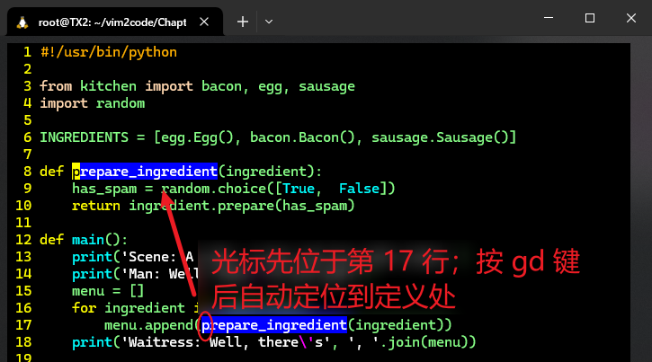

**图 4.8 Vim 原生支持函数定义的定位**

虽然 `Vim` 不提供相应的语义支持，但 `Vim` 支持 `tags` 标签。`Vim` 中的标签是一个具有语义内涵的单词和结构的文件。在 `Python` 语境下，类、函数、方法都可以视为 `Vim` 标签。


## 4 Exuberant Ctags 简介

`Exuberant Ctags` 是一个外部工具（详见：[http://ctags.sourceforge.net](http://ctags.sourceforge.net/)），实现了对 `Vim` 标签特性的增强。通过在当前代码库生成一个对应的 `tags` 文件，可以对代码中的函数及方法的定义进行快速定位（支持跨文件模块操作）。

安装步骤如下：

```bash
# 适用环境：Debian
$ sudo apt install universal-ctags
# 在当前文件夹下生成 tags 文件
$ ctags -R .
$ ls
README.md  kitchen  tags  welcome.py
```

再次打开 `welcome.py`，将光标移至第 10 行的方法名 `prepare` 下，按 <kbd>Ctrl</kbd><kbd>]</kbd> 将自动定位并打开 `kitchen/egg.py` 文件：

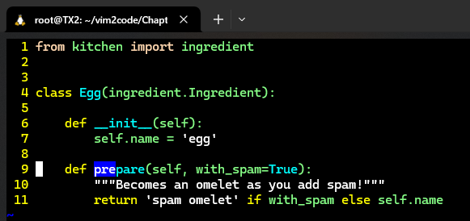

**图 4.9 通过 ctags 定位到 prepare 方法的一处定义**

与 `ctags` 相关的几个操作：

- `Ctrl-]`：进入光标所在标签的（其中一个）定义处；
- `Ctrl-t`：返回到光标所在标签对应的引用位置；
- `:tselect`：简写为 `:ts`，列出光标所在标签可能的定义位置列表；也可以直接使用 `g]` 组合键（如图 4.10 所示）；
- `:tn` 与 `:tp`：适用于存在多个同名标签的情况，分别实现上翻和下翻。

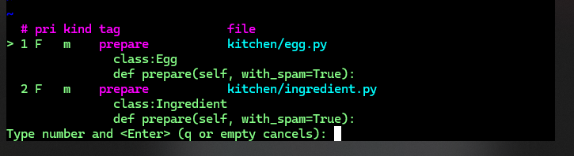

**图 4.10 执行命令 :tselect 列出的多个定义位置信息，输入对应的数字 + 回车键，即可跳转到对应的文件**

甚至可以在 `Vim` 外通过命令 `vim -t <tag_name>` 直接将匹配到的定义文件用 `Vim` 打开。例如，将匹配到的第一个 `prepare` 标签定义文件用 `Vim` 打开，可以执行命令：`vim -t prepare` + <kbd>Enter</kbd>；效果和 `vim kitchen/egg.py` + <kbd>Enter</kbd> 一致。

> [!tip]
>
> **注意**
>
> `ctags` 的有效定位离不开 `tags` 文件，并且需要启用 `Vim` 的 `tags` 选项，设置为 `:set tags=tags;`。这里末尾的分号 `;` 必须写全，否则无法在其他父级目录中检索。为了让 `tags` 文件所在的代码库实时更新 `tags` 的内容，可以在 `Vim` 每次保存文件时更新 `tags`，即在 `vimrc` 文件中实现以下配置：
>
> ```bash
> " Regenerate tags when saving Python files.
> autocmd BufWritePost *.py silent! !ctags -R &
> ```
>
> 这里的 `*.py` 是仅对 `Python` 源码文件生效，也可以根据实际情况进行扩充，例如：
>
> ```bash
> autocmd BufWritePost *.cpp,*.h silent! !ctags -R &
> ```
>
> 最后需要注意的是，`Vim` 的这种快速定位方案的特点也是它的短板：必须单独生成一个 `tags` 文件放到项目根目录。相比其他 `IDE` 确实感觉要 `low` 很多（实际项目中我个人是不会考虑用 `ctags` 的）。


## 5 借助 Undotree 插件实现 Vim 撤销树的可视化

之前学过 `Vim` 的撤销操作（`u` 命令），本节对这一知识点进行了扩展。`Vim` 除了简单的撤销当前操作外，还支持更为复杂的撤销树（`undo tree`）操作。这可以通过 `Undotree` 插件进行可视化展示，如图 4.11 所示：

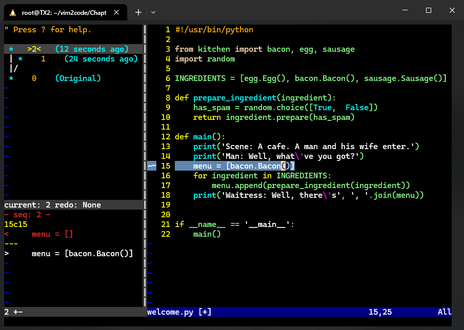

**图 4.11 利用 Undotree 插件实现 Vim 撤销树的可视化效果**

**应用场景**：文件编辑过程中，先进行一次内容变更（记为 `X`），然后用 `u` 命令撤销变更；再进行第二次变更（记为 `Y`），然后再用 `u` 撤销。此时，多次执行 `u` 命令只能还原变更 `Y` 的内容，人们普遍认为变更 `X` 是无法还原的。想撤销到变更 `X`，可利用 `Undotree` 插件的可视化界面来实现。

**安装方法**（通过 `Vim-Plug` 工具）：

1. 打开 `vimrc` 文件，在 `call plug#begin()` 和 `call plug#end()` 之间新增一行内容：`Plug 'mbbill/undotree'`；
2. 保存并快速安装插件，执行命令：`:w | so $MYVIMRC | PlugInstall` + <kbd>Enter</kbd>

要显示 `Vim` 撤销树，输入命令 `:UndotreeToggle` + <kbd>Enter</kbd> 即可（如图 4.11 所示）。

此外也可以自定义一个快捷键来快速切换撤销树的显示与隐藏，如 `<f5>` 键，配置到 `vimrc` 文件中：

```bash
" Map Undotree to <F5>
noremap <f5> :UndotreeToggle<cr>
```

撤销树的操作和其他窗口类似，支持方向键 <kbd>J</kbd><kbd>K</kbd> 上下导航，按 <kbd>Enter</kbd> 键加载对应版本的撤销内容。`Undotree` 插件提供的侧边栏分为上下两部分：上方为撤销历史记录的树形结构；下方为当前光标对应版本的具体变更情况（风格类似 `Git`）。

更多用法，可以通过 `:help undo-tree` 进行了解。