# 第五章 在 Vim 中实现代码的构建、测试与运行


> **本章概要**
>
> - 版本控制简介（`Git`）
> - 实现 `Git` 和 `Vim` 高效协同的方法
> - 利用 **vimdiff** 比较和合并文件
> - 利用 **vimdiff** 解决 Git 冲突
> - **tmux**、**screen** 以及 `Vim` 的终端模式在多任务和执行 shell 命令中的应用
> - 用 **quickfix** 和 **location** 列表捕获警告与错误信息的方法
> - `Vim` 内置命令 `:make` 和插件在代码构建与测试中的应用
> - 语法检查程序的手动及插件实现方案

配套源码：`https://github.com/PacktPublishing/Mastering-Vim-Second-Edition/tree/main/Chapter05`。

本章又是一个 “大杂烩” 章节，上述要点仅为本书实际包含的内容，并非这篇笔记实际梳理的内容。本文将针对《[Vim Masterclass](https://blog.csdn.net/frgod/category_12867333.html)》专栏进行相应扩充，相关基础知识仅给出参考链接，不再赘述。

---


## 1 Git 版本控制

`Debian` 系 `Linux` 环境的 `Git` 安装：`sudo apt install git`。

接着完成基础配置：

```bash
$ git config --global user.name 'Your Name'
$ git config --global user.email 'your@email'
```

然后在 `GitHub` 创建一个同名仓库 `spam`：

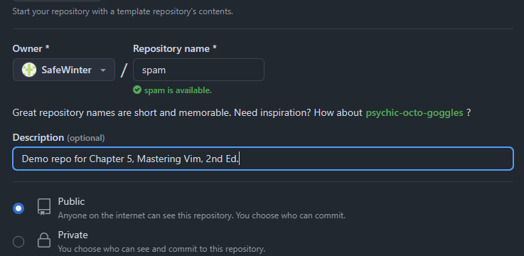

**图 5.1 在 GitHub 创建同名练习仓库 spam**

其他 `Git` 操作一概略过（详见我的 `Git` 专栏《[Git Version Control Cookbook 2](https://blog.csdn.net/frgod/category_12716684.html)》），这里只补充一个知识点：本地已有 `Git` 库推送到远程 `GitHub` 的相关操作：

```bash
# 1. 定位到示例仓库根目录，完成 Git 仓库初始化
$ pwd
/root/vim2code
$ cd Chapter05/spam/
$ git init
Initialized empty Git repository in /root/vim2code/Chapter05/spam/.git/
# 2. 创建首次提交
$ git add .
$ git commit -m 'Initial commit'
[master (root-commit) 85446da] Initial commit
 5 files changed, 57 insertions(+)
 create mode 100755 kitchen/bacon.py
 create mode 100755 kitchen/egg.py
 create mode 100755 kitchen/ingredient.py
 create mode 100755 kitchen/sausage.py
 create mode 100755 welcome.py
# 3. 将 master 分支修改为 main 分支，方便后续推送
$ git branch -M main
# 4. 添加远程推送仓库 URL
$ git remote add origin https://github.com/SafeWinter/spam.git
$ git push -u origin main
Username for 'https://github.com': <My Account_name>
Password for 'https://SafeWinter@github.com': <My Login_password>
remote: Support for password authentication was removed on August 13, 2021.
remote: Please see https://docs.github.com/get-started/getting-started-with-git/about-remote-repositories#cloning-with-https-urls for information on currently recommended modes of authentication.
fatal: Authentication failed for 'https://github.com/SafeWinter/spam.git/'
$ 
```

根据提示可知，基于 `HTTPS` 协议 + 用户名/密码校验的推送的方式自 2021 年 8 月起就禁止使用了。于是只能改用 `SSH` 协议 + 密钥对的形式：

```bash
$ ssh-keygen -t ed25519 -C "demo@example.com"
```

其间遇到的提示一律按回车键跳过，最后在 `~/.ssh/` 路径下会生成对应的公私钥文件。然后复制公钥文件（默认为 `id_ed25519.pub`）中的内容，粘贴到 `GitHub` 统一的 `SSH` 公钥管理页面：

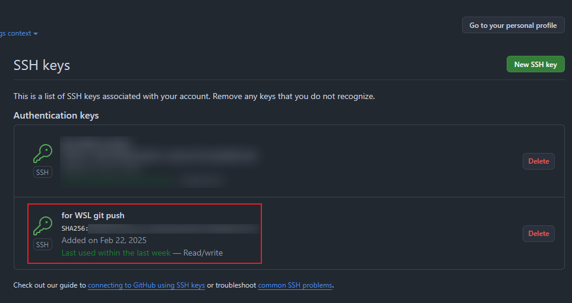

**图 5.2 将从 WSL 生成的 SSH 公钥配置到 GitHub 管理页面**

再次执行推送命令，即可完成同步：

```bash
# 1. Remove original origin
$ git remote remove origin
# 2. Add ssh-based origin
$ git remote add origin git@github.com:SafeWinter/spam.git
# 3. Push to sync with the remote GitHub repo
$ git push -u origin main
Enumerating objects: 8, done.
Counting objects: 100% (8/8), done.
Delta compression using up to 16 threads
Compressing objects: 100% (8/8), done.
Writing objects: 100% (8/8), 1.18 KiB | 1.18 MiB/s, done.
Total 8 (delta 1), reused 0 (delta 0)
remote: Resolving deltas: 100% (1/1), done.
To github.com:SafeWinter/spam.git
 * [new branch]      main -> main
Branch 'main' set up to track remote branch 'main' from 'origin'.
$ 
```

这样就实现了本地 `Git` 仓库到远程 `GitHub` 的同步。


## 2 将 Git 集成到 Vim

即安装 `vim-fugitive` 插件（[https://github.com/tpope/vim-fugitive](https://github.com/tpope/vim-fugitive)）。手动安装方法详见《[Vim Masterclass](https://blog.csdn.net/frgod/category_12867333.html)》专栏 [第 26 篇笔记](https://blog.csdn.net/frgod/article/details/145313538)，这里基于 `vim-plug` 工具来演示安装步骤：

1. 在 `.vimrc` 文件负责安装插件的区域新增一行：`Plug 'tpope/vim-fugitive'`；
2. 保存并安装该插件：`:w | so ~/.vimrc | PlugInstall` + <kbd>Enter</kbd>；
3. 启用 `vim-fugitive`：在 `Vim` 的命令模式下运行：`:Git` + <kbd>Enter</kbd>。

实测效果如下：

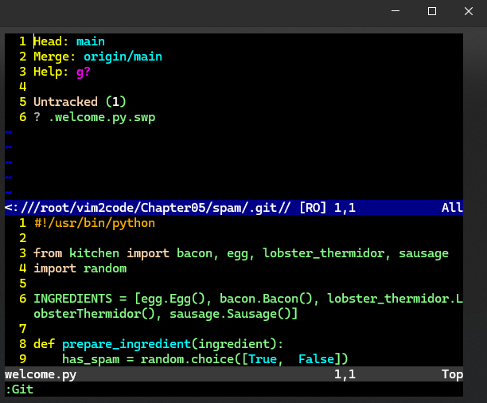

**图 5.3 安装 vim-fugitive 插件并执行 Git 命令实测效果图**

绝大部分 `Git` 命令都可以通过 `:Get <command>` 的形式在 `Vim` 中运行。例如逐行审核模式 `git blame` 命令可以通过 `:Get blame` 实现：

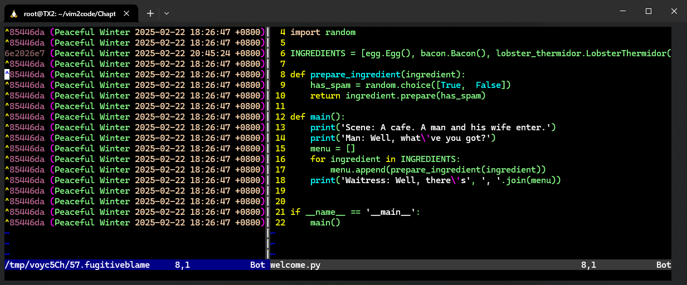

**图 5.4 在 Vim 执行 git blame 命令实测效果图**

在左边 `blame` 窗口处于激活状态时，输入以下大写字符命令可切换不同的显示模式：

- `C`：将 `blame` 窗口显示到仅展示 `SHA-ID` 标识（Commit）的宽度（如图 5.5 所示）；
- `A`：将 `blame` 窗口显示到仅展示 `SHA-ID` 标识 + 作者（Author）的宽度（如图 5.6 所示）；
- `D`：将 `blame` 窗口显示到包含提交日期（Date）的宽度（如图 5.4 所示）；

实测效果图如下：

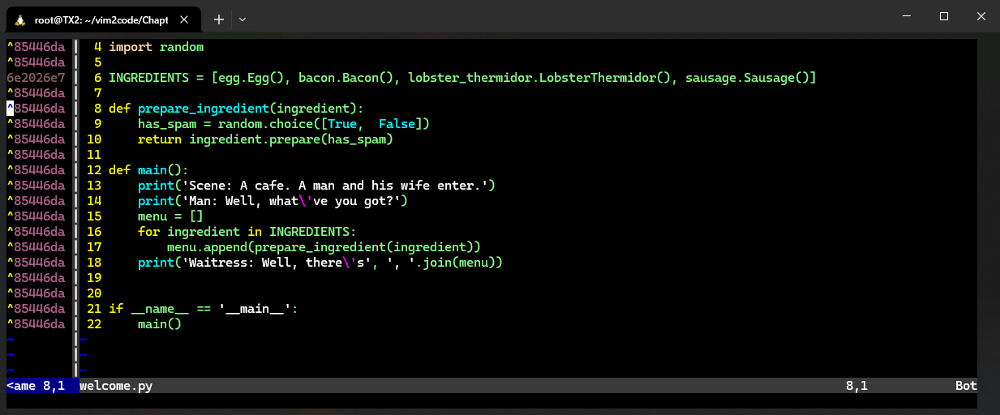

**图 5.5 在 Blame 窗口中按大写的 C 键后，窗口宽度变为仅展示 Commit 信息**

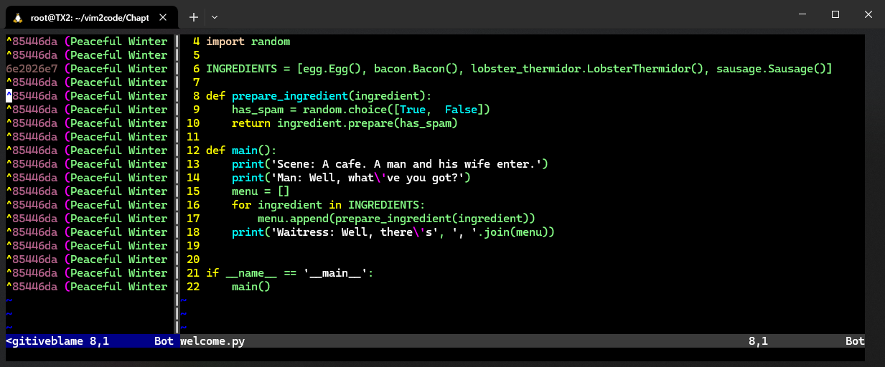

**图 5.6 在 Blame 窗口中按大写的 A 键后，窗口宽度变为展示 Commit + Author 信息**

该插件封装的其他常见 `Git` 命令还有：

- `:Gread`：直接将文件签出至缓冲区进行预览；
- `:Ggrep`：封装命令 `git grep`；
- `:GMove`：封装命令 `git mv`，同时重命名缓冲区；
- `:GDelete`：封装命令 `git remove`；

更多命令用法，详见插件离线文档：`:help fugitive` 或线上文档：`https://github.com/tpope/vim-fugitive`。


## 3 用 vimdiff 解决版本冲突

`vimdiff` 命令可在不打开 `Vim` 的情况下比较两个文件的内容，例如：

```bash
$ vimdiff kitchen/bacon.py kitchen/egg.py
```

实测结果：

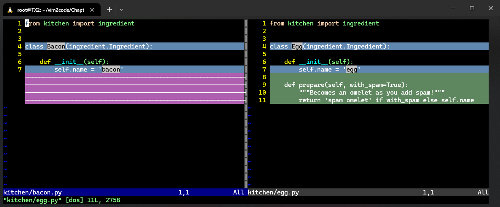

**图 5.7 用 vimdiff 命令比较两个文件的实测效果图**

与 `vimdiff` 相关的常用命令：

- `]c`：移动到下一处差异；
- `[c`：移动到上一处差异；
- `:diffget`：缩写为 `:diffg`，等效于正常模式的 `do` 命令（即 `diff obtain`，表示获取差异）；
  - `:%diffget`：将所有差异批量合并到当前文件；
- `:diffput`：缩写为 `:diffpu`，等效于正常模式的 `dp` 命令（即 `diff put`，表示推送差异）；
  - `:%diffput`：将所有差异批量推送到对面文件；

如果相互比较的文件不止两个，则获取、推送差异内容时还需要指明差异的来源或去向。例如：

```bash
$ vimdiff kitchen/bacon.py kitchen/egg.py kitchen/sausage.py
```

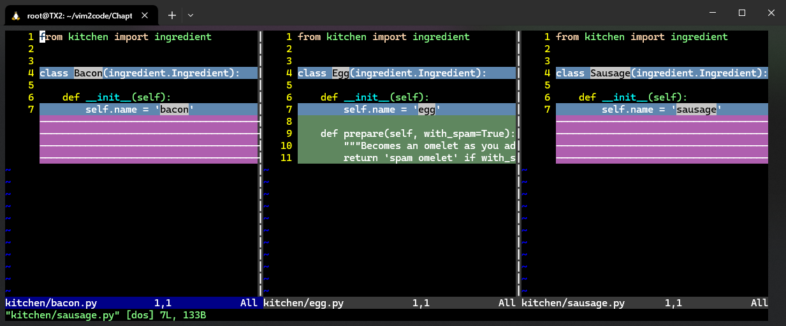

**图 5.8 用 vimdiff 同时打开三个文件进行比较的实测效果图**

如果要将 `bacon.py` 中的差异内容推送到 `egg.py`，则需要执行命令：`:diffput egg` + <kbd>Enter</kbd>。其语法格式为：

```bash
:diffput <partial buffer name>
```

此外，也可以将 `vimdiff` 配置到 `Git` 中作为合并分支时的操作工具，具体配置如下：

```bash
# 将 Git 设置为默认的合并工具
$ git config --global merge.tool vimdiff
# 在合并时显示共同祖先节点
$ git config --global merge.conflictstyle diff3
# 禁用系统提示，直接用 vimdiff 打开差异版本
$ git config --global mergetool.prompt false
```


## 4 实战：git + vimdiff 处理版本冲突

本节模拟了一个合并版本存在冲突的小案例：分别对主分支 `main` 和 `feature-no-spam` 分支上的同一文件 `welcome.py` 进行修改（用不同的内容修改同一位置），然后将 `feature-no-spam` 分支强制合并到 `main` 分支：

```bash
$ pwd
/root/vim2code/Chapter05/spam
# 1. 创建并签出新分支
$ git checkout -b feature-no-spam
Switched to a new branch 'feature-no-spam'
# 2. 修改 welcome.py
$ vim welcome.py
#def prepare_ingredient(ingredient):
#    return ingredient.prepare(with_spam=False)
# 3. 创建相互冲突的第一个提交
$ git add welcome.py
$ git commit -m 'Exclude spam from every dish'
[feature-no-spam c4bbd79] Exclude spam from every dish
 1 file changed, 1 insertion(+), 2 deletions(-)
# 4. 切回 main 分支创建相互冲突的第二个提交
$ git checkout main
Switched to branch 'main'
Your branch is up to date with 'origin/main'.
$ vim welcome.py
#def prepare_ingredient(ingredient):
#    return ingredient.prepare(with_spam=True)
git add welcome.py
$ git commit -m 'Include spam in every dish'
# 5. 将 feature-no-spam 分支合并到 main 分支
$ git merge feature-no-spam
Auto-merging welcome.py
CONFLICT (content): Merge conflict in welcome.py
Automatic merge failed; fix conflicts and then commit the result.
# 6. 用提前配置好的合并工具处理冲突
$ git mergetool
```

实测效果：

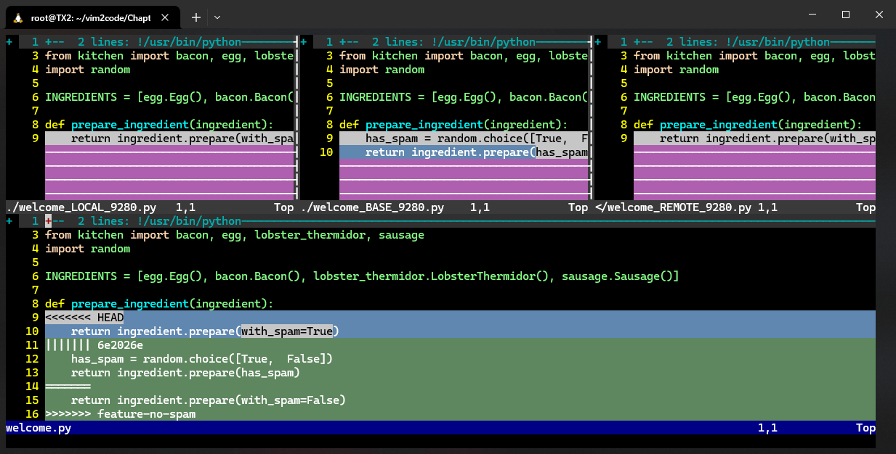

**图 5.9 用 vimdiff 来处理 Git 分支冲突问题**

上图针对版本冲突一共出现了四个区域，它们分别是——

- **LOCAL**：本地版本，即当前分支中合并前的文件内容；
- **BASE**：基础版本，即冲突产生前的最后一次提交中的内容；
- **REMOTE**：远程版本，即将合并到当前本地版本的外来分支内容；
- **MERGED**：最终解决冲突后作为合并结果的版本内容。

各区域代表的含义也可以通过下列伪代码表示：

```markdown
<<<<<<< [LOCAL commit/branch]
[LOCAL change]
||||||| merged common ancestors
[BASE - closest common ancestor]
=======
[REMOTE change]
>>>>>>> [REMOTE commit/branch]
```

想要快速采纳左、中、右三个版本，需要分别执行：

- `:diffg L`：获取 `LOCAL` 版本中的差异内容；
- `:diffg B`：获取 `BASE` 版本中的差异内容；
- `:diffg R`：获取 `REMOTE` 版本中的差异内容；

假定按外来分支的版本为准，执行 `:diffg R`，操作界面将变为：

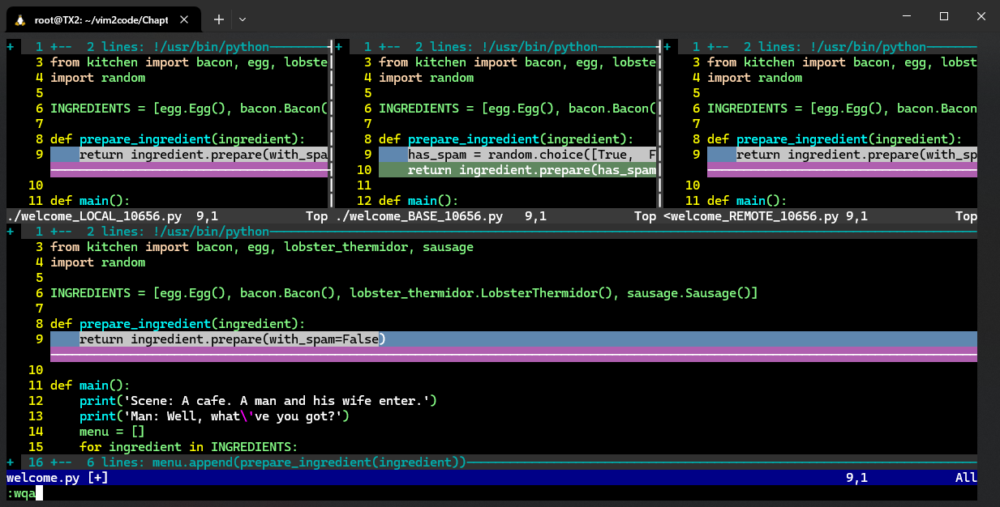

**图 5.10 以外来分支的版本为准处理合并冲突的实测效果图**

解决冲突后，务必记得执行 `:wqa` 来退出 `vimdiff`；接着再执行 `git commit -m "Fixed a pesky merge conflict"` 提交最终版本。这标志着本次合并冲突的结束。

> [!tip]
>
> **注意**
>
> 解决版本冲突的过程中，系统会在同级目录下会生成一个 `.orig` 格式的临时文件，将其直接删除即可：
>
> 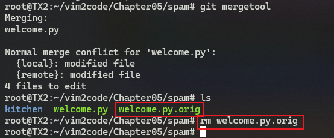
>
> **图 5.11 删除无关的 .orig 文件**
>
> 可以看到，`vimdiff` 也和 `Vim` 是可以高度定制化的，更多配置选项，参考 `:h 'diffopt'`。


## 5 tmux 的用法

`tmux` 是一个 `terminal` 终端复用工具，允许用户在一个终端窗口中创建、管理和切换多个会话、窗口和面板，提升多任务处理效率。

源码位置：[https://github.com/tmux/tmux](https://github.com/tmux/tmux)

### 5.1 tmux 的安装与启用

快捷安装：`sudo apt install tmux`

启动方法：`tmux` + <kbd>Enter</kbd>

实测效果：

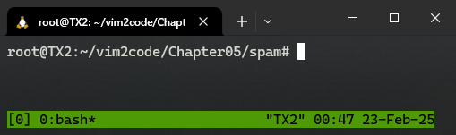

**图 5.12 进入 tmux 后的实测界面效果**


### 5.2 tmux 的实用配置

`tmux` 的操作指令通常有个固定前缀，默认为 <kbd>Ctrl</kbd> + <kbd>B</kbd>；为了不和 `Vim` 引起冲突，也可以在配置文件 `~/.tmux.conf` 中自定义该前缀：

```bash
# Use Ctrl-\ as a prefix.
unbind-key C-b
set -g prefix 'C-\'
bind-key 'C-\' send-prefix
```

保存该配置，重启 `tmux` 后将生效新的前缀：<kbd>Ctrl</kbd> + <kbd>\\</kbd>。

另外几个非常实用的组合键改造方案如下：

1. 用 `-` 取代默认的 `"` 实现 `tmux` 分屏的水平切割；
2. 用 `|` 取代默认的 `%` 实现 `tmux` 分屏的垂直切割；
3. 用 `jklh` 键取代默认的 `select-pane -LDUR` 操作，实现分屏焦点的转移；

`~/.tmux.conf` 配置文件的完整改造方案如下：

```bash
# Use Ctrl + \ as a prefix.
unbind-key C-b
set -g prefix 'C-\'
bind-key 'C-\' send-prefix

# Use | to create vertical splits.
bind | split-window -h
unbind '"'

# Use - to create horizontal splits.
bind - split-window -v
unbind '%'

# use hjkl to navigate diff panes
bind h select-pane -L
bind j select-pane -D
bind k select-pane -U
bind l select-pane -R
```


### 5.3 多个 tmux 标签的创建与退出

`tmux` 多个实例的创建有两类：

- 同一窗口下的多个分屏实例：通过上面介绍的水平或垂直分割实现，即 `{TMUX_PREFIX}` + `-` 或 `{TMUX_PREFIX}` + `|`；
- 不同窗口的多标签页实例：类似 `Vim` 的标签页（tabs），创建方法：
  - （在 `tmux` 环境下）`{TMUX_PREFIX}` + <kbd>C</kbd>；
  - （非 `tmux` 环境下）直接执行 `tmux` 命令就会默认创建一个新的标签页实例。

`tmux` 的退出也有两种情况：

- 彻底关闭当前实例：在对应 `tmux` 实例内执行 `exit` 命令即可；
- 以分离状态退出：即让 `tmux` 会话在后台运行，不与任何终端窗口连接；用户稍后还可以重新连接到该会话继续操作。方法是：`{TMUX_PREFIX}` + <kbd>Ctrl</kbd><kbd>D</kbd>；

以分离状态退出 `tmux` 后，可通过 `tmux list-sessions` 命令查看后台运行的所有 `tmux` 会话列表：

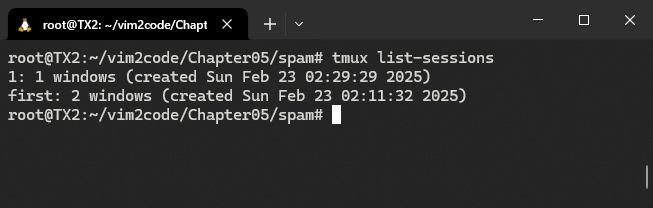

**图 5.13 查看所有在后台运行的 tmux 会话列表**

列表中首个冒号前的部分为该会话的标识符（即 `1` 和 `first`），重新连接到其中一个会话，命令格式为：`tmux attach -t <TMUX_ID>`，例如：

```bash
# 连接到标识为 1 的后台 tmux 会话
$ tmux attach -t 1
```


### 5.4 tmux 多标签页的切换与重命名

如果当前 `tmux` 会话存在多个标签页（`tmux` 称其为“窗口”）时，可通过下列命令进行上翻、下翻：

- 下翻：`{TMUX_PREFIX}` + <kbd>N</kbd>（表示 `Next`，如图 5.14 所示）；
- 上翻：`{TMUX_PREFIX}` + <kbd>P</kbd>（表示 `Previous`，如图 5.15 所示）；

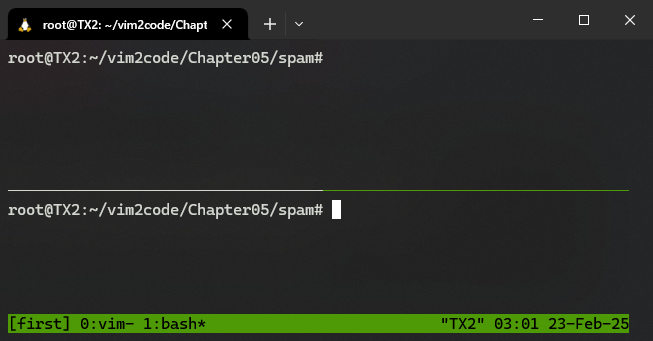

**图 5.14 通过 tmux 前缀 + N 键实现标签页的下翻（从标识 0 切换到标识 1，后面的星号表示激活状态，横线表示非激活状态）**

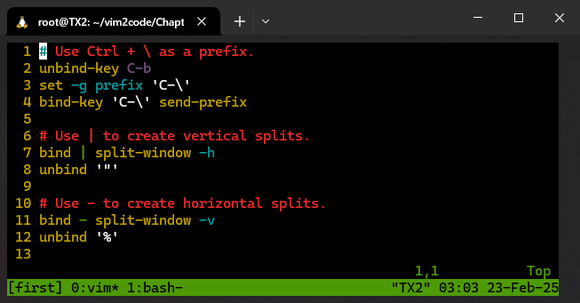

**图 5.15 通过 tmux 前缀 + P 键实现标签页的上翻（从标识 1 切换回标识 0，后面的星号表示激活状态，横线表示非激活状态）**

从这两个截图可以看到，当前会话的标识符默认从 0 开始编号，也可以自定义名称（如截图中的 `first`），有两种重命名：

- 创建 `tmux` 会话时指定名称：`tmux new -s <new_name>`
- 进入 `tmux` 后修改会话名称：`{TMUX_PREFIX}` + <kbd>$</kbd>

不仅会话标识符可以修改，多标签环境下的标签名也可以修改，执行命令 `{TMUX_PREFIX}` + <kbd>,</kbd> 即可。


### 5.5 tmux 与 Vim 的多窗口环境

为了避免二者在组合键上的冲突，书中引入了一个新的插件 `vim-tmux-navigator`（[https://github.com/christoomey/vim-tmux-navigator](https://github.com/christoomey/vim-tmux-navigator)），并且用 `vim-plug` 工具演示了安装方法及相应的组合键配置，个人感觉实用性不强，这一小节不重点梳理：

```bash
# Smart pane switching with awareness of Vim splits.
# See: https://github.com/christoomey/vim-tmux-navigator
is_vim="ps -o state= -o comm= -t '#{pane_tty}' \
| grep -iqE '^[^TXZ ]+ +(\\S+\\/)?g?(view|n?vim?x?)(diff)?$'"
bind-key -n C-h if-shell "$is_vim" "send-keys C-h" "select-pane -L"
bind-key -n C-j if-shell "$is_vim" "send-keys C-j" "select-pane -D"
bind-key -n C-k if-shell "$is_vim" "send-keys C-k" "select-pane -U"
bind-key -n C-l if-shell "$is_vim" "send-keys C-l" "select-pane -R"
bind-key -T copy-mode-vi C-h select-pane -L
bind-key -T copy-mode-vi C-j select-pane -D
bind-key -T copy-mode-vi C-k select-pane -U
bind-key -T copy-mode-vi C-l select-pane -R
```


## 6 screen 及 terminal 方案

除了 `tmux`，`screen` 和 `Vim` 自带的 `terminal` 终端模式也能提供多窗口环境。不过 `screen` 的可扩展性不及 `tmux`，因此不做梳理。

而 `terminal` 模式在本书第三章（详见 [本专栏第 4 篇笔记](https://blog.csdn.net/frgod/article/details/145717574)）已经介绍过，即通过 `:term` + <kbd>Enter</kbd> 启用，这里也不再赘述。只补充一个知识点：默认情况下 `:term` + <kbd>Enter</kbd> 是在当前窗口的上方 **水平切割** 出一个新窗口叠在原窗口上方运行，若要实现 **垂直切割** 出新窗口，必须执行 `:vert term` + <kbd>Enter</kbd>。


