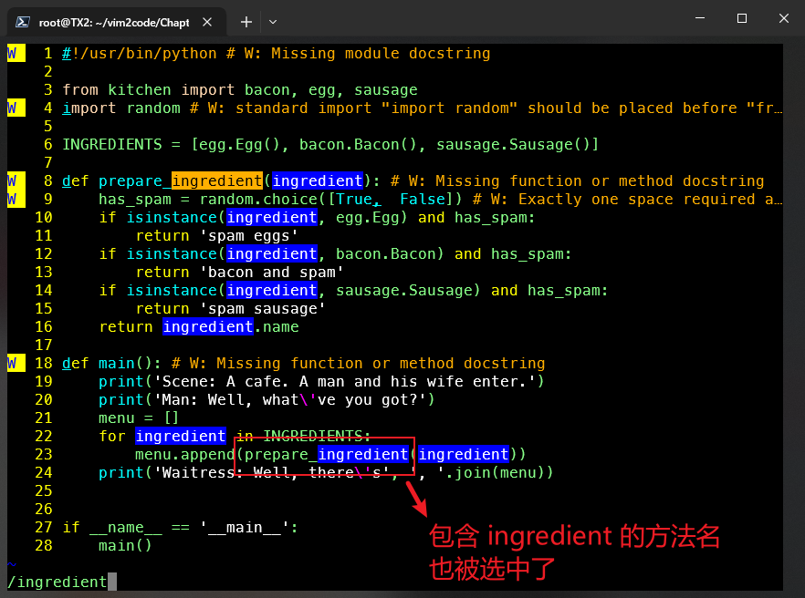
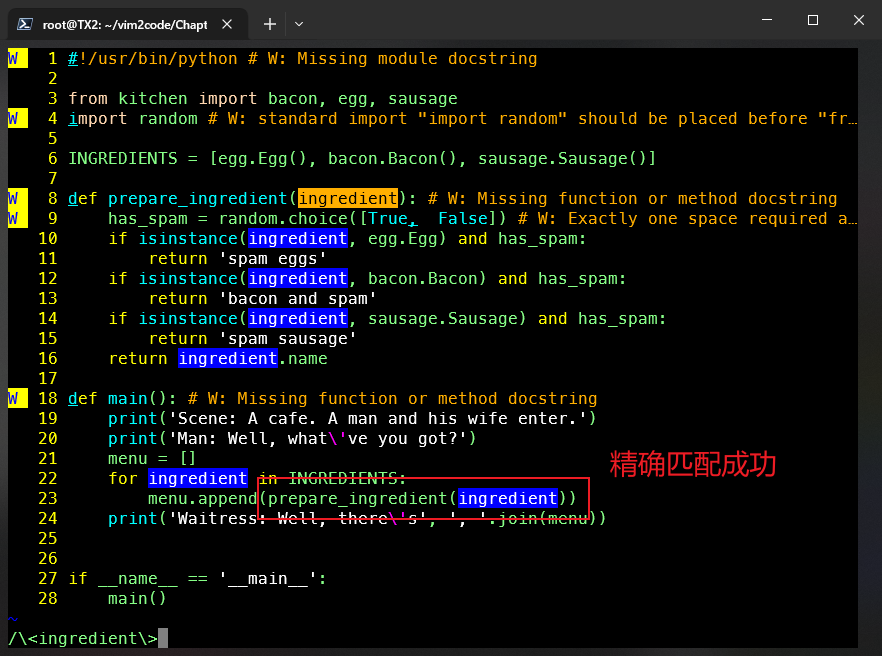
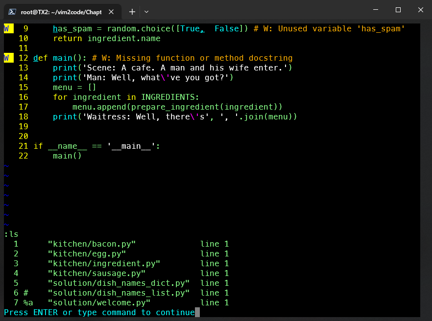
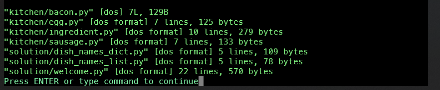
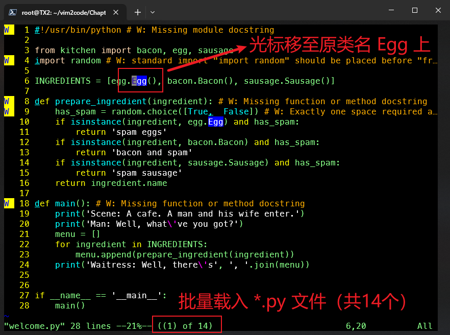
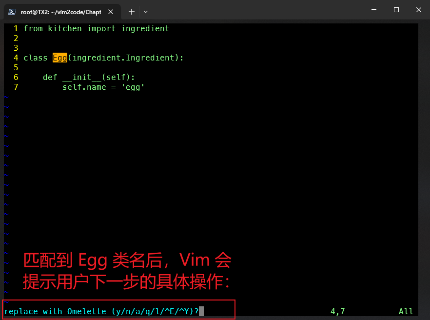
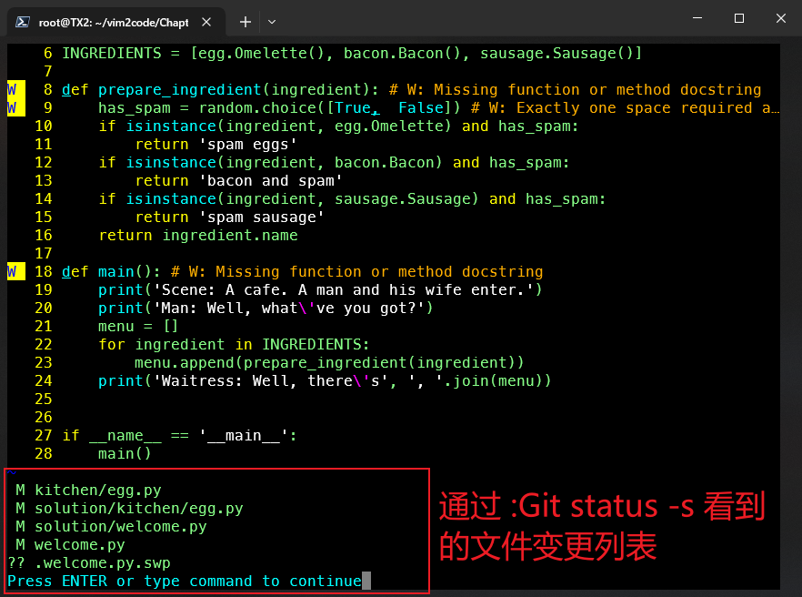
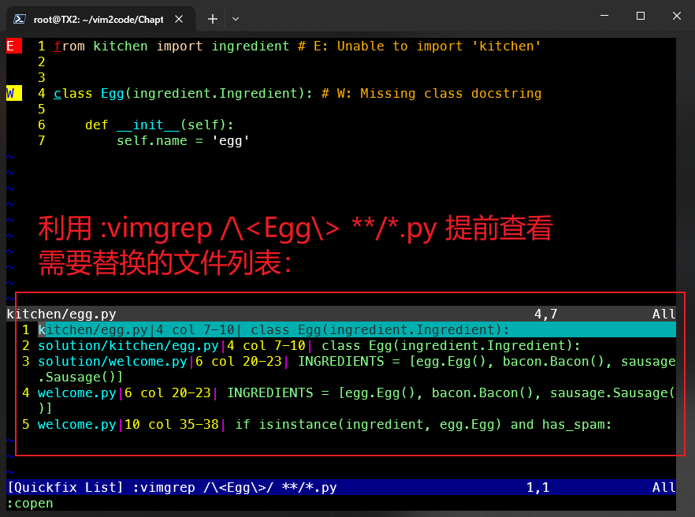
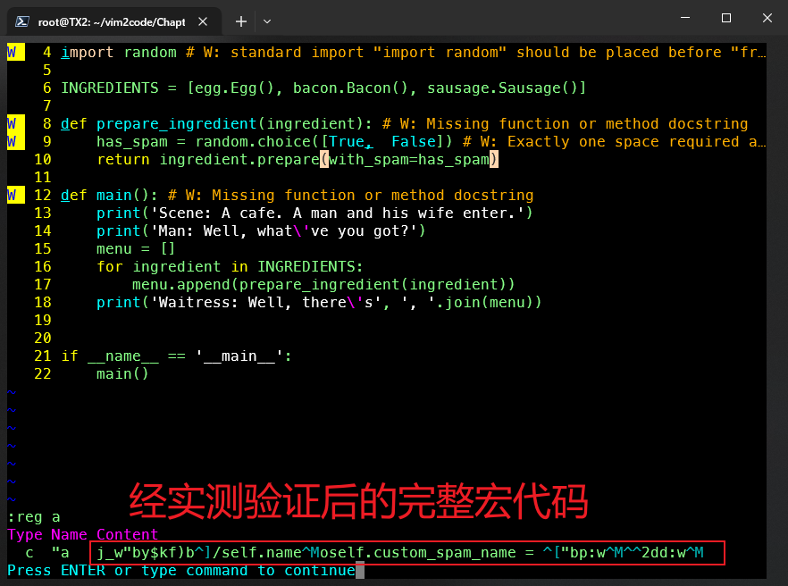

# 第六章 正则表达式和 Vim 宏在代码重构中的应用


> **本章概要**
> 
> - `substitute` 命令在查询替换中的用法；
> - 借助正则表达式让查询替换更加智能化；
> - 巧用 `arglist` 实现多文件批量操作；
> - 重构技巧演示：方法的重命名以及参数的重新排序；
> - 宏的录制与按键组合回放技巧。

本章源码：`https://github.com/PacktPublishing/Mastering-Vim-Second-Edition/tree/main/Chapter06`。

本章对 `substitute` 命令、正则表达式、以及 `arglist` 参数列表进行了深入探讨，不过书中说的重构和我理解的重构在概念上相差较大，有点虎头蛇尾的感觉。与之前章节一样，与《[Vim Masterclass](https://blog.csdn.net/frgod/category_12867333.html)》专栏相似的基础内容不再赘述，仅梳理有差异的知识点。

---


## 1 substitute 替换命令

`substitute` 命令用于同一行内的文本替换，其语法格式为：

```markdown
:s/<find-this>/<replace-with-this>/<flags>
```

具体用法详见《**Vim Masterclass**》专栏 [第 10 篇笔记](https://blog.csdn.net/frgod/article/details/145095539)。这里仅补充常见的 `flags` 标记：

- `g`：全局替换标记（global），用于替换行中出现的所有匹配项；
- `c`：确认标记（confirm），在替换文本前提示用户是否执行下一步操作。其中——
  - `y`：表示确认替换（yes）；
  - `l`：确认替换然后退出（last）；
  - `n`：跳过本次替换（no）；
  - `a`：替换当前及后续所有匹配项（all）；
  - `q` 或 `<Esc>`：退出本轮替换；
  - `^E` 或 `Ctrl-E`：表示上翻一屏；
  - `^Y` 或 `Ctrl-Y`：表示下翻一屏；
- `e`：不显示错误标记（error），如果未找到匹配项，则不显示错误；
- `i`：忽略大小写标记（ignore case）；
- `I`：区分大小写检索标记。

更多 `flags` 标记用法，详见 `:h s_flags`。


## 2 关于 substitute 的精确匹配

通常 `:s` 命令匹配到的关键词都是 **模糊匹配**。例如 `:s/ingredient/demo_target` 既能匹配 `ingredient` 本身，也能匹配 `prepare_ingredient`：



**图 6.1 substitute 命令的默认模糊匹配模式举例（ingredient）**

如果需要精确匹配，需使用 `/\<ingredient\>`：



**图 6.2 通过人为控制检索范围实现精确匹配**


## 3 参数列表 arglist 在跨文件操作中的应用

如果启动 `Vim` 时使用了多个文件名，则该文件名列表会被记入 `Vim` 的参数列表（argument list），即 `arglist`。

`arglist` 常见操作：

- `:arg <pattern>`：定义 `arglist`；
- `:argdo <commands>`：对 `arglist` 的所有文件批量执行指定命令；
- `:args`：显示 `arglist` 列表内容。

例如，对本章练习源码文件夹下的所有 `*.py` 文件执行批量替换，将精确匹配的 `ingredient` 全部替换为 `food`，需要在 `Vim` 环境下先后执行如下两条命令：

```bash
:arg **/*.py
:argdo %s/\<ingredient\>/food/ge | update
```

注意第 2 行命令末尾必须加上 `update`，否则变更缓冲区内容后无法顺利切换到其他缓冲区。这里的 `update` 相当于 `write`，仅在缓冲区存在变更时保存该文件。

随着替换命令的批量执行，用 `:ls` 查看缓冲区列表可以看到当前 Vim 会话中存在多个缓冲区：



**图 6.3 执行批量替换后看到的缓冲区列表情况**


> [!tip]
>
> **注意**
>
> 上述需求也可以在 `Vim` 外直接实现：
>
> ```bash
> $ vim **/*.py -c ":argdo %s/<ingredient>/food/ge | update"
> ```
>
> 实测结果（自动打开 `Vim`）：
>
> 
>
> **图 6.4 在 Vim 外通过 -c 选项实现批量替换**
>
> 这里的 `-c` 选项表示执行指定的命令脚本。如果需要批量替换后退出 `Vim`，则用 `-c` 再跟一个 `qa` 命令即可：
>
> ```bash
> $ vim **/*.py -c "argdo %s/\<ingredient\>/food/ge | update" -c qa
> ```
>
> 是否修改成功，可以通过 `git status -s` 或 `git diff` 进行检查（需提前初始化 `Git` 项目）。


## 4 Vim 正则表达式基础

特殊字符：

| 特殊字符 |           含义           |
| :------: | :----------------------: |
|   `.`    | 任意字符（不含行尾字符） |
|   `^`    |      一行的起点位置      |
|   `$`    |      一行的终点位置      |
|  `\_.`   | 任意字符（包括行尾字符） |
|   `\<`   |           词首           |
|   `\>`   |           词尾           |

更多详情，参考 `:h ordinary-atom`。

常见字符类（character classes）：

| 字符类 |                 含义                 |
| :----: | :----------------------------------: |
|  `\s`  |        空白（制表符和空格符）        |
|  `\d`  |               任意数字               |
|  `\D`  |            任意非数字字符            |
|  `\w`  |  任意单词字符（数字、数字或下划线）  |
|  `\l`  |             任意小写字符             |
|  `\L`  |        除小写字符外的任意字符        |
|  `\u`  |             任意大写字符             |
|  `\a`  | 任意字母字符（alphabetic character） |

更多详情，参考 `:h character-classes`。

常见正则量词：

|   量词符号   |          含义           |
| :----------: | :---------------------: |
|     `*`      |  0 次及以上，贪婪匹配   |
|     `\+`     |  1 次及以上，贪婪匹配   |
|    `\{-}`    | 0 次及以上，非贪婪匹配  |
| `\?` 或 `\=` |  0 次或 1 次，贪婪匹配  |
|   `\{n,m}`   |  n 次到 m 次，贪婪匹配  |
|  `\{-n,m}`   | n 次到 m 次，非贪婪匹配 |

更多详情，参考 `:h multi`。

常见正则序列：

|    符号     |                  含义                  |
| :---------: | :------------------------------------: |
| `[A-Z0-9]`  | 匹配 `A` 到 `Z`、`0` 到 `9` 的任意字符 |
| `[^A-Z0-9]` |             对上述序列取反             |
|  `[,4abc]`  |     匹配逗号符、`4`、`a`、`b`、`c`     |

正则中的分组与或操作：

- `\|`：正则或操作，例如：`carrot\|parrot` 匹配 `carrot` 或 `parrot`；
- `\(\)`：正则分组操作，常与或操作连用，例如：`\(c\|p\)arrot` 匹配 `carrot` 或 `parrot`；

将 `cat hunting mice` 替换为 `mice hunting cat`，执行命令：

```bash
:s/\(cat\) hunting \(mice\)/\2 hunting \1
```

其中 `\1` 包含第一个捕获组（`cat`），`\2` 包含第二个捕获组（`mice`）。


> [!tip]
>
> **关于贪婪与非贪婪搜索**
>
> 贪婪搜索（`greedy`）：指尽量匹配尽可能多的字符；
>
> 非贪婪搜索（`non-greedy`）：指尽量匹配尽可能少的字符。
>
> 例如，给定字符串 `foo2bar2`，`\w\+2` 按贪婪搜索将匹配到 `foo2bar2`；而 `\w\{-1,}2` 按非贪婪搜索仅匹配 `foo2`。


## 5 关于 magic 模式

可以看到 `Vim` 中的很多正则表达式写法都需要转义字符处理，对于需要大量使用正则表达式的场景，可以通过切换不同的 `magic` 模式简化书写。

`Vim` 中的 **magic** 模式是指正则表达式中元字符的特殊行为，分别对应四种状态：`magic`、`nomagic`、`very magic` 和 `very nomagic`（经 `DeepSeek` 增补）。它们决定了哪些字符被视为特殊元字符，哪些字符需要转义。

### 5.1 magic 模式

该模式也是 `Vim` 的默认模式，除了 `.`、`*`、`^`、`$` 等特殊字符无需转义外，其余特殊字符（如 `+`、`?`、`()`、`{}`）均要转义，例如：`\+`、`\(\)`。

该模式也可以用 `\m` 显式声明，如：`/\mfoo` 或者 `:s/\mfoo/bar`。


### 5.2 no magic 模式

该模式下，所有特殊字符均需转义，可用 `\M` 启用该模式，例如：默认的 `/^.*$` 对应的 `no magic` 模式写法为：`/\M^\.\*$`。

此外也可以在 `vimrc` 配置文件中指明使用 `no magic` 模式：

```bash
set nomagic
```


### 5.3 very magic 模式

该模式下，除字母、数字、下划线以外的所有字符，都将被视为特殊字符，此时无需手动输入转义字符。该模式可通过 `\v` 显式启用，适用于存在大量特殊字符的场景，例如刚才的换位案例：

```bash
# 默认 magic 模式：
:s/\(cat\) hunting \(mice\)/\2 hunting \1
# 启用 very magic 模式：
:s/\v(cat) hunting (mice)/\2 hunting \1
```


### 5.4 very nomagic

此时所有字符都按字面意义匹配，除非显式转义。该模式适合匹配纯文本，避免正则表达式的特殊行为。可用 `\V` 显式启用，例如：

```bash
/\Vfoo.bar
```

这里的 `.` 只是一个普通的句点字符，而不是一个通配符。

更多用法，参考 `:h magic`。


## 6 批量重命名变量名、方法名或类名

案例演示：用 `Vim` 批量替换当前文件夹下的所有 `*.py` 文件，使得类名 `Egg` 被统一替换为 `Omelette`。

具体实现：

由于需要实现跨文件批量查找替换，这里需要先定义参数列表：

```bash
:arg **/*.py
```

执行上述命令后，所有 `*.py` 文件就都被加载到了 `Vim` 的缓冲区内。此时切到一个包含原类名的缓冲区（如 `welcome.py`），并将光标定位到 `Egg` 上：



**图 6.5 定义 arglist 后将光标定位到待替换的类名 Egg 上**

然后执行以下命令：

```bash
:argdo %s/\<[Ctrl + r, Ctrl + w]\>/Omelette/gec | update
```

**注意**：上述命令中的 `[Ctrl + r, Ctrl + w]` 是 **一组按键操作**，不是实际输入的文本内容；它表示先按 <kbd>Ctrl</kbd> + <kbd>R</kbd>、再按 <kbd>Ctrl</kbd> + <kbd>W</kbd>，这样就能自动录入当前光标所在的完整单词（本例即为 `Egg`），以避免手动输入较长的类名而引入不必要的笔误（实现方案有很多种，但这样写恐有炫技之嫌）。因此，本例最终批量执行的命令为：

```bash
:argdo %s/\<Egg\>/Omelette/gec | update
```

由于开启了确认模式，执行命令后 `Vim` 在成功匹配到类名 `Egg` 后，会在下方状态栏让用户确认下一步操作：



**图 6.6 执行命令并匹配到目标关键字后，Vim 将在下方提示用户进行下一步操作**

提示栏中的字符含义在本篇第一小节中介绍过，这里直接输入 `a` 进行批量替换。这样当前文件的所有匹配项都将被替换为指定内容（即 `Omellete`）；接着继续查找下一个文件，再进行二次确认……直到匹配替换完全结束。

此时通过 `:Git status -s` 命令可以快速查看受影响的文件列表（需提前用 `Git` 初始化并安装 `vim-fugitive` 插件）：



**图 6.7 批量替换结束后，利用 fugitive 插件和 Git 环境查看所有受影响的文件列表**

上述方案虽然完成了既定目标，但无法提前获知需要替换的文件列表。要想提前了解需要替换哪些文件，可以使用命令 `:vimgrep /\<Egg\>/ **/*.py`，然后执行 `:copen` + <kbd>Enter</kbd> 查看匹配到的文件列表：



**图 6.8 利用 vimgrep + copen 命令提前获知需要替换的文件列表**

其他实用替换技巧：

- `:%s/<[^>]*>//g`：批量删除文档中的所有 `HTML` 标记；
- `:%s#//.*$##`：删除单行注释（以 `//` 开头）。


## 7 Vim 宏的应用

关于 `Vim` 宏的基础知识与用法，可完全参考《**Vim Masterclass**》专栏 [第 15 篇笔记](https://blog.csdn.net/frgod/article/details/145169396)，这里仅梳理具体演示案例。

### 7.1 Vim 宏在代码重构中的应用

需要重构的源码文件如下（`Chapter06/welcome.py`）：

```python
#!/usr/bin/python

from kitchen import bacon, egg, sausage
import random

INGREDIENTS = [egg.Egg(), bacon.Bacon(), sausage.Sausage()]

def prepare_ingredient(ingredient):
    has_spam = random.choice([True,  False])
    if isinstance(ingredient, egg.Egg) and has_spam:
        return 'spam eggs'
    if isinstance(ingredient, bacon.Bacon) and has_spam:
        return 'bacon and spam'
    if isinstance(ingredient, sausage.Sausage) and has_spam:
        return 'spam sausage'
    return ingredient.name

def main():
    print('Scene: A cafe. A man and his wife enter.')
    print('Man: Well, what\'ve you got?')
    menu = []
    for ingredient in INGREDIENTS:
        menu.append(prepare_ingredient(ingredient))
    print('Waitress: Well, there\'s', ', '.join(menu))


if __name__ == '__main__':
    main()

```

重构目标：改造 L8 至 L16 的多重 `if` 分支判定逻辑。 

总思路：将各分支的返回值重构为一个父类方法的返回值，再让各子类在继承父类时重写该方法，从而彻底消除 `if` 判定。

以下是具体实现步骤：

1. 先在父类新增一个成员属性 `custom_spam_name`，然后修改 `prepare` 方法：

```python
# Chapter06/solution/ingredient.py
class Ingredient(object):

    def __init__(self, name):
        self.name = name
        self.custom_spam_name = None

    def prepare(self, with_spam=True):
        """Might or might not add spam to the ingredient."""
        if with_spam:
            return self.custom_spam_name or 'spam ' + self.name
        return self.name

```

2. 改造子类：将原方法 `prepare_ingredient` 中的各分支返回值重构到 `Ingredient` 各子类的 `custom_spam_name` 属性中：

```python
# Chapter06/kitchen/egg.py
from kitchen import ingredient
class Egg(ingredient.Ingredient):
    def __init__(self):
        self.name = 'egg'
        self.custom_spam_name = 'spam eggs'
        
# Chapter06/kitchen/bacon.py
from kitchen import ingredient
class Bacon(ingredient.Ingredient):
    def __init__(self):
        self.name = 'bacon'
        self.custom_spam_name = 'bacon and spam'
        
# Chapter06/kitchen/sausage.py
from kitchen import ingredient
class Sausage(ingredient.Ingredient):
    def __init__(self):
        self.name = 'sausage'
        self.custom_spam_name = 'spam sausage'
```

3. 最后完成对 `welcome.py` 的重构（L8 到 L10）：

```python
#!/usr/bin/python

from kitchen import bacon, egg, sausage
import random

INGREDIENTS = [egg.Egg(), bacon.Bacon(), sausage.Sausage()]

def prepare_ingredient(ingredient):
    has_spam = random.choice([True,  False])
    return ingredient.prepare(with_spam=has_spam)

def main():
    print('Scene: A cafe. A man and his wife enter.')
    print('Man: Well, what\'ve you got?')
    menu = []
    for ingredient in INGREDIENTS:
        menu.append(prepare_ingredient(ingredient))
    print('Waitress: Well, there\'s', ', '.join(menu))


if __name__ == '__main__':
    main()

```

书中演示的 `Vim` 宏重构操作，其实是通过录制宏 `"a`，将原来的多重 `if` 判定逻辑（光标初始定位到第一个 `if` 处）：

```python
def prepare_ingredient(ingredient):
    has_spam = random.choice([True,  False])
    if isinstance(ingredient, egg.Egg) and has_spam:
        return 'spam eggs'
    if isinstance(ingredient, bacon.Bacon) and has_spam:
        return 'bacon and spam'
    if isinstance(ingredient, sausage.Sausage) and has_spam:
        return 'spam sausage'
    return ingredient.name
```

逐步改造为：

```python
def prepare_ingredient(ingredient):
    has_spam = random.choice([True,  False])
    return ingredient.prepare(with_spam=has_spam)
```

的过程；并且在逐一删除 `if` 逻辑的过程中，需要同步修改各子类的 `custom_spam_name` 的取值；另外，由于整个过程需要借助 `Ctrl-]` 跳转到各子类的定义文件，因此还需要提前装好 `ctags` 工具（`sudo apt install universal-ctags`），并在项目根路径下提前生成 `tags` 文件（`ctags -R .`）。

一切就绪后，就可以将光标定位到第一个 `if` 处，并录制 `Vim` 宏到寄存器 `"a` 中。最终实测结果如下：



完整的宏代码摘录如下（书中最后还漏掉了保存 `welcome.py` 的关键步骤，这里一并更正）：

```markdown
j_w"by$kf)b^]/self.name^Moself.custom_spam_name = ^["bp:w^M^^2dd:w^M
```


### 7.2 批量添加前缀

本例较为简单，可作为练手题。通过宏录制，在下列列表的每一项字符串前加注前缀 `spam `（注意末尾有个空格符）：

```python
dish_names = [
    'omelet',
    'sausage',
    'bacon'
]
```

最终效果：

```python
dish_names = [
    'spam omelet',
    'spam sausage',
    'spam bacon'
]
```


### 7.3 宏的递归调用

本节通过演示将示例字典的键值对互换来介绍 `Vim` 宏的 **递归调用**（强烈不推荐使用）：

处理前：

```python
dish_names = [
    'egg': 'spam omelet',
    'sausage': 'spam sausage',
    'bacon': 'bacon and spam'
]
```

处理后：

```python
dish_names = [
    'spam omelet': 'egg',
    'spam sausage': 'sausage',
    'bacon and spam': 'bacon'
]
```

所谓宏的递归调用，就是在某个寄存器中，例如在 `"d` 中出现类似 `@d` 的语句来调用自身。这无疑将引入堆栈溢出风险，这类做法也 **明显不符合最佳实践**。因此实际应用时应尽量避免这样 **走捷径** 的方案。


### 7.4 Vim 宏在 arglist 中的应用

利用 `:argdo` 命令可以实现对多个文件批量执行宏命令，格式为（假如宏代码位于寄存器 `"a` 内）：

```python
:arg **/*.py
:argdo execute ":normal @a" | update
```

