# 第七章 Vim 的个性化配置


> **本章概要**
>
> - 定制 `Vim` 的配色方案，让 `Vim` 更好看
> - 状态栏展示信息的增强
> - `gVim` 个性化配置
> - 定制工作流时的良好习惯
> - 合理组织 `.vimrc` 内容的方法

本章没有配套的练习源码，都是一些实操性很强的基础配置，需要大量上手练习。

---


## 1 升级到最新版 pip

为了更好地测试本章内容，最好先升级 `pip` 工具到最新版本。执行命令：

```bash
# 1. 先尝试用 --upgrade 升级：
$ python3 -m ensurepip --upgrade
# 2. 如果运行失败，则换用 get-pip 方案：
$ curl https://bootstrap.pypa.io/get-pip.py -o get-pip.py && python3 get-pip.py
# 3. 升级后验证 pip 版本：
$ pip --version
pip 25.0.1 from /usr/local/lib/python3.9/dist-packages/pip (python 3.9)
```


## 2 定制配色方案

本书第一章就设置了默认配色方案 `murphy`：

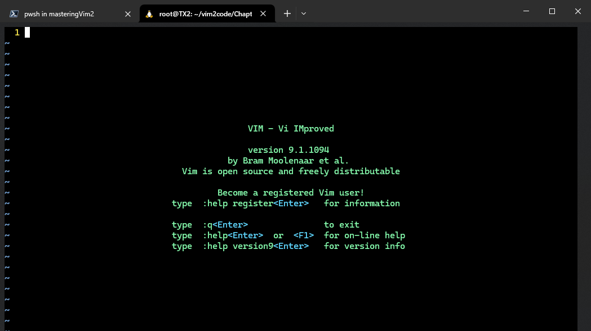

**图 7.1 为了和本书演示效果同步而直接配置的 murphy 配色方案效果图**

查看当前可用的配色方案，执行命令：`:colorscheme` + <kbd>Space</kbd> + <kbd>Ctrl</kbd><kbd>D</kbd>

实测效果如下：

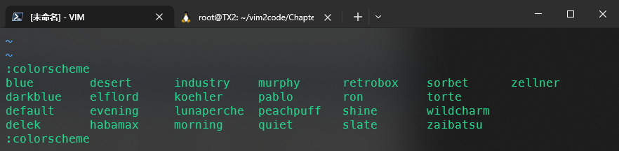

**图 7.2 查看当前可用的配色方案（数量有限）**

由于内置的配色方案有限，书中提供了两个 `Vim` 插件：`vim-colorschemes` 和 `ScrollColors`。前者提供了上百种不同的流行配色方案；后者则引入了 `:SCROLL` 和 `:SCROLLCOLOR` 命令来实时预览这些方案：

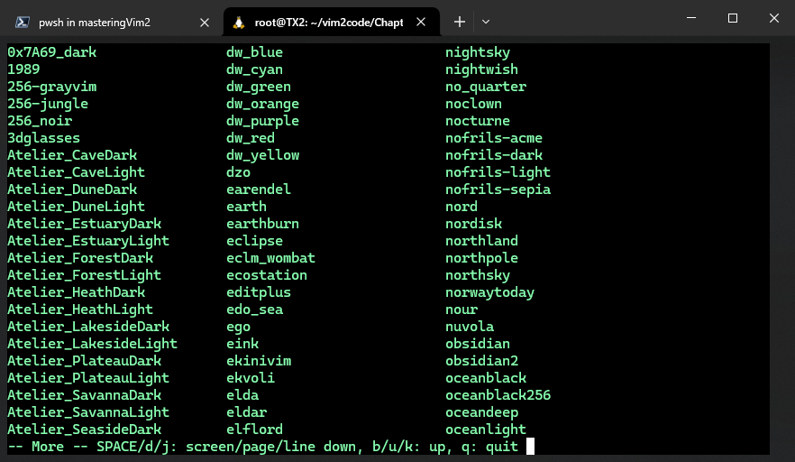

**图 7.3 vim-colorschemes 插件提供的上百种流行配色方案**

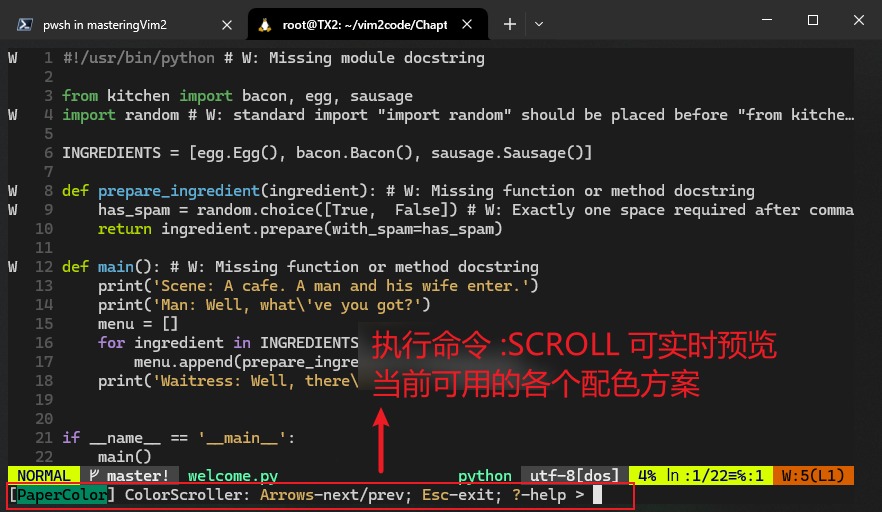

**图 7.4 vim-colorschemes 插件配合 ScrollColors 插件可实现配色方案的实时预览**

这两款插件都是通过 `vim-plug` 统一安装管理的，在 `vimrc` 文件的 `call` 命令之间加入以下内容即可：

```bash
Plug 'flazz/vim-colorschemes'
Plug 'vim-scripts/ScrollColors'
```

重启 `Vim` 即可生效。也可以直接在打开的 `.vimrc` 文件中运行 `:w | so ~/.vimrc | PlugInstall` + <kbd>Enter</kbd> 立即生效：

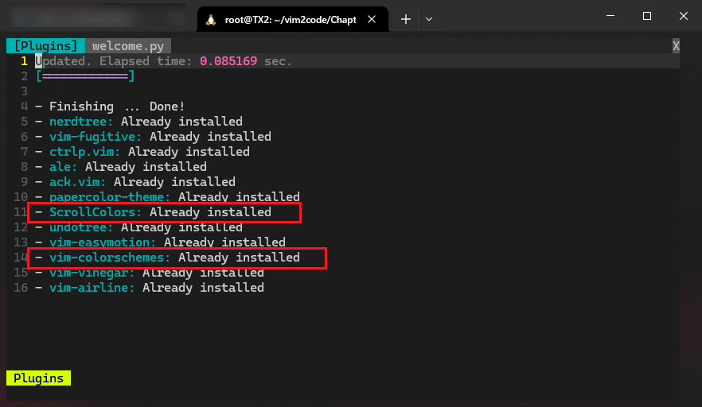

**图 7.5 通过 vim-plugin 对配色方案的两个增强插件进行统一管理**

### 2.1 配色方案 PaperColor 实战演练

作者喜欢的配色方案叫 `PaperColor`，需要从 `GitHub` 单独下载（[https://github.com/NLKNguyen/papercolor-theme](https://github.com/NLKNguyen/papercolor-theme)）。没想到实测时还踩了一个不大不小的坑：插件必须先安装再配置——在 `vimrc` 中的顺序千万不能颠倒，否则 `Vim` 一启动就报错。

正确的配置步骤如下：

使用 `vim-plug` 单独安装 `papercolor-theme` 插件：

1. 向 `.vimrc` 文件新增一行配置命令：`Plug 'NLKNguyen/papercolor-theme'`
2. 执行命令 `:w | so ~/.vimrc | PlugInstall` + <kbd>Enter</kbd>

然后，**在** `call plug#end()` **这句命令的后面** 配置 `PaperColor` 方案：

```bash
" Change a colorscheme.
set background=dark
colorscheme PaperColor
```

**注意**：上述配置中，背景主题 `background` 的设置也必须写在配色方案 `colorscheme` 的前面。

最终的界面效果如下（感觉确实比 `murphy` 好看些）：

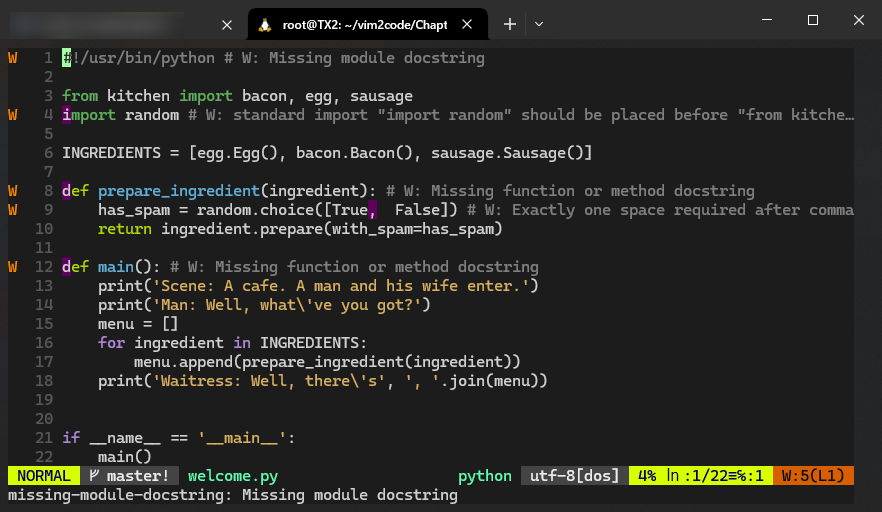

**图 7.6 正确配置后的 PaperColor 方案效果图（深色背景模式）**

如果不按顺序配置，则启动 `Vim` 就会报错：

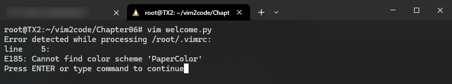

**图 7.7 如果顺序颠倒、先配置再安装插件，则 Vim 一启动就会报错**

此时按回车键强行打开文件也看不到想要的效果：

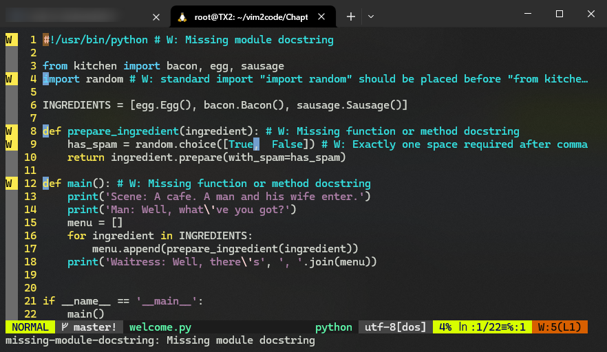

**图 7.8 即便按回车强行打开 Vim，也看不到想要的配色方案效果**


## 3 美化并增强 Vim 状态栏

这一节介绍的 `powerline-status` 工具也是个巨坑：配置极其繁琐，最后还不成功。最后通过 `vim-plug` 一键安装更为轻量的 `airline` 插件才松了口气。安装方法很简单：

1. 向 `.vimrc` 文件新增一行配置命令：`Plug 'vim-airline/vim-airline'`
2. 执行命令 `:w | so ~/.vimrc | PlugInstall` + <kbd>Enter</kbd>

最终效果如下：

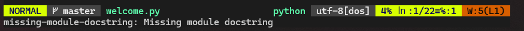

**图 7.9 Vim 状态栏增强插件 airline 的最终效果截图**

但要渲染出截图中的特殊符号，需要安装 `Powerline` 或 `Nerd Font` 字体（这两类字体我的 `WSL` 都没有），好在还有 `DeepSeek` 帮忙。

这是 `Nerd Font` 字体的安装方法：

```bash
# 1. 检查当前环境是否安装了 Nerd Font
$ fc-list | grep -i "Nerd Font"
# 2. 如果没有，则从 GitHub 下载 Nerd Font
$ git clone https://github.com/ryanoasis/nerd-fonts.git --depth=1
# 3. 通过 install 脚本安装
$ cd nerd-fonts
$ ./install.sh
# 4. 刷新字体缓存
$ fc-cache -fv
# 5. 再次验证是否安装成功
$ fc-list | grep -i "Nerd Font"
```

这是 `Powerline` 字体的：

```bash
# 1. 检查当前环境是否安装了 Powerline
$ fc-list | grep -i "Powerline"
# 2. 如果没有，则从 GitHub 下载 Powerline
$ git clone https://github.com/powerline/fonts.git --depth=1
# 3. 通过 install 脚本安装
$ cd fonts
$ ./install.sh
# 4. 刷新字体缓存
$ fc-cache -fv
# 5. 再次验证是否安装成功
$ fc-list | grep -i "Powerline"
```

这样再次打开 `Vim` 就能看到 `airline` 的各种效果了；此外，刚才克隆的 `GitHub` 字体文件夹也可以全部删除了，因为字体默认是安装到系统字体目录 `/usr/share/fonts/` 或 `~/.local/share/fonts/` 下的。

> [!tip]
>
> **DIY 拓展：整体迁移 WSL 的存放路径**
>
> 默认情况下 WSL 的所有操作都是在 `C` 盘下进行的，下载或安装的插件默认也在系统盘。可以通过以下命令实现 `WSL` 物理存储位置的整体迁移——
>
> 1. 在 `Windows` 中打开 `PowerShell`，并执行 `WSL` 导出命令：`wsl --export Ubuntu-20.04 D:\wsl-ubuntu.tar`
> 2. 在 `PowerShell` 中导出 `WSL` 发行版：`wsl --unregister Ubuntu-20.04`
> 3. 导入发行版到新位置（最好提前建好新路径 `D:\wsl`）：`wsl --import Ubuntu-20.04 D:\wsl D:\wsl-ubuntu.tar`
>
> 注意，`Ubuntu-20.04` 是我本地的 `Ubuntu` 完整发行版名称，可通过 `wsl --list --verbose` 查看：
>
> ```bash
> > wsl --list --verbose
>   NAME                   STATE           VERSION
> * docker-desktop-data    Stopped         2
>   Ubuntu-20.04           Running         2
>   docker-desktop         Stopped         2
> ```
>
> 一旦迁移成功，之前默认放在系统盘下的 `WSL` 虚拟硬盘文件也可以一并删除了，具体位置为 `C:\Users\<用户名>\AppData\Local\Packages\<WSL发行版>\LocalState\ext4.vhdx`。我本地的 `WSL发行版` 为一个以 `CanonicalGroupLimited` 开头的文件夹。虚拟硬盘文件删除后，`WSL发行版` 这个文件夹也可以一并删除。


## 4 gVim 的个性化定制

这一节讲得不好，可完全参考我之前的《[Vim Masterclass](https://blog.csdn.net/frgod/category_12867333.html)》专栏 [第 27 篇笔记](https://blog.csdn.net/frgod/article/details/145338140)。

更多用法，可参考 `:h gui`。


## 5 实战：vimrc 配置文件的同步

目前暂时还没有公认的 `Vim` 配置文件的同步标准，常见的做法是将 `Vim` 配置托管到 `GitHub` 这样的 `Git` 服务平台，以 `Git` 仓库的形式实现多端同步。同步到不同的终端后，再通过`symlink` 软链接与 `Vim` 的实际配置进行关联。

具体实战步骤如下：

1. 在 `GitHub` 新增一个仓库 `dotfiles` 作为今后 `Vim` 同步配置的公共远程仓库：

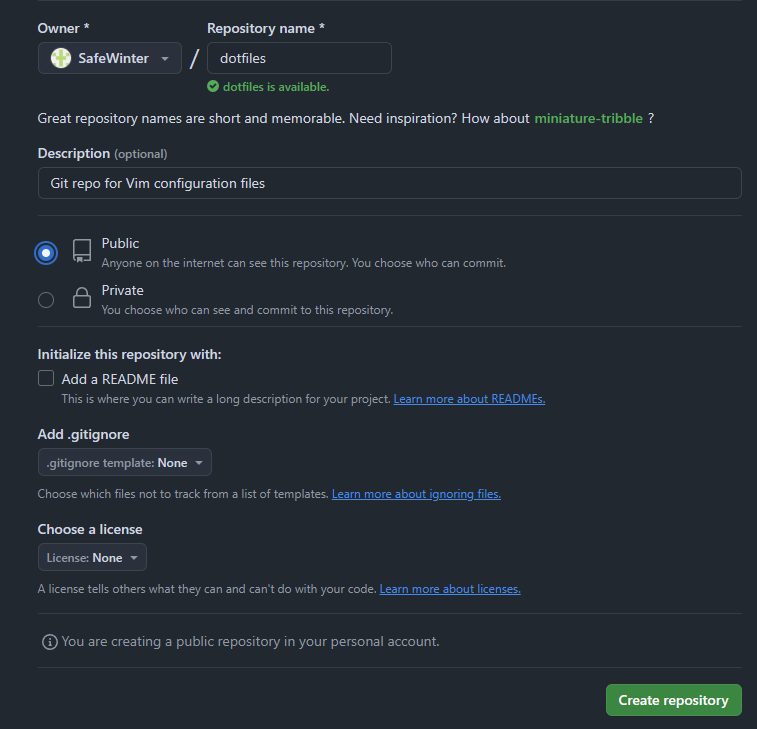

**图 7.10 在 GitHub 新建一个 dotfiles 项目作为 Vim 配置的公共远程仓库**

2. 将 `WSL` 本地的 `vimrc` 文件同步推送到 `dotfiles` 项目：

```bash
# 1. 克隆 dotfiles 到本地
$ git clone git@github.com:SafeWinter/dotfiles.git .dotfiles
Cloning into '.dotfiles'...
warning: You appear to have cloned an empty repository.
$ cd .dotfiles/
# 2. 复制本地 .vimrc 文件
$ cp ~/.vimrc .
$ git add .
$ git status -s
A  .vimrc
# 3. 完成初始提交（根据之前的 GPG 密钥配置，我需要输入 GPG 安全密码）
$ git commit -m 'Init commit'
[master (root-commit) 58604e6] Init commit
 1 file changed, 70 insertions(+)
 create mode 100644 .vimrc
# 4. 同步推送到远程仓库
$ git push
Enumerating objects: 3, done.
Counting objects: 100% (3/3), done.
Delta compression using up to 16 threads
Compressing objects: 100% (2/2), done.
Writing objects: 100% (3/3), 1.88 KiB | 1.88 MiB/s, done.
Total 3 (delta 0), reused 0 (delta 0)
To github.com:SafeWinter/dotfiles.git
 * [new branch]      master -> master
$ 
```

由于之前配置了 `GPG` 密钥，本地提交时需要输入 `passphrase` 安全密码：

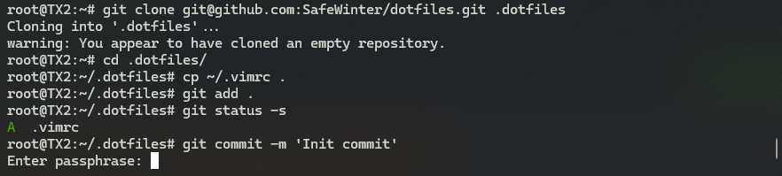

**图 7.11 按照之前的 GPG 配置完成必要的身份校验（非必选操作）**

最后，建立 `symlink` 软链接与 `dotfiles` 项目中的新 `vimrc` 文件位置建立关联（在当前帐户的主目录下运行）：

```bash
# 1. 备份原配置文件
$ mv ~/.vimrc ~/.vimrc.bak
# 2. 建立软链接：
# 格式：ln -s <original_file> <link_to_file>
$ ln -s ./.dotfiles/.vimrc .vimrc
# 3. 检查确认
$ ls -l .vimrc
lrwxrwxrwx 1 root root 18 Feb 26 20:49 .vimrc -> ./.dotfiles/.vimrc
```

这样就完成了 `vimrc` 的同步。任意打开一个文件，效果都和此前一样：

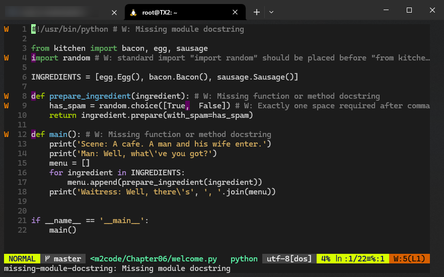

**图 7.12 完成 Vim 配置同步后，用 Vim 任意打开某个文件来验证配置是否成功（符合预期）**

至于 `dotfiles` 项目的同步，既可以每次变更后手动同步，也可以通过设置 `cron` 定时任务同步。


## 6 Vim 个性化定制的良好习惯

书中推荐的几个习惯：

- 时常回顾 `vimrc` 文件中的配置，及时清理不需要的别名、函数及第三方插件；

- 尝试对近期常用的操作设置组合键，同时解绑不常用的组合键。例如：

  ```bash
  nnoremap <leader>p :CtrlP <cr>
  nnoremap <leader>t :CtrlPTag <cr>
  nnoremap <leader>g :grep <c-r><c-w> */**<cr>
  nnoremap ; :
  vnoremap ; :
  ```

- 抽时间学习已安装的插件文档，说不定有惊喜；

- 务必重视在 `vimrc` 中留下必要的注释：

`vimrc` 注释的几种常见写法：

1. 一行注释一行配置型：

```bash
" Show last command in the status line.
set showcmd

" Highlight cursor line.
set cursorline

" Ruler (line, column and % at the right bottom).
set ruler

" Display line numbers if terminal is wide enough.
if &co > 80
  set number
endif

" Soft word wrap.
set linebreak

" Prettier display of long lines of text.
set display+=lastline

" Always show statusline.
set laststatus=2
```

2. 注释与配置同行型（尤其适合管理 `vim-plug` 引入的插件）：

```bash
Plug 'EinfachToll/DidYouMean' " filename suggestions
Plug 'easymotion/vim-easymotion' " better move commands
Plug 'NLKNguyen/papercolor-theme' " colorscheme
Plug 'ajh17/Spacegray.vim' " colorscheme
Plug 'altercation/vim-colors-solarized' " colorscheme
Plug 'christoomey/vim-tmux-navigator' " better tmux integration
Plug 'ervandew/supertab' " more powerful Tab
Plug 'junegunn/goyo.vim' " distraction-free writing
Plug 'ctrlpvim/ctrlp.vim' " Ctrl+p to fuzzy search
Plug 'mileszs/ack.vim' " ack integration
Plug 'scrooloose/nerdtree' " prettier netrw output
Plug 'squarefrog/tomorrow-night.vim' " colorscheme
Plug 'tomtom/tcomment_vim' " commenting helpers
Plug 'tpope/vim-abolish' " change case on the fly
Plug 'tpope/vim-repeat' " repeat everything
Plug 'tpope/vim-surround' " superchange surround commands
Plug 'tpope/vim-unimpaired' " pairs of helpful shortcuts
Plug 'tpope/vim-vinegar' " - to open netrw
Plug 'vim-scripts/Gundo' " visualize the undo tree
Plug 'vim-scripts/vimwiki' " personal wiki
```

3. 巧用 `Vim` 手动折叠行（marker folds）：

```bash
...
" => Editing ------------------------------------------------- {{{1
syntax on
...
" => Looks --------------------------------------------------- {{{1
set background=light
colorscheme PaperColor
...
```

作者给出的折行效果：

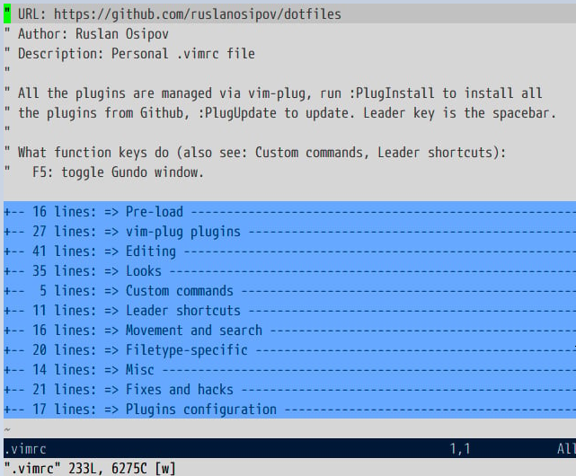

**图 7.13 作者给出的 Vim 配置文件分区域手动折叠效果**

