# 第八章 让您的 Vim 技艺脱胎换骨——Vimscript 初探


> **本章概要**
>
> - `Vimscript` 的基本语法
> - `Vimscript` 编程风格指南
> - 从零打造一个 `Vim` 插件的全过程演示

本章源码：`https://github.com/PacktPublishing/Mastering-Vim-Second-Edition/tree/main/Chapter08`

这一章可谓全书的精华，不失为 `Vim9script` 脚本的绝佳入门材料。作者在前一版的基础上，对旧版 `Vim` 脚本 [^1] 进行了全面修订，前面章节中埋下的很多伏笔在本章都能找到答案。为了近距离感受 `Vimscript` 的强大，作者在本章最后还从零开始打造了一款实用的 `Vim` 插件，让看似零散的脚本语法在实战应用中得到整合，旨在进一步让读者们的 `Vim` 水平有一个质的飞跃。

本章虽知识点密集，但也仅仅是 `Vim` 脚本的冰山一角；想要真正掌握它还需要后期大量深入研读相关文档，并配合相当程度的实战项目训练才行。

---


## 1 为何选择 Vimscript

`Vimscript` 实际上是一种图灵完备的脚本语言，这意味着它具备 **解决任何可计算问题** 的能力。虽然其主要用途是扩展 `Vim` 编辑器，但这一语言特性使其在理论上能够实现一系列复杂的逻辑和算法。


## 2 Vimscript 的运行方式

`Vimscript` 由一系列 `Vim` 命令构成，既可以在命令模式下执行每条 `Vim` 命令，也可以用 `:source` 命令来运行包含 `Vimscript` 的某个文件（通常以 `.vim` 作扩展名）：

```bash
:source <vimscript_filename>
# 或者
:so %
```

这里的 `%` 表示 **当前打开的文件**。实战过程中，如果要立即生效当前 `.vimrc` 文件的配置内容，还可以写作：

```bash
:w | so %
```

注意：务必先保存再运行，否则新内容无法生效。

> [!tip]
>
> **最佳实践**
>
> 用 `:so %` 运行较长的 `Vim` 脚本；用 `Vim` 命令模式来调试脚本。


### 2.1 实测首个 Vim 脚本的执行

新建并打开一个示例文件 `01_variables.vim`，输入以下内容（先按旧版 `Vimscript` 的写法演示）：

```bash
let g:ingredient = 'egg'

echo 'Scene: A cafe. A man and his wife enter.'
echo 'Man: Well, what''ve  you got?'
echo g:ingredient
echo '- said the waitress'
```

运行 `:w | so %` + <kbd>Enter</kbd>：

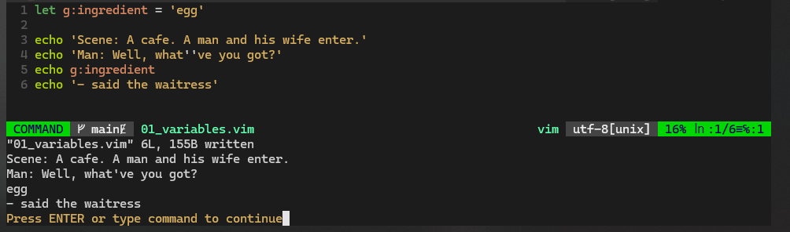

**图 8.1 实测 :w | so % 命令的执行结果**


## 3 脚本在命令模式下的自动续行

在命令模式下，如果输入函数定义或流程控制运算符（如 `if`、`while`、`for` 等），输入回车后 `Vim` 会继续留在命令模式下，实现 “自动续行”：[^2]

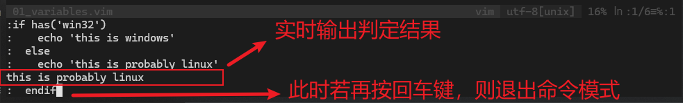

**图 8.2 实测 if 语句在 Vim 命令模式下的 “自动续行” 效果**

上述命令还可以用管道符 `|` 串联成一行：`if has('win32') | echo 'this is windows' | else | echo 'this is probably linux' | endif`。


## 4 关于新版 Vimscript 9

`Vim9` 引入了 `Vimscript 9`，也叫 `Vim9script`，其核心变更包括——

- 性能大幅提升：新版执行速度将带来 10 到 100 倍的提升；
- 注释使用 `#`，取代此前的 `"`；
- 变量声明使用 `var`；
- 用 `def` 定义函数；
- 可以显式声明 `true` 和 `false` 逻辑值；
- 支持用空格提升可读性；
- 新语法特性需要手动开启：要么在脚本文件首行添加 `vim9script`，要么在某个命令前加 `vim9cmd`；

作者建议，`Vim9script` 最好作为 `Vimscript` 的有益补充；但如果对性能有要求，则推荐使用 `Vim9script`，甚至可以用它重写 `.vimrc` 文件（唯一不足的是无法向下兼容）。


## 5 语法速览

经典教材推荐：[《Learn Vimscript the Hard Way》](https://learnvimscriptthehardway.stevelosh.com/)（作者：Steve Losh）[^3]。

### 5.1 变量赋值

```bash
# 旧版
let dish = 'spam omelet'
# 新版（还可以用 const、final）
var dish = 'spam omelet'
```

声明布尔型变量：

```bash
# 旧版（用 1 或 0 表示布尔值）
let has_spam = 1
has_spam = 0
# 新版（支持显式声明）
var has_spam = true
has_spam = false
```


### 5.2 关于变量作用域

通过添加前缀来设置变量的作用域，例如：

```bash
let g:dish = 'spam omelet'
let w:has_spam = 1
```

常见的变量作用域如下（旧版）：

- `g`：表示 `global`，即全局作用域（默认作用域，但函数内声明除外）；
- `v`：表示 `vim-variables`，由 `Vim` 定义的全局作用域；
- `l`：表示 `local scope`，局部作用域（也是函数内声明的默认作用域）；
- `b`：表示 `buffer`，即当前缓冲区；
- `w`：`current window`，即当前窗口作用域；
- `t`：`current tab`，即当前标签作用域；
- `s`：表示 `script`，即脚本级作用域，其变量只在被 `:source` 命令调用的脚本文件内可见；
- `a`：表示 `function argument`，即函数参数作用域。

新版调整：

- 默认作用域改为 `s` 级作用域；
- 不再使用 `a:` 前缀来声明函数参数作用域变量；函数参数作用域改为局部作用域（`l:`）的一部分。


### 5.3 Vim 配置项的赋值

例如声明 `ignorecase` 选项的值：

```bash
# 旧版
let &ignorecase = 0
# 新版
&ignorecase = 0
```


### 5.4 Vim 寄存器的赋值

例如修改寄存器 `a"` 的值：

```bash
# 旧版
let @a = 'spam spam spam'
# 新版
@a = 'spam spam spam'
```


### 5.5 字符串的连接

旧版使用 `.` 操作符，新版改为 `..`：

```bash
# 旧版
let g:dish = 'spam omelet'
let g:statement = 'Well, we''ve got ' . g:dish

# 新版
g:dish = 'spam omelet'
var statement = 'Well, we''ve got ' .. g:dish
```


### 5.6 关于 Vim 脚本中的引号和注释

注意：示例中的单引号是通过重复录入单引号 `'` 实现的。虽然外围也可以改用双引号，写作 `"Well, we've got "`，但由于旧版 `Vimscript` 的注释也是用双引号 `"` 标识的，因此容易产生混淆，不建议这样更改；正因如此，某些 `Vim` 命令的同一行后不能跟一个注释语句，因为会被误判为没写完的字符串（例如 `echo` 命令）：

```bash
# 旧版
let g:dish = 123
echo g:dish "comment content
```

运行结果：

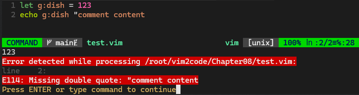

**图 8.3 实测旧版 Vimscript 中的 echo 命令与注释语句在同一行时报错**

而在新版 `Vim9script` 中，注释语句改用 `#` 标识，上述测试脚本可以写为：

```bash
# 新版
vim9script
g:dish = 123
echo g:dish #comment content
```

运行结果：

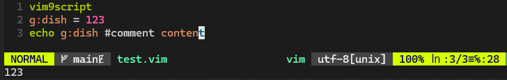

**图 8.4 实测新版 Vim9script 中的 echo 命令与新版注释语句在同一行时运行不报错**

显然我本地的 `PaperColor` 主题还不能正确解析这种情况，因此还是尽量不要这样写。


### 5.7 echo、echom 与 messages

`echo` 命令会将内容显示到状态栏，但该结果不会被记录，一旦删除将无法查看。

`echom` 或 `echomsg` 命令会将输出内容同步记录到当前会话的信息日志，并可通过 `:messages` + <kbd>Enter</kbd> 查看：

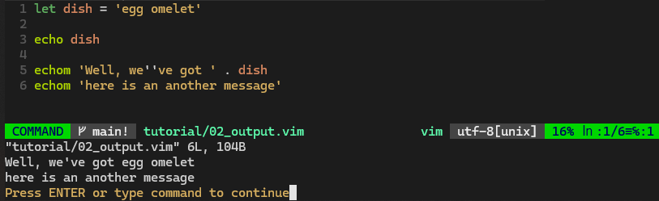

**图 8.5 实测 echo、echom 与 messages 命令的执行结果**

更多用法，详见 `:h message-history`。


### 5.8 条件语句

```bash
# 旧版
# if 的写法
let ingredient = 'egg'

if ingredient == 'egg' 
  echo 'spam omelet' 
elseif ingredient == 'lobster' 
  echo 'spam lobster thermidor' 
else 
  echo dish . ' and spam' 
endif 

# 三目运算符
echo 'spam ' . (ingredient == 'egg' ? 'omelet' : dish)

# 逻辑运算符 &&、||、!
let is_egg = 0
let is_lobster = 0
if (!is_egg && !is_lobster)
  echo ingredient . ' and spam'
endif
```

上述示例脚本对应的 `vim9script` 新版等效写法如下：

```bash
vim9script

const ingredient = 'egg'

if ingredient == 'egg' 
  echo 'spam omelet' 
elseif ingredient == 'lobster' 
  echo 'spam lobster thermidor' 
else 
  echo dish .. ' and spam' 
endif 

echo 'spam ' .. (ingredient == 'egg' ? 'omelet' : dish)

const is_egg = 0
const is_lobster = 0
if (!is_egg && !is_lobster)
  echo ingredient .. ' and spam'
endif
```

另外，专用于文本内容比较还有几个具体的写法（也是 `Vim` 脚本的推荐写法）：

|                     比较类型                      | 写法  |           示例           |
| :-----------------------------------------------: | :---: | :----------------------: |
|         **相等匹配**（大小写随系统设置）          | `==`  |  `'egg' == 'EGG'`（假）  |
|           明确忽略大小写的 **相等匹配**           | `==?` | `'egg' ==? 'EGG'`（真）  |
|           明确考虑大小写的 **相等匹配**           | `==#` | `'egg' ==# 'EGG'`（假）  |
|  检查与右侧模式是否 **匹配**（大小写随系统设置）  | `=~`  | `'egg' =~ 'e.\+'`（真）  |
|     检查与右侧模式是否 **匹配**（忽略大小写）     | `=~?` | `'egg' =~? 'E.\+'`（真） |
|     检查与右侧模式是否 **匹配**（考虑大小写）     | `=~#` | `'egg' =~# 'E.\+'`（假） |
| 检查与右侧模式是否 **不匹配**（大小写随系统设置） | `!~`  |  `'egg' !~ '.gg'`（假）  |
|    检查与右侧模式是否 **不匹配**（忽略大小写）    | `!~?` | `'egg' !~? 'E.\+'`（假） |
|    检查与右侧模式是否 **不匹配**（考虑大小写）    | `!~#` | `'egg' !~# 'E.\+'`（真） |


### 5.9 List 列表

`Vimscript` 中的列表概念与 `Python` 非常相似：

```bash
# 旧版
let ingredients = ['egg', 'bacon', 'sausage']
# 新版
var ingredients = ['egg', 'bacon', 'sausage']
```

列表的基本操作（增删查改）如下——


#### 5.9.1 查

列表元素则通过索引获取：

```bash
# 旧版
let egg = ingredients[0]      " get 1st element
let bacon = ingredients[1]    " get 2nd element
let sausage = ingredients[-1] " get last element

# 新版
const egg = ingredients[0]      # get 1st element
const bacon = ingredients[1]    # get 2nd element
const sausage = ingredients[-1] # get last element
```

获取子列表：

```bash
# 旧版
let slice = ingredients[1:]   " ['bacon', 'sausage']
let slice = ingredients[0:1]  " ['egg', 'bacon']
# 新版
var slice = ingredients[1 : ]
slice = ingredients[0 : 1]
```

除了查列表项的 **值**，还可以查列表项的 **索引**：

```bash
# 旧版
let i = index(ingredients, 'sausage') " 2
# 新版
var i = index(ingredients, 'sausage') # 2
```

以及查元素个数（`len()` 函数）：

```bash
# 旧版
echo 'There are ' . len(ingredients) . ' ingredients.'
# 新版
echo 'There are ' .. len(ingredients) .. ' ingredients.'
```

查某元素的重复次数（`count()` 函数）：

```bash
# 旧版
echo 'There are ' . count(ingredients, 'egg') . ' eggs.'
# 新版
echo 'There are ' .. count(ingredients, 'egg') .. ' eggs.'
```

查某列表是否为空（`empty()` 函数）：

```bash
# 旧版新版皆可
if empty(ingredients)
  echo 'There are no ingredients!'
endif
```


#### 5.9.2 增

在列表末尾新增一个元素：

```bash
# 旧版
call add(ingredients, 'lobster')
# 新版
add(ingredients, 'lobster')
```

在列表开头新增一个元素：

```bash
# 旧版
call insert(ingredients, 'tomato')
# 新版
insert(ingredients, 'tomato')
```

在指定位置插入一个元素：

```bash
# 旧版
call insert(ingredients, 'ham', 2)
# 新版
insert(ingredients, 'ham', 2)
```

若 `ingredients` 最初为 `['tomato', 'egg', 'bacon', 'sausage', 'lobster']`，插入 `'ham'` 后则变为 `['tomato', 'egg', 'ham', 'bacon', 'sausage', 'lobster']`。


> [!note]
>
> **注意**
>
> `add` 函数和 `insert` 函数都是直接在列表上进行修改，因此不是纯函数，且返回值均为更新后的列表。


#### 5.9.3 删

两种方式：`unlet` 语句和 `remove` 内置函数：

```bash
# 旧版
unlet ingredients[2]          " 删除第三个列表项
call remove(ingredients, -1)  " 删除最后一个列表项
unlet ingredients[:1]         " 删除多个元素，相当于 call remove(ingredients, 0, 1)

# 新版
unlet ingredients[2]
remove(ingredients, -1)  # 删除最后一个列表项，并返回被删元素
unlet ingredients[:1]    # 删除多个元素，相当于 remove(ingredients, 0, 1)
```


#### 5.9.4 改

常见的两种方式：`+` 运算符和 `extend()` 内置函数：

```bash
# 旧版
let fresh = ['egg', 'lobster']
let preserved = ['bacon', 'sausage']
let ingredients = fresh + preserved  " ['egg', 'lobster', 'bacon', 'sausage']
call extend(fresh, preserved)

# 新版
var fresh = ['egg', 'lobster']
var preserved = ['bacon', 'sausage']
ingredients = fresh + preserved
extend(fresh, preserved)
```

上述代码中，`extend` 函数文如其名，会扩展 `fresh` 的列表项，而 `preserved` 不变。

此外，`extend` 还可以接收第三个参数：`extend({expr1}, {expr2} [, {expr3}])`。它是一个索引值，用于指定 `{expr2}` 加到 `{expr1}` 中的具体位置。

除了改变列表项的个数，还可以改变列表项的顺序—— `sort()` 排序函数：

```bash
# 旧版
call sort(ingredients)

# 新版
sort(ingredients)
```

这是最简单的排序方式——按字母表升序排序。此外还支持不同区域文化排序和自定义排序，格式为 `sort({list} [, {how} [, {dict}]])`，详见 `:h sort()`。

更多关于 `list` 列表的用法，详见 `:h list`。


### 5.10 字典

新版 `Vim9script` 在字典的定义上省去了多余的反斜杠符：

```bash
# 旧版
let menu = { 
  \ 'egg': 'spam omelet', 
  \ 'bacon': 'bacon and spam', 
  \ 'sausage': 'spam with sausage' 
  \ }

# 新版
var menu = { 
  'egg': 'spam omelet', 
  'bacon': 'bacon and spam', 
  'sausage': 'spam with sausage' 
}
```

字典的基本操作（增删改查）也和列表有很多相似之处——

字典中某 `key` 键对应的 `value` 值通过方括号和 `.` 操作符访问：

```bash
# 旧版
let egg_dish = menu['egg']  " get an element
let egg_dish = menu.egg     " another way to access an element

# 新版
var egg_dish = menu['egg']  # get an element
egg_dish = menu.egg         # another way to access an element
```

值的修改或者键值对的新增都可以通过直接赋值实现：

```bash
# 旧版
let menu['lobster'] = 'lobster thermidor'
let menu.lobster = 'lobster thermidor'

# 新版
menu['lobster'] = 'lobster thermidor'
menu.lobster = 'lobster thermidor'
```

最终得到的 `menu` 如下：

```bash
{
  'bacon': 'bacon and spam', 
  'egg': 'spam omelet', 
  'sausage': 'spam with sausage', 
  'lobster': 'lobster thermidor'
}
```

键值对的删除也和列表类似，分为 `unlet` 语句删除和 `remove()` 函数删除；后者返回被删的字典 **值**：

```bash
# 旧版
unlet menu['lobster']
let lobster = remove(menu, 'lobster')
echo lobster  " lobster thermidor

# 新版
unlet menu['lobster']
const lobster = remove(menu, 'lobster')
echo lobster  # lobster thermidor
```

同理，字典也支持 `extend()` 函数进行扩展：

```bash
# 旧版
call extend(menu, {'lobster': 'lobster thermidor'})
# 新版
extend(menu, {'lobster': 'lobster thermidor'})
```

如果 `menu` 已存在 `lobster` 的键，则扩展的最终结果可以用第三个参数 `{expr3}` 来手动控制，其取值有三个：

- `"keep"`：保留 `menu` 原来的值；
- `"force"`：（默认情况）使用新的键值对替换原来的值；
- `"error"`：不允许出现重复的键，并给出报错信息。

此外，字典也支持 `len()` 函数和 `empty()` 函数，分别用于查看键值对的个数和非空判定：

```bash
# 新旧两版写法相同
if !empty(menu)
  echo 'There are ' . len(menu) . ' dishes in the menu.'
endif
```

此外 `len(menu)` 还可以写为方法形式：

```bash
# 旧版（不能有空格）
echo menu->len()

# 新版（可以有空格）
echo menu -> len()
```

字典还有个特有的函数 `has_key`，用于判定某个 `key` 键是否存在：

```bash
# 新旧两版写法相同
if has_key(menu, 'egg')
  echo 'An egg dish is called ' . menu['egg']
endif
```


### 5.11 循环

#### 5.11.1 for 循环

首先是 `for` 循环。可以作用于列表：

```bash
# 新旧两版写法一致（以新版为例）
for ingredient in ['egg', 'bacon', 'sausage']
  echo ingredient
endfor
```

作用于字典时分两种情况：

```bash
# 新旧两版写法一致（以新版为例）
const menu = {
  'egg': 'spam omelet',
  'bacon': 'bacon and spam',
  'sausage': 'spam with sausage'
}

# 遍历 key 键
for ingredient in keys(menu) 
  echo 'A dish with ' .. ingredient .. ' is called ' .. menu[ingredient] 
endfor 

# 遍历键值对
for [ingredient, dish] in items(menu) 
  echo 'A dish with ' .. ingredient .. ' is called ' .. dish 
endfor 
```

`for` 循环中可以使用 `break` 退出整个循环，也可以用 `continue` 中断当次循环、并继续下一次循环：

```bash
# break 示例
var ingredients = ['egg', 'bacon', 'sausage'] 

for ingredient in ingredients 
  if ingredient ==# 'bacon' 
    echo 'Found bacon! Breaking!' 
    break 
  endif 
  echo 'Looking at an ingredient ' .. ingredient .. ', no bacon yet.' 
endfor 
# 结果：
#  Looking at an ingredient egg, no bacon yet.
#  Found bacon! Breaking!

# continue 示例
ingredients = ['egg', 'bacon', 'sausage'] 

for ingredient in ingredients
  if ingredient ==# 'egg'
    echo 'Ignoring the egg...'
    continue
  endif
  echo 'Looking at an ingredient ' .. ingredient
endfor
# 结果：
#  Ignoring the egg...
#  Looking at an ingredient bacon
#  Looking at an ingredient sausage
```


#### 5.11.2 while 循环

新旧两版的 `while` 循环写法一样：

```bash
# 以新版为例
ingredients = ['egg', 'bacon', 'sausage']

while !empty(ingredients)
  echo remove(ingredients, 0)
endwhile
# 结果：
#  egg
#  bacon
#  sausage
```

`while` 循环也支持 `continue` 和 `break` 关键字，以 `break` 为例：

```bash
# break 示例
ingredients = ['egg', 'bacon', 'sausage']

while len(ingredients) > 0
  var ingredient = remove(ingredients, 0)
  if ingredient ==# 'bacon'
    echo 'Found the bacon, breaking!'
    break
  endif
  echo 'Looking at an ingredient ' .. ingredient
endwhile
# 结果：
#  Looking at an ingredient egg
#  Found the bacon, breaking!
```


### 5.12 函数

旧版使用 `function` 关键字，新版使用 `def`（类似 `Python`）：

```bash
# 旧版
function PrepareIngredient(ingredient) 
  echo a:ingredient . ' and spam' 
endfunction 

function PrepareIngredient2(ingredient)
  return a:ingredient . ' and spam'
endfunction

# 新版
def PrepareIngredient(ingredient: string) 
  echo ingredient .. ' and spam' 
enddef 

def PrepareIngredient2(ingredient: string): string
  return ingredient .. ' and spam'
enddef
```

函数的调用如下：

```bash
# 旧版
call PrepareIngredient('aaa')
echo PrepareIngredient2('bbb')

# 新版
PrepareIngredient('aaa')
echo PrepareIngredient2('bbb')
```

注意：

- `Vim` 要求用户定义的函数名 **必须以大写字母开头**；
- 新版函数的声明需要指定参数的数据类型；若有返回值还需声明返回值的类型，否则无法正常运行；
- 新版函数的参数作用域，已从之前的 `:a` 前缀改为 `:l`，即局部作用域（`local`）。


#### 5.12.1 Lambda 表达式

`Vim` 还支持 `Lambda` 表达式，只是新旧两个版本差异比较大：

```bash
# 旧版：{args -> expr1}
let PrepareIngredient = {ingredient -> ingredient . ' and spam1'}
# 新版：var lambda = (arg): type => expression
var PrepareIngredient = (ingredient): string => ingredient .. ' and spam'
```

`Lambda` 表达式的调用与普通函数相同。更多用法，详见 `:h lambda`。


### 5.13 Class 类

`Class` 类在旧版的 `Vimscript` 中存在很多欠优雅的古怪语法。如果希望在脚本中应用面向对象编程，应该首选新版写法：

```bash
vim9script

class Dish
  var ingredient: string
  var dish_name: string

  def PrepareIngredient(has_spam: bool)
    this.dish_name = has_spam ? this.ingredient ..
        \ ' and spam' : this.ingredient
  enddef
endclass

var bacon = Dish.new('bacon')
bacon.PrepareIngredient(true)
echo bacon.dish_name # bacon and spam
```

对应的旧版写法：

```bash
function PrepareIngredient(has_spam) dict
  let self.dish_name = a:has_spam == 1 ? self.ingredient . ' and spam'
      \ : self.ingredient
endfunction 

let dish = { 
  \ 'ingredient': 'sausage', 
  \ 'dish_name': '', 
  \ 'PrepareIngredient': function('PrepareIngredient')
  \ } 

call dish.PrepareIngredient(1) 
echo dish.dish_name " sausage and spam
```

可以看到，旧版 `Class` 实现有很多奇怪的写法，而新版借鉴了当前流行开发语言的 `OOP` 特性（如 `Java`、`TypeScript`、`Dart`）。新版 `Class` 实现还支持静态成员变量、静态方法、接口定义、公有成员、枚举类、父类继承和接口实现等，更多用法及注意事项，详见 `:h vim9class`。


### 5.14 map 和 filter

这两个内置函数都是用于集合型数据的操作，`map` 用于映射或转换成其他值；`filter` 则用于筛选符合一定条件的元素。二者在函数式编程中十分常见，但在 `Vim` 脚本的写法中略显古怪，不如其他编程语言直观：

```bash
# 旧版写法
let dishes = ['spam omelet', 'sausage', 'bacon and spam']  

function HasSpam(dish) 
  if stridx(a:dish, 'spam') > -1
    return 1
  endif 
  return 0 
endfunction 

call filter(dishes, 'HasSpam(v:val)') 
echo dishes
" ['spam omelet', 'bacon and spam']

let dishes = ['spam omelet', 'sausage', 'bacon']

call map(dishes, 'HasSpam(v:val) ? v:val : v:val . '' and spam ''')
echo dishes
" ['spam omelet', 'sausage and spam ', 'bacon and spam ']
```

而在 `Vim9script` 中写法其实是一样的，只是抽离出的函数定义写法略有不同：

```bash
# 新版写法
vim9script

var dishes = ['spam omelet', 'sausage', 'bacon and spam']  

def HasSpam(dish: string): bool
  if stridx(dish, 'spam') > -1
    return 1
  endif 
  return 0 
enddef 

filter(dishes, 'HasSpam(v:val)') 
echo dishes 
# ['spam omelet', 'bacon and spam']

dishes = ['spam omelet', 'sausage', 'bacon']

map(dishes, 'HasSpam(v:val) ? v:val : v:val .. '' and spam ''')
echo dishes
# ['spam omelet', 'sausage and spam ', 'bacon and spam ']
```

这里的 `v:val` 是内部遍历 `dishes` 列表时的循环变量的 **值**；此外还有 `v:key`，对应当前循环变量的 **键**。二者都是 **固定写法**。对于字典而言，它们就是每个 `entry` 项的键和值；而对于列表，则分别对应索引值和元素值。

代码中的 `stridx` 函数用于查找子字符串，即判定参数 `dish` 中是否包含子字符串 `'spam'`：包含则返回对应的索引值，否则返回 `-1`。

此外，`filter` 和 `map` 的第二个参数除了写成字符串形式，还可以利用刚才提到的 `Lambda` 表达式进行改造：

```bash
# 新版第 13 行的等效替换
filter(dishes, (_, dish) => HasSpam(dish))
# 新版第 19 行的等效替换
map(dishes, (_, dish) => HasSpam(dish) ? dish : dish .. ' and spam')
```

如果改造一下 `HasSpam`，还可以写为更简洁的形式（使用 `funcref` 函数引用的形式）：

```bash
def HasSpam(key: number, dish: string): bool
  return stridx(dish, 'spam') > -1
enddef
filter(dishes, HasSpam)
```

同理，`map` 的映射逻辑也可以封装到一个新函数中：

```bash
def AddSpamIfMissing(key: number, dish: string): string
  return HasSpam(key, dish) ? dish : dish .. ' and spam'
enddef
map(dishes, AddSpamIfMissing)
```

当然也可以赋给一个变量或常量：

```bash
const AddSpamIfMissing = (key, dish) => !HasSpam(key, dish)
  \ ? dish .. ' and spam'
  \ : dish
map(dishes, AddSpamIfMissing)
```

实测结果：

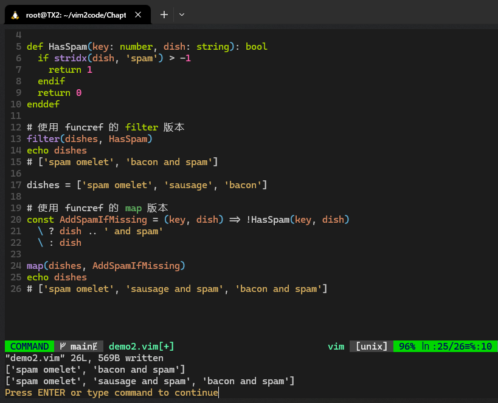

**图 8.6 实测用 funcref 函数引用改造后的 filter 和 map 执行结果（符合预期）**


### 5.15 与 Vim 进行交互

这一节很多内容在实测时与原书不符，这里仅列举两个简单的案例。

可以使用 `execute` 解析一个字符串命令：

```bash
# 新旧版本保持一致
var dish = 'spam omelet'
execute 'echo dish ''probably got spam in it'''
# 相当于执行
echo dish 'probably got spam in it'
```

此外也可以实现在 `normal` 模式下执行某些操作，例如：

```bash
# 在 normal 模式下查询关键字并删除第一个匹配项
execute 'normal /egg^Mdw'
```

注意，这里的 `^M` 是通过 <kbd>Ctrl</kbd><kbd>Q</kbd><kbd>Enter</kbd> 产生的，而不是手动输入 `^M` 这两个字符。

执行上述语句时，`Vim` 会临时中断运行，提示输入任意键或回车键继续。按提示输入回车键，`Vim` 才会删除第一个匹配到的关键字：

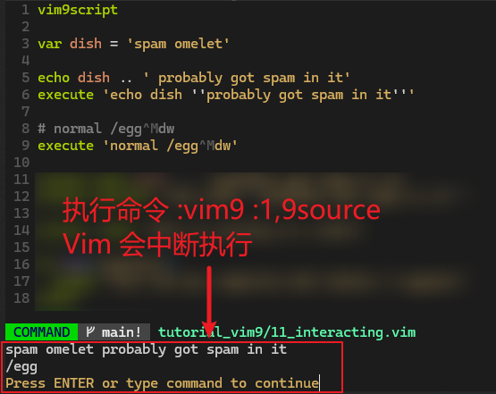

**图 8.7 实测 execute 命令查找并删除第一个匹配项时 Vim 被中断的效果截图**

这里用到了一个 `vim9cmd` 命令来手动运行脚本文件中的某一段内容（截图中即为第 1 至 9 行）。若此时再按回车键，第 8 行的第一个匹配项 `egg` 将被删除：

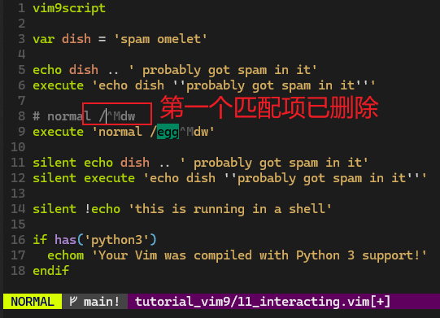

**图 8.8 输入回车键后删除第一个匹配项的效果图**

最后值得一提的是特性检测函数 `has()`。例如检测当前 `Vim` 是否支持 `python3` 可以写作：

```bash
if has('python3')
  echom 'Your Vim was compiled with Python 3 support!'
endif
```

检测当前操作系统是否为 `Windows` 系统，使用 `has('win32')`，支持的操作系统名称有：`win64`、`macunix`、`unix`、`osxdarwin`（MacOS）等等。

更多用法，详见 `:h feature-list`。


### 5.16 与文件相关的命令

第一个是 `expand` 命令，用于获取文件路径信息。例如获取当前文件的扩展名（当前文件名为 `12_file.vim`）：

```bash
# 旧版
echom 'Current file extension is ' . expand('%:e') " Current file extension is vim
# 新版
echom 'Current file extension is ' .. expand('%:e') # Current file extension is vim
```

除了 `:e` 获取扩展名，`expand` 函数还支持以下文件信息展示：

- `:p`：文件的完整路径（`full path`）；
- `:h`：文件头部信息（`head`，即所在文件夹的名称）；
- `:t`：文件尾部信息（`tail`，即最后的文件名）；
- `:r`：文件根信息（`root`，即省略扩展名后的所在文件夹和文件名）；
- `:e`：文件扩展名信息（`extension`）。

实测结果（当前 `Shell` 位于 `~/vim2code/Chapter08/`，打开的文件相对路径为 `./tutorial_vim/12_file.vim`）：

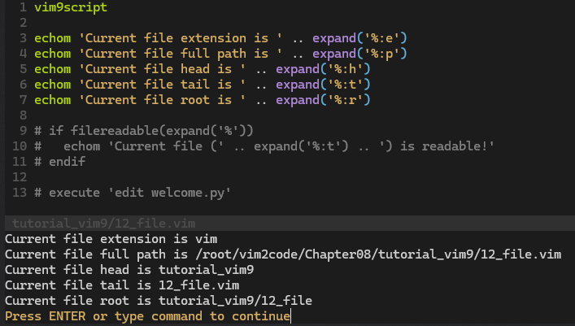

**图 8.9 实测 expand 不同参数获取到的文件路径信息**

更多用法，详见 `:h expand`。


### 5.17 Prompt 提示语命令

在用 `Vimscript` 做人机交互时，提示用户输入的信息通常分为两类：一是不限制输入内容的；另一种是只能输入指定内容的。前者使用 `input` 函数，后者使用 `confirm` 函数。

#### 5.17.1 input 函数

`input` 示例如下：

```bash
# 旧版
let ingredient = input('Please input an ingredient: ')
echo "\n"
echo 'We now serve ' . ingredient . ' and spam!'

# 新版
var ingredient = input('Please input an ingredient: ')
echo "\n"
echo 'We now serve ' .. ingredient .. ' and spam!'
```

这里的 `\n` 用于断开 `input` 提示语与后续输出内容。

运行结果：

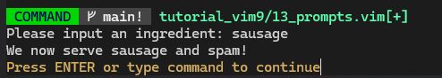

**图 8.10 运行 input 函数的实测结果截图（手动输入 “sausage”）**


#### 5.17.2 confirm 函数

再看一个 `confirm` 的例子：

```bash
# 新旧写法都一致，以新版为例
var answer = confirm('Add spam to a dish?', "&yes\n&no") 
echo answer

answer = confirm(
    \ 'Add spam to a dish?', "absolutely &yes\nhell &no")
echo answer
```

这里的 `&y` 和 `&n` 用于将 `y` 和 `n` 变为快捷应答键（与 `VB` 类似）。`\n` 用于在备选项之间生成一个分隔符（即逗号）：

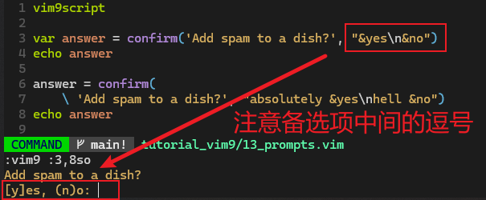

**图 8.11 执行第一个 confirm 语句的提示情况截图**

从截图还可以看到一些细节，`[y]` 表示按回车键即可默认选择 `yes` 选项，`(n)` 表示 `no` 选项的快捷键，但此时并非默认选项。按指定内容输入字符后，`confirm` 函数将从 `1` 开始返回指定选项的序号：

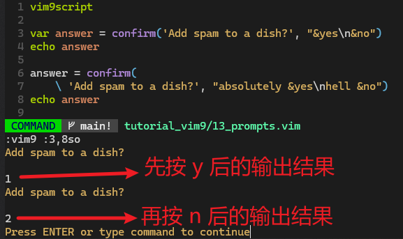

**图 8.12 先后输入 y 和 n 后的 confirm 函数返回值情况**


#### 5.17.3 将提示语放入自定义快捷键

如果要将提示输入的逻辑放入某个自定义快捷键组合，为了避免组合键的按键被误认为 `input` 函数的用户输入内容，需要成对使用 `inputsave()` 和 `inputrestore()` 来隔离手动输入的内容。

例如，将 `input` 手动输入的内容直接 `echo` 到当前状态栏，并绑定一组快捷键自动实现该操作，具体脚本如下：

```bash
# 以新版写法为例
def InputIngredient(): string
  inputsave()
  var ingredient = input('Please input an ingredient: ')
  inputrestore()

  return ingredient
enddef

nnoremap <leader>a = <scriptcmd>ingredient = InputIngredient()<cr><scriptcmd>echo ingredient<cr>
```

在示例文件 `Chapter08/tutorial_vim9/13_prompts.vim` 中运行 `:vim9 :14,22so` + <kbd>Enter</kbd> 单独执行第 14 到 22 行脚本：

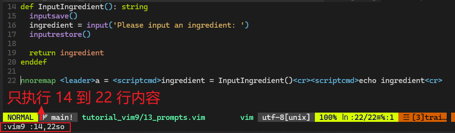

**图 8.13 在 Vim9script 中设置自定义组合键（Leader 键 + a）**

然后输入 `Leader` 键（默认为 <kbd>\\</kbd>）+ <kbd>A</kbd> 即可唤起 `InputIngredient()` 函数的运行，提示用户输入任意文本。例如输入 `bacon` 后按回车键，`Vim` 就会自动将该内容输出到状态栏：


**图 8.14 按 Leader 键 + a 自动弹出提示语，输入 bacon 后回车，系统将自动打印该内容**

> [!note]
>
> **DIY：关于 scriptcmd 标签的用法**
>
> 上述示例代码中，`<scriptcmd>` 标签是通过 `DeepSeek` 改进后的固定写法。原书代码本来为：
>
> ```bash
> # TODO: Something is not working here, getting a compilation error.
> nnoremap <leader>a = :let ingredient = InputIngredient()<cr>:echo ingredient<cr>
> ```
>
> 正如注释所言，直接运行会报编译错误：`E117: Unknown function: InputIngredient`。这是因为组合键的定义仅在 `normal` 正常模式下生效（`nnoremap`）；而 `Vim` 在默认情况下是无法直接调用 `Vim9` 脚本中用户定义的函数（如 `InputIngredient`）的，`Vim9` 函数默认是局部作用域。为此，必须使用 `<scriptcmd>` 标签绕过这个问题，让 `Vim` 能够直接在键映射中调用 `Vim9` 新版脚本的局部函数和变量。详见 `:h <ScriptCmd>`。


#### 5.18 利用帮助系统学习 Vim9 脚本

常用的几个文档如下：

- `:h eval`：深入了解旧版 `Vim` 脚本的表达式求值的各种用法（用于向后兼容）；
- `:h vim9`：深入了解 `Vim9` 脚本的新语法特性；
- `:h vim9class`：深入了解 `Vim9` 的 `Class` 类、对象、接口、类型、枚举等；


### 5.19 Vimscript 推荐编程风格

主要内容包括：

- 缩进使用两个空格；
- 不用制表符（即 <kbd>Tab</kbd> 键）；
- 操作符两边加空格；
- 每行最多 80 个字符宽度；
- 一行内容的换行缩进用四个空格表示；
- 插件名称示例：`plugin-names-like-this`
- 函数名示例：`FunctionNamesLikeThis`
- 命令名称示例：`CommandNamesLikeThis`
- 一组参数示例：`augroup_names_like_this`
- 变量名示例：`variable_names_like_this`
- 在变量前加注作用域前缀；
- 若有疑问，参考 `Python` 的编码指导原则；

更多推荐风格，请参考谷歌推荐方案：`https://google.github.io/styleguide/vimscriptguide.xml`


## 6 从零打造一个 Vim 插件

需求描述：通过自定义 `Vim` 插件（取名为 `vim-commenter`）快速注释（或取消注释）光标所在的 `Python` 代码。

### 6.1 Vim 插件的目录结构

自 `Vim 8.x` 后，`Vim` 插件就只有一种统一的目录结构：

- `autoload/`：负责插件的懒加载
- `colors/`：存放配色方案
- `compiler/`：负责与编译器相关的功能（视具体语言而异）
- `doc/`：存放插件文档
- `ftdetect/`：文件类型探测方面的设置（视具体文件类型而异）
- `ftplugin/`：与文件类型相关的插件代码（视具体文件类型而异）
- `indent/`：与缩进相关的设置（视具体文件类型而异）
- `plugin/`：存放插件核心功能代码
- `syntax/`：定义各语言语法特性相关的设置（视具体语言而异）


### 6.2 第一版实现

为突出核心功能，这里直接通过自动加载运行自定义插件：

```bash
$ mkdir -p ~/.vim/pack/plugins/start/vim-commenter/plugin
$ cd ~/.vim/pack/plugins/start/vim-commenter/plugin
$ vim commenter.vim
```

插件内容如下：

```bash
# 旧版
" Comment out the current line in Python.
function! commenter#Comment()
  let l:line = getline('.')
  call setline('.', '# ' . l:line)
endfunction
nnoremap gc :call commenter#Comment()<cr>

# 新版
vim9script
# Comment out the current line in Python
export def Comment()
  var line = getline('.')
  setline('.', '# ' .. line)
enddef
nnoremap gc = <ScriptCmd>Comment()<cr>
```

> [!note]
>
> **注意**
>
> 为了更快适应 `Vim9script` 语法，后续插件代码均改为新版写法，以满足今后的性能需求（绝对原创）。

接着随便打开一个文件（如第 6 章的 `Chapter06/welcome.py`），在某行输入 `gc` 会看到该行自动变为了注释语句：

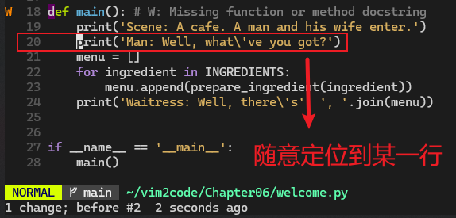

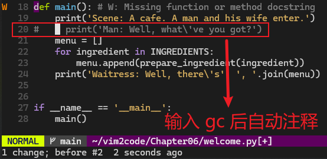

**图 8.15 完成首版插件逻辑后在任一 Python 文件上实测的注释效果**

但是问题也很明显：再按 `gc` 无法自动取消注释：

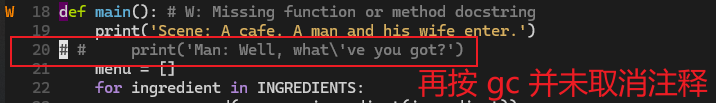

**图 8.16 首版实现的 Bug：再次输入 gc 命令无法自动取消注释，光标位置也有问题**


### 6.3 第二版实现

先解决注释符号不在当前缩进位置的问题：

```bash
vim9script

const comment_string = '# '
# Comment out the current line in Python
export def Comment()
  var i = indent('.') # Number of spaces
  var line = getline('.')
  var cur_row = getcurpos()[1]
  var cur_col = getcurpos()[2]
  setline('.', line[ : i - 1] .. comment_string .. line[i : ])
  cursor(cur_row, cur_col + len(comment_string))
enddef
nnoremap gc = <ScriptCmd>Comment()<cr>
```

运行结果（`#` 的位置修复成功）：

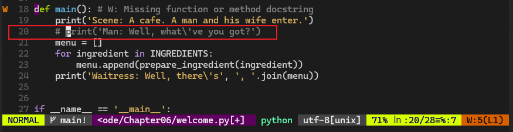

**图 8.17 修复问题：注释符号应于当前行的缩进量保持一致**


### 6.4 第三版实现

接着解决注释的切换问题，对插件核心逻辑做如下修改：

```bash
vim9script

const comment_string = '# '
# Comment out the current line in Python
export def ToggleComment()
  var i = indent('.') # Number of spaces
  var line = getline('.')
  var cur_row = getcurpos()[1]
  var cur_col = getcurpos()[2]
  var cur_offset = 0
  if line[i : i + len(comment_string) - 1] ==# comment_string
    setline('.', line[ : i - 1] .. line[i + len(comment_string) : ])
  else
    setline('.', line[ : i - 1] .. comment_string .. line[i : ])
    cur_offset = len(comment_string)
  endif
  cursor(cur_row, cur_col + cur_offset)
enddef
nnoremap gc = <ScriptCmd>ToggleComment()<cr>
```

保存后验证效果（符合预期）：

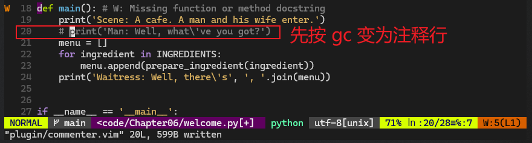

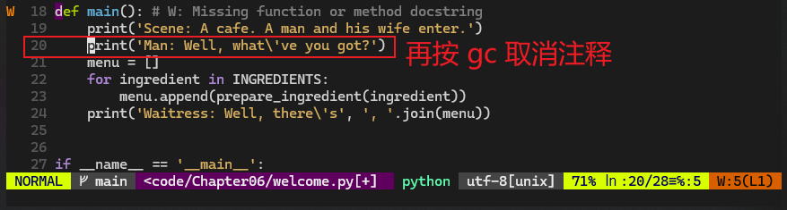

**图 8.18 实测注释切换功能，光标位置也能正常还原**


### 6.5 第四版实现

上述逻辑对于当前行存在缩进量的情况是有效的，如果没有缩进，就有问题了：

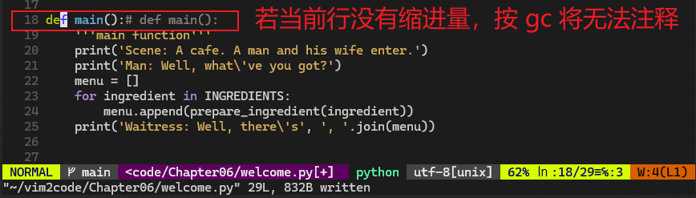

**图 8.19 实测新 Bug：当前行没有缩进量时，按 gc 键无法正常切换当前行注释**

为此，需要再次更新，实现第四版修订：

```bash
vim9script

const comment_string = '# '
# Comment out the current line in Python
export def ToggleComment()
  const i = indent('.') # Number of spaces
  const line = getline('.')
  const cur_row = getcurpos()[1]
  const cur_col = getcurpos()[2]
  const prefix = i > 0 ? line[: i - 1] : '' # Handle 0 indent
  const has_commented = line[i : i + len(comment_string) - 1] ==# comment_string
  if has_commented
    setline('.', prefix .. line[i + len(comment_string) : ])
  else
    setline('.', prefix .. comment_string .. line[i : ])
  endif
  const cur_offset = has_commented ? 0 : len(comment_string)
  cursor(cur_row, cur_col + cur_offset)
enddef
nnoremap gc = <ScriptCmd>ToggleComment()<cr>
```

至此，核心功能点就实现完毕了。


### 6.6 拆解插件逻辑

接下来需要按 `Vim` 插件的标准目录结构进行合理拆分。

首先，将 `comment_string` 变量改为全局作用域，然后移动到 `vim-commenter/ftplugin/python.vim`，因为只有它与特定语言（`Python`）相关，而 `ftplugin` 文件夹就是负责处理特定语言的相关配置。`python.vim` 的内容如下：

```bash
vim9script

# 定义 Python 专用的注释符号（buffer-local 常量）
const b:commenter_comment_string = '# '
lockvar b:commenter_comment_string  # 锁定为常量
```

这里和原书的内容就不同了。根据 `DeepSeek` 给出的回复，上述代码有两点值得关注：

- 使用 `b:commenter_comment_string`（`buffer-local` 变量），确保不同文件类型不会互相干扰；
- `lockvar` 确保该变量不可被意外修改；
- 之所以同时使用 `const` 和 `lockvar` 是出于兼容性的考虑。`lockvar` 适用于旧版 `Vimscript`，`const` 是 `Vim9` 推荐的常量声明写法；

然后对 `vim-commenter/plugin/commenter.vim` 做如下改造：

```bash
vim9script

# Comment out the current line in Python
export def ToggleComment()
  if !exists('b:commenter_comment_string')
    echoerr 'Comment string not defined for filetype: ' .. &filetype
    return
  endif

  const comment_string = b:commenter_comment_string
  const i = indent('.')                     # Number of indent spaces
  const line = getline('.')                 # Content of current line
  const cur_row = getcurpos()[1]            # Current row number
  const cur_col = getcurpos()[2]            # Current column number
  const prefix = i > 0 ? line[: i - 1] : '' # Handle 0 indent
  const comment_len = len(comment_string)
  const has_commented = line[i : i + len(comment_string) - 1] ==# comment_string
  if has_commented
    # Cancel comment
    setline('.', prefix .. line[i + comment_len : ])
  else
    # Make comment line
    setline('.', prefix .. comment_string .. line[i : ])
  endif
  const cur_offset = has_commented ? 0 : comment_len
  cursor(cur_row, cur_col + cur_offset)
enddef

nnoremap gc = <ScriptCmd>ToggleComment()<cr>
```

其中，第 5 至 8 行是 `DeepSeek` 补上的，用到了防御式编程；同时还补全了核心逻辑的注释与排版，抽离了公共变量 `comment_len`，使得代码整体更易于维护。

保存最新改动后，使用 `so %` 重新生效。此时重新打开一个测试文件，反复执行 `gc` 命令，该行内容会正常切换注释（如果不重新打开测试文件，`Vim` 可能会报错，提示找不到 `python` 文件类型：`Comment string not defined for filetype: python`）。

为了进一步验证配置的有效性，再对 `.c` 结尾的 `C` 语言源文件指定新的注释符号 `// `，新建文件类型配置 `ftplugin/c.vim`：

```bash
vim9script

const b:commenter_comment_string = '// '
lockvar b:commenter_comment_string
```

然后任意生成一个 `C` 语言源码文件 `demo.c`：

```c
#include <stdio.h>

// 这是一个单行注释
int main() {
    // 打印 Hello, World!
    printf("Hello, World!\n");

    /* 这是一个多行注释
       第二行注释 */
    int x = 10;
    if (x > 5) {
        printf("x is greater than 5\n");
    }

    /*
     * 另一个多行注释
     * 用于测试
     */
    return 0;
}
```

打开该文件，多次执行 `gc` 命令，会看到光标所在行成功实现注释行的切换：

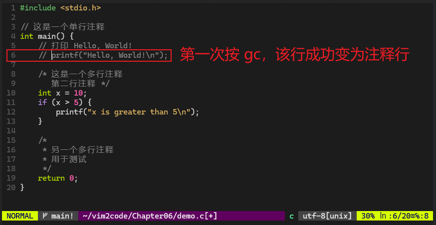

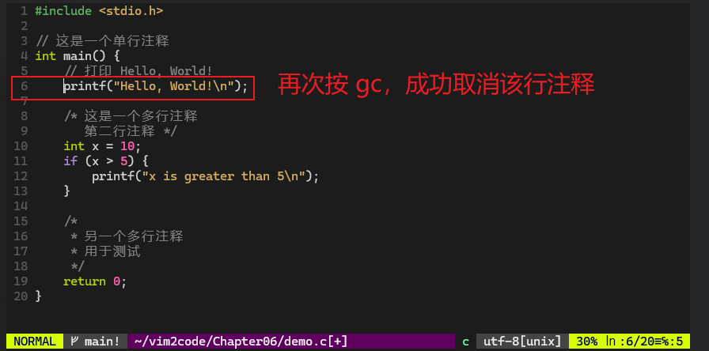

**图 8.20 实测 vim-commenter 插件对 C 语言文件成功实现注释行的切换**


### 6.7 拆分到 autoload 目录

为了进一步提高插件性能，还可以将核心逻辑迁移到 `autoload` 文件夹下。先创建文件夹：

```bash
$ mkdir autoload
$ vim autoload/commenter.vim
```

`autoload/commenter.vim` 的文件内容如下：

```bash
vim9script

# Comment out the current line in Python
export def ToggleComment()
  if !exists('b:commenter_comment_string')
    echoerr 'Comment string not defined for filetype: ' .. &filetype
    return
  endif

  const comment_string = b:commenter_comment_string
  const i = indent('.')                     # Number of indent spaces
  const line = getline('.')                 # Content of current line
  const cur_row = getcurpos()[1]            # Current row number
  const cur_col = getcurpos()[2]            # Current column number
  const prefix = i > 0 ? line[: i - 1] : '' # Handle 0 indent
  const comment_len = len(comment_string)
  const has_commented = line[i : i + len(comment_string) - 1] ==# comment_string
  if has_commented
    # Cancel comment
    setline('.', prefix .. line[i + comment_len : ])
  else
    # Make comment line
    setline('.', prefix .. comment_string .. line[i : ])
  endif
  const cur_offset = has_commented ? -comment_len : comment_len
  cursor(cur_row, cur_col + cur_offset)
enddef
```

然后将原来的 `plugin/commenter.vim` 中的同名函数删除，并作如下修改：

```bash
vim9script

nnoremap gc <ScriptCmd>commenter#ToggleComment()<cr>
```

注意，第 3 行在调用 `ToggleComment` 函数时加了一个 `commenter#` 前缀。这是 `autoload` 的特有命名规则：该目录下的文件名 `commenter.vim` 对应命名空间 `commenter#`。如果缺失命名空间，`gc` 命令将无法关联到 `ToggleComment` 函数，并报错：`E117: Unknown function: ToggleComment`。

完成上述变更后，重新打开一个 `Python` 示例文件，插件预定功能均正常运行。

此时插件各部分的加载顺序如下：

1. 打开 `Vim`，`<...>/vim-commenter/plugin/commenter.vim` 中的内容将被自动加载，自定义组合键 `gc` 生效；
2. 打开任意一个 `Python` 文件，将激活 `<...>/vim-commenter/ftplugin/python.vim` 中的内容；此时注释标记初始化成功（即 `# `）；
3. 按 `gc` 键将激活 `<...>/vim-commenter/autoload/commenter.vim` 中的内容，并执行 `commenter#ToggleComment()` 中的插件核心逻辑。


### 6.8 新增插件文档

插件文档统一放到 `/doc` 文件夹下，新增 `/doc/commenter.txt`：

```bash
*commenter.txt* Our first commenting plugin.
*commenter*
=====================================================================
CONTENTS *commenter-contents*

1. Intro........................................|commenter-intro|
2. Usage........................................|commenter-usage|

=====================================================================
1. Intro *commenter-intro*

Have you ever wanted to comment out a line with only three presses of a button? Now you can! The new and wonderful vim-commenter lets you comment out a single line in Python quickly!

2. Usage *commenter-usage*

This wonderful plugin supports the following key bindings:

gc: toggle comment on a current line

That's it for now. Thanks for reading!

vim:tw=78:ts=2:sts=2:sw=2:ft=help:norl:
```

上述内容中——

- 形如 `*help-tag*` 的内容表示一个帮助标签，可跟在 `:help` 命令后快速跳转到文档内容中；
- 形如 `|commenter-intro|` 的内容表示文档内部目录，用于快速导航到正文中的对应位置；
- 形如 `====` 的内容仅为装饰效果，无实际意义；
- 最后一行 `vim:tw=78:ts=2:sts=2:sw=2:ft=help:norl:` 用于控制文档页的版面样式（所有选项都可用 `set` 关键字设置）。

这样，运行 `:h commenter-intro` 即可进入该插件帮助文档页。更多帮助文档的写法，详见 `:h help-writing`。

手动加载帮助文档，需运行命令 `:help-tags ~/.vim/pack/plugins/start/vim-commenter/doc`，即后跟一个 `/doc` 文件夹的完整路径。

实测效果：

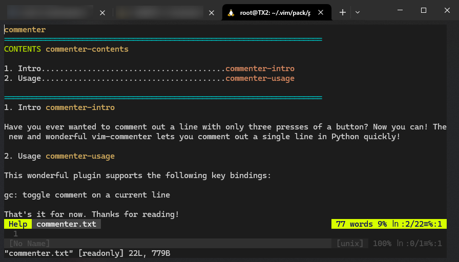

**图 8.21 为 vim-commenter 插件配置帮助文档后的实测查询效果**


### 6.9 功能增强：支持多行操作

仅仅使用 `gc` 命令只能对单行内容进行注释或取消注释，实际应用中最好加入多行支持，例如按 `5gc` 可以将包括当前行在内的下面五行代码批量注释（或批量取消注释）。

本节内容升级为 `Vim9script` 语法后与原书出入较大，若需按旧版写法实现增强，请参考原书内容，这里仅梳理新版重构方案。

先改造 `plugin/commenter.vim`：

```bash
vim9script

nnoremap gc <ScriptCmd>commenter#ToggleComment(v:count1)<cr>
```

这里的 `v:count1` 表示键入的数量，且默认为 1。

在改造 `autoload/commenter.vim`：

```bash
vim9script

# Returns true if b:commenter_comment_string exists.
def HasCommentStr(): bool
  if exists('b:commenter_comment_string')
    return true
  endif
  echoerr 'Comment string not defined for filetype: ' .. &filetype
  return false
enddef

# Detect smallest indentation for a range of lines.
def DetectMinIndent(start: number, end: number): number
  var min_indent = -1
  var i = start
  while i <= end
    if min_indent == -1 || indent(i) < min_indent
      min_indent = indent(i)
    endif
    i += 1
  endwhile
  return min_indent
enddef

def InsertOrRemoveComment(lnum: number, line: string, indent: number, has_commented: bool)
  # Handle 0 indent cases
  const prefix = indent > 0 ? line[ : indent - 1] : ''
  const comment_str = b:commenter_comment_string
  if has_commented
    # Remove comment sign
    setline(lnum, prefix .. line[indent + len(comment_str) : ])
  else
    # Add comment sign
    setline(lnum, prefix .. comment_str .. line[indent : ])
  endif
enddef

# Comment out the current line in Python
export def ToggleComment(count: number)
  if !HasCommentStr()
    return
  endif

  const start = line('.')
  # Stop at the end of file.
  var end = start + count - 1
  if end > line('$')
    end = line('$')
  endif

  const indent = DetectMinIndent(start, end)
  const lines = start == end ? [getline(start)] : getline(start, end)

  const cur_row = getcurpos()[1]            # Current row number
  const cur_col = getcurpos()[2]            # Current column number

  const comment_string = b:commenter_comment_string
  const comment_len = len(comment_string)
  const has_commented = lines[0][indent : indent + comment_len - 1] ==# comment_string

  var lnum = start
  for line in lines
    InsertOrRemoveComment(lnum, line, indent, has_commented)
    lnum += 1
  endfor
  const cur_offset = has_commented ? -comment_len : comment_len
  cursor(cur_row, cur_col + cur_offset)
enddef
```

运行 `:w | so %` 生效新内容后，任意打开一个测试文件，如 `Chapter06/welcome.py`：

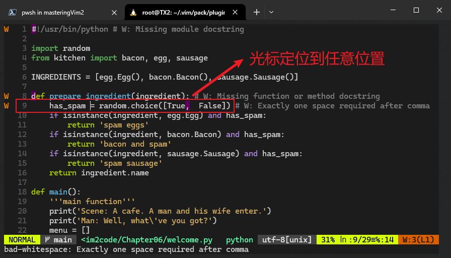

**图 8.22 多行注释功能重构完毕后打开任意一个 Python 测试文件**

然后按 `5gc`：

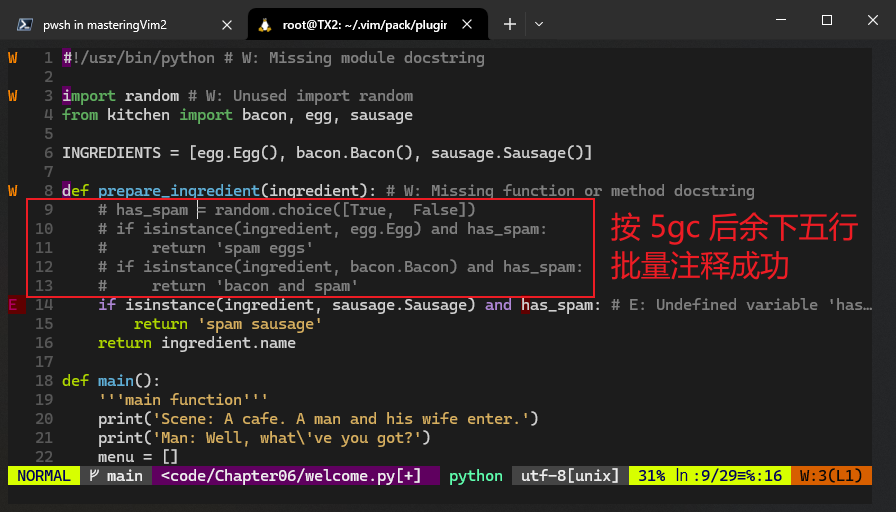

**图 8.23 光标定位到任意位置，按 5gc 测试批量注释功能**

再按一次 `5gc`，测试批量取消注释，实测结果如下（符合预期）：

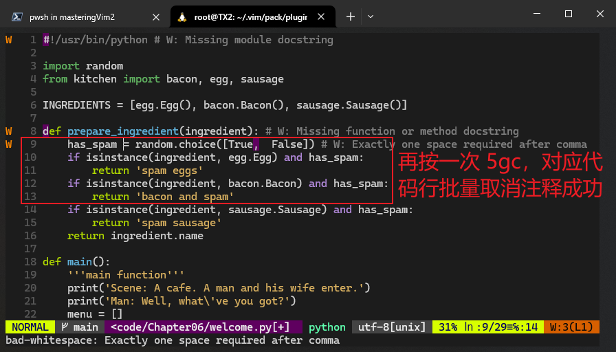

**图 8.24 在原位置再按一次 5gc，测试批量取消注释功能（符合预期）**


### 6.10 插件的对外发布

实测过程中，每一次插件更新我都在本地用 `Git` 进行了变更管理，因此剩下的步骤就是到 `GitHub` 新建仓库并关联到本地即可：

```bash
# 在 GitHub 新建一个 Vim 插件仓库 vim-commenter
# 复制出远程 URL 备用：git@github.com:SafeWinter/vim-commenter.git
$ cd ~/.vim/pack/plugins/start/vim-commenter
$ git init
$ git add .
$ git commit -m "First version of the plugin is ready!"
$ git remote add origin git@github.com:SafeWinter/vim-commenter.git
# 重命名本地分支，和 GitHub 上的 main 分支保持一致
$ git branch -m master main
# 为方便后续 git pull 操作，最好手动关联一下上游分支
$ git branch --set-upstream-to=origin/main main
# 将本地提交记录推送到远程 GitHub 仓库
$ git push origin main
```

此外，还可以给该仓库添加 `README` 文档页和 `LICENSE` 许可，使其他人可以更方便地使用：

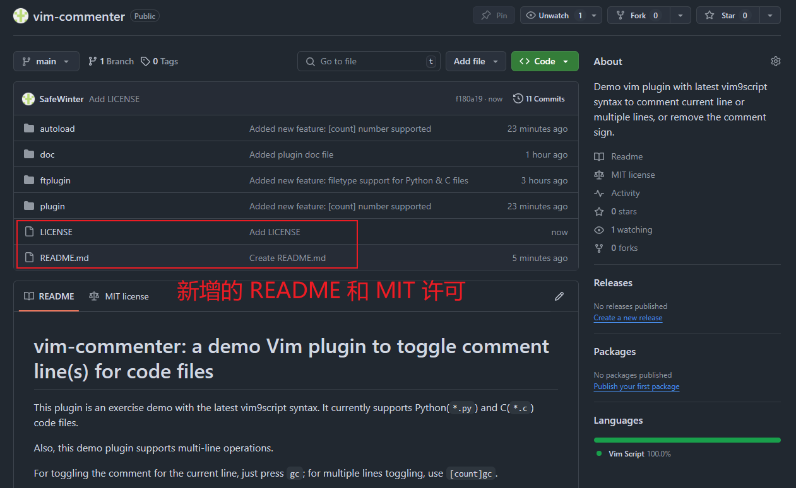

**图 8.25 最终发布到 GitHub 社区的自定义 Vim 插件项目截图**


---

[^1]: `Vimscript` 是 `Vim8.x` 及以前版本的专属 `Vim` 脚本语言；`Vim9script` 由 `Vim` 之父 **Bram Moolenaar** 于 2022 年 6 月正式发布。自 2023 年 8 月 **Bram Moolenaar** 猝然离世（享年 62 岁）后，开源社区的 `Vim` 核心成员与爱好者们又纷纷组织起来，于 2024 年 1 月推出了改良版的 `Vim 9.1` 版，并对此前的 `Vim9script` 存在的诸多问题进行了全面修复，以此纪念这位 `Vim` 编辑器的缔造者、维护者以及终身领导者。
[^2]: 先别管 `has('win32')` 以及上面的 `var`、`let` 的含义，因为后面会具体介绍；这里先建立执行 `Vim` 脚本的直观感受

[^3]: 完整 PDF 版本我已免费上传到网盘：`https://pan.baidu.com/s/1kUzFlLSBBLx5rZVO_TFTZw?pwd=7dnv`，提取码：`7dnv`


