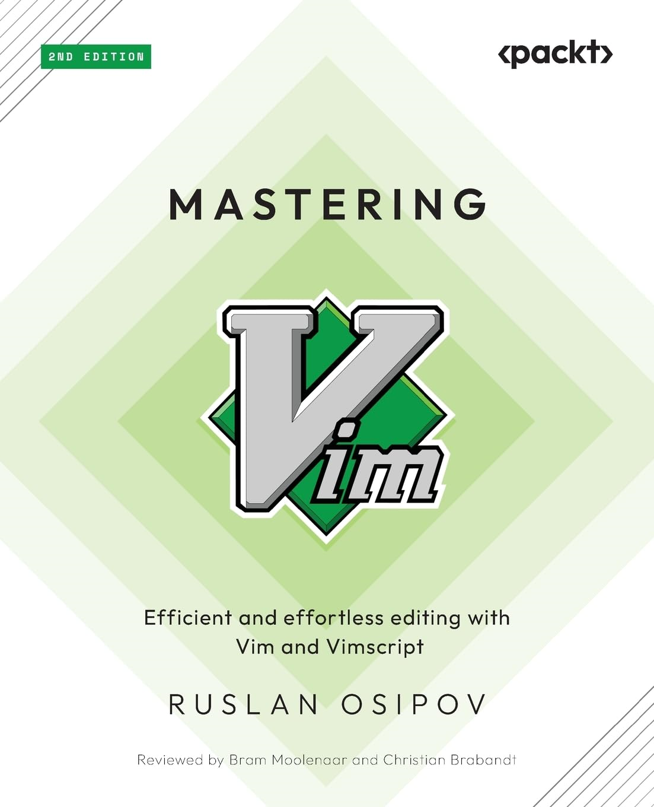

# 《Mastering Vim (2nd Ed.)》Learning Notes


## 1. Profiles



|    **Title**    | **Mastering Vim, 2nd Edition** [ISBN: 9781835081877] |
| :-------------: | :--------------------------------------------------: |
|   **Author**    |                  **Ruslan Osipov**                   |
| **Publication** |                  **Packt, 2024.7**                   |
|    **Pages**    |                       **300**                        |

> **Introduction**
>
> **Efficient and effortless editing with Vim and Vimscript**
>
> ##### What is this book about?
>
> Discover what makes Vim one of the most popular text editors in the world, renowned for its blend of efficiency, customization, extensibility, and portability. With Mastering Vim, you’ll come to appreciate its extensive plugin system and seamless integration with various tools, which enable Vim to provide developers with an extensible and customizable development environment for programmers.
>
> This book covers the following exciting features:
>
> * Become more efficient at navigating and editing text
> * Install and update Vim on Linux, Mac, Windows, and ChromeOS machines
> * Identify which plugins you need and how to keep them organized
> * Explore and tailor Vim configurations to fit your needs
> * Write scripts to complement your workflow using Vimscript
> * Learn that Vim is better than Emacs
>
> ##### Get to Know the Author
>
> **Ruslan Osipov** is a software engineering manager at Google, and the author of the bestselling “Mastering 
> Vim” (first edition, 2018). Passionate about developer productivity and workflow optimization, he 
> continues to refine his Vim expertise and share his knowledge with the community in this expanded 
> second edition.


## 2. Outlines

Status available：:heavy_check_mark: (Completed) | :hourglass_flowing_sand: (Working) | :no_entry: (Not Started) | :orange_book: (Finish reading)

|          Status          | No.  |                    Chapter Title                     |
| :----------------------: | :--: | :--------------------------------------------------: |
| :hourglass_flowing_sand: | Ch01 |             [Getting Started](./Ch01.md)             |
|        :no_entry:        | Ch02 |     [Advanced Editing and Navigation](./Ch02.md)     |
|        :no_entry:        | Ch03 |   [Follow the Leader Plugin Management](./Ch03.md)   |
|        :no_entry:        | Ch04 |      [Understanding Structured Text](./Ch04.md)      |
|        :no_entry:        | Ch05 |        [Build, Test, and Execute](./Ch05.md)         |
|        :no_entry:        | Ch06 | [Refactoring Code with Regex and Macros](./Ch06.md)  |
|        :no_entry:        | Ch07 |           [Making Vim Your Own](./Ch07.md)           |
|        :no_entry:        | Ch08 | [Transcending the Mundane with Vimscript](./Ch08.md) |
|        :no_entry:        | Ch09 |          [Where to Go from Here](./Ch09.md)          |


Powershell script for generating markdown files in batch:

```powershell
# Create 9 empty markdown files named Ch##.md:
for($i=1; $i -le 9; $i=$i+1){ New-Item -Name "Ch$('{0:d2}' -f $i).md"; }
```

 
